# Apuntes de clase — Viernes 18 de septiembre de 2026

## Mecanismos de inferencia, búsqueda y optimización en inteligencia artificial

La clase presenta una visión general de varias familias clásicas y modernas de algoritmos de inteligencia artificial. La idea central es que **"IA" no describe un único tipo de algoritmo**: dependiendo del problema podemos razonar con reglas, explorar espacios de estados, optimizar funciones, aprender a partir de datos o recompensas, o utilizar modelos fundacionales.

!!! note "Idea principal"
    Antes de elegir una técnica de IA hay que identificar **qué tipo de problema tenemos**, cómo se representa una solución, cómo se evalúa y qué garantías necesitamos.

---

## 1. Sistemas expertos y motores de inferencia

Los **sistemas expertos** representan conocimiento mediante:

- **hechos**, que describen información conocida;
- **reglas**, normalmente de la forma `IF condición THEN conclusión`;
- un **motor de inferencia**, que decide qué reglas pueden aplicarse y genera nuevos hechos.

Por ejemplo:

```text
Hecho:
temperatura = 95 °F

Regla:
IF temperatura > 90 °F
THEN activar_ventilador
```

El sistema no ejecuta necesariamente una secuencia imperativa fija. En lugar de decir explícitamente "haz A, después B y después C", se describe conocimiento y el motor determina qué conclusiones pueden derivarse.

### 1.1. Encadenamiento hacia delante

En **forward chaining** se parte de los hechos conocidos y se aplican reglas que produzcan nuevas conclusiones.

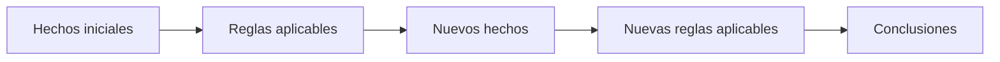

El proceso continúa hasta que:

- se alcanza una conclusión buscada;
- ya no puede activarse ninguna regla nueva;
- o se cumple algún criterio de parada.

### 1.2. Encadenamiento hacia atrás

En **backward chaining** se empieza por una hipótesis u objetivo y se pregunta qué tendría que ser cierto para demostrarlo.

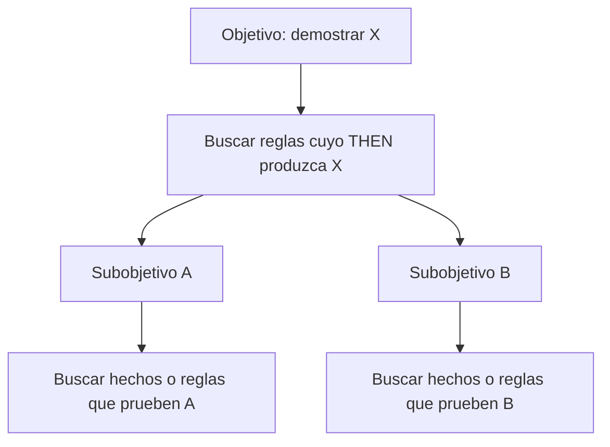

Este enfoque es característico de sistemas lógicos y lenguajes como **Prolog**.

### 1.3. Explicabilidad

Una ventaja importante de los sistemas basados en reglas es que pueden conservar la cadena de inferencias utilizada.

Esto permite obtener no solo una respuesta, sino una especie de **demostración**:

```text
Hecho A
→ activa Regla 3
→ produce Hecho B
→ activa Regla 7
→ produce Conclusión C
```

Esta trazabilidad puede ser especialmente útil en sistemas donde se necesita justificar cómo se ha alcanzado una decisión.

---

## 2. Lenguajes declarativos: Prolog y Lisp

La clase menciona la importancia histórica de lenguajes asociados a la IA clásica, especialmente **Prolog** y **Lisp**.

En programación imperativa escribimos una secuencia de instrucciones:

```text
haz A
haz B
si ocurre C, haz D
```

En enfoques declarativos o lógicos se describe más bien:

```text
estos hechos son ciertos
estas relaciones se cumplen
demuestra si X puede deducirse
```

Esta diferencia es importante porque cambia el papel del programador: en vez de especificar completamente **cómo** resolver el problema, se describe parte del conocimiento y se deja que el sistema busque una demostración o una solución.

---

## 3. Espacios de estados

Muchos problemas de IA pueden representarse mediante un **espacio de estados**.

Un estado contiene toda la información relevante de una situación concreta. Una acción transforma un estado en otro.

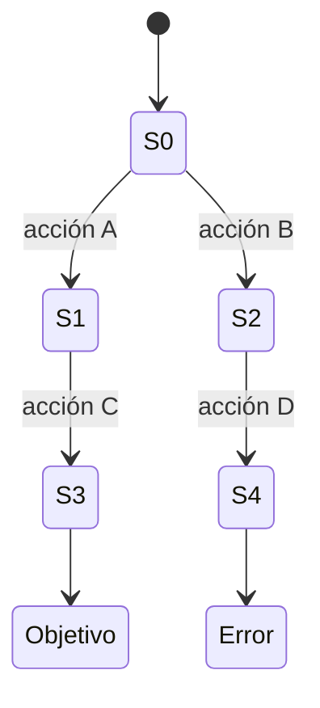

En un programa, por ejemplo, un estado podría incluir:

- valor de las variables;
- punto de ejecución;
- contenido de memoria;
- decisiones tomadas anteriormente.

El número de estados posibles puede crecer de forma gigantesca, por lo que probar exhaustivamente todos los estados de un programa real suele ser inviable.

### Aplicación al testing

La búsqueda en espacios de estados puede utilizarse para intentar encontrar secuencias que conduzcan a un fallo.

Si se alcanza un estado erróneo, resulta especialmente útil conservar el camino:

```text
estado inicial
→ estado 4
→ estado 12
→ estado 37
→ error
```

Esa secuencia permite reproducir el fallo.

---

## 4. Búsqueda heurística y algoritmo A*

El algoritmo **A*** es uno de los algoritmos clásicos de búsqueda informada.

Para cada nodo (n) utiliza normalmente:

[
f(n) = g(n) + h(n)
]

donde:

- (g(n)): coste real acumulado desde el origen hasta (n);
- (h(n)): estimación del coste desde (n) hasta el objetivo;
- (f(n)): estimación total del coste de una solución pasando por (n).

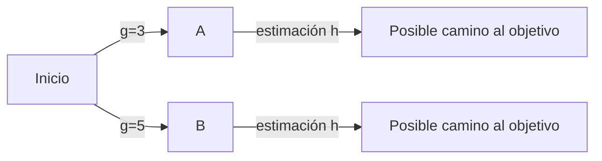

La heurística permite evitar explorar indiscriminadamente todo el árbol de búsqueda.

!!! important "La heurística"
    Una heurística no tiene por qué conocer la solución exacta. Su función es proporcionar información útil sobre qué estados parecen más prometedores.

---

## 5. Branch and Bound

**Branch and Bound** es otra familia de técnicas para resolver problemas de optimización combinatoria.

La idea general es:

1. dividir el problema en ramas;
2. calcular una **cota** para cada rama;
3. descartar ramas que no puedan mejorar la mejor solución conocida;
4. continuar explorando únicamente las ramas prometedoras.

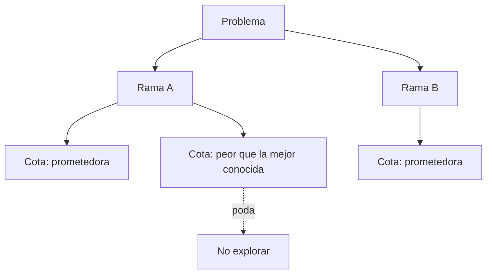

La poda es lo que evita tener que recorrer todo el espacio de soluciones.

---

## 6. El problema de la mochila

El **Knapsack Problem** sirve durante la clase como ejemplo recurrente.

Disponemos de objetos con:

- un peso (w_i);
- un beneficio (v_i).

Queremos maximizar:

[
sum_i v_i x_i
]

sujeto a:

[
sum_i w_i x_i leq W
]

donde:

- (W) es la capacidad máxima de la mochila;
- (x_i in {0,1}) indica si el objeto se incluye.

| Objeto | Peso | Beneficio | Se incluye |
| --- | ---: | ---: | --- |
| 1 | 3 | 5 | 1 / 0 |
| 2 | 2 | 7 | 1 / 0 |
| 3 | 1 | 3 | 1 / 0 |
| 4 | 1 | 3 | 1 / 0 |

Una solución puede representarse mediante un vector binario:

```text
[1, 0, 1, 1]
```

Eso significa que se seleccionan los objetos 1, 3 y 4.

### Soluciones factibles

Una solución es **factible** si cumple todas las restricciones.

Por ejemplo, aunque una combinación produzca un beneficio enorme, deja de ser válida si supera el peso máximo permitido.

Por tanto, en optimización aparecen dos conceptos diferentes:

1. **factibilidad**: ¿cumple las restricciones?;
2. **calidad**: si es factible, ¿qué valor tiene la función objetivo?

---

## 7. Optimización matemática

Optimizar significa buscar valores que **maximicen** o **minimicen** una función.

Maximizar (f(x)) puede transformarse en minimizar (-f(x)), de modo que muchos métodos se expresan directamente como problemas de minimización.

### Ejemplo

[
f(x) = x^2
]

Su mínimo global se encuentra en:

[
x = 0
]

---

## 8. Descenso por gradiente

Cuando la función es diferenciable podemos utilizar información de su derivada para movernos en la dirección de descenso.

La actualización básica es:

[
x_{t+1} = x_t - alpha 
abla f(x_t)
]

donde (alpha) es el **learning rate** o tamaño de paso.

Para:

[
f(x)=x^2
]

tenemos:

[
f'(x)=2x
]

Si empezamos en (x=3) con (alpha=0.1):

[
x_1 = 3 - 0.1 cdot 6 = 2.4
]

El nuevo punto está más cerca del mínimo.

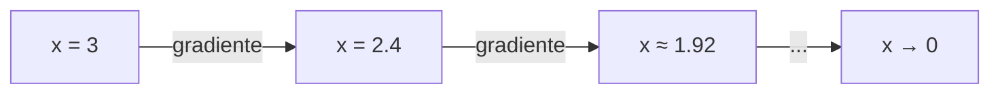

El tamaño de paso es importante:

- demasiado pequeño → convergencia lenta;
- demasiado grande → puede saltarse el mínimo o volverse inestable.

---

## 9. Método de Newton y Hessiano

El método de Newton utiliza información de **segundo orden**.

En varias dimensiones se utiliza el **Hessiano**, la matriz de segundas derivadas:

[
H_f(x)=
egin{bmatrix}
rac{partial^2 f}{partial x_1^2} & cdots \\
dots & ddots
end{bmatrix}
]

La actualización de Newton se expresa como:

[
x_{t+1}=x_t-H_f(x_t)^{-1}
abla f(x_t)
]

Para una función cuadrática ideal como (f(x)=x^2), Newton puede alcanzar el mínimo en un único paso:

[
x_{1}=3-rac{6}{2}=0
]

!!! note
    Los métodos de segundo orden pueden converger muy rápido cuando la función tiene buenas propiedades matemáticas, pero calcular o invertir el Hessiano puede ser muy costoso en problemas grandes.

### Limitaciones de la optimización clásica

Los métodos basados en derivadas presentan dificultades cuando:

- la función no es diferenciable;
- es discontinua;
- solo existe un simulador que devuelve el valor;
- las variables son discretas;
- existen muchísimos óptimos locales;
- evaluar la función es caro.

Aquí aparecen las **metaheurísticas**.

---

## 10. Metaheurísticas

Una metaheurística intenta obtener soluciones buenas mediante un proceso iterativo sin necesitar una descripción matemática perfecta del problema.

Esquema general:

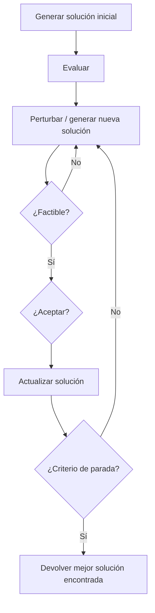

Estas técnicas normalmente **no garantizan encontrar el óptimo global**, pero pueden producir soluciones muy buenas en problemas donde los métodos exactos son demasiado costosos.

---

## 11. Hill Climbing

**Hill Climbing** mantiene una solución y acepta cambios que la mejoren.

Proceso básico:

1. partir de una solución;
2. generar un vecino;
3. evaluarlo;
4. si mejora la solución actual, aceptarlo;
5. repetir.

Su principal problema es que puede quedar atrapado en:

- óptimos locales;
- mesetas;
- regiones donde para mejorar primero habría que empeorar.

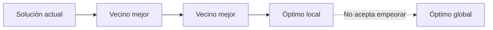

Aceptar soluciones de igual calidad puede ayudar a desplazarse por una **meseta** en lugar de quedar bloqueado exactamente en el mismo punto.

---

## 12. Simulated Annealing

**Simulated Annealing** está inspirado en el proceso físico de recocido de los metales.

La diferencia esencial respecto a Hill Climbing es que **puede aceptar temporalmente soluciones peores** para escapar de óptimos locales.

### Esquema

1. generar una solución inicial;
2. perturbarla;
3. comprobar restricciones;
4. si mejora, aceptarla;
5. si empeora, aceptarla con cierta probabilidad;
6. reducir progresivamente la temperatura;
7. repetir.

Una forma habitual de la probabilidad de aceptación es:

[
P(	ext{aceptar}) = e^{-Delta E/T}
]

donde:

- (Delta E) representa cuánto empeora la nueva solución;
- (T) representa la temperatura.

### Intuición

- **temperatura alta** → se aceptan con mayor facilidad movimientos peores;
- **temperatura baja** → el algoritmo se vuelve progresivamente más conservador.

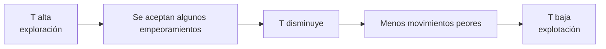

Esta capacidad de empeorar temporalmente puede permitir atravesar una región mala para llegar posteriormente a otra región con soluciones mejores.

---

## 13. Algoritmos genéticos

Los **algoritmos genéticos** están inspirados en evolución, selección y reproducción.

En lugar de trabajar con una sola solución mantienen una **población**.

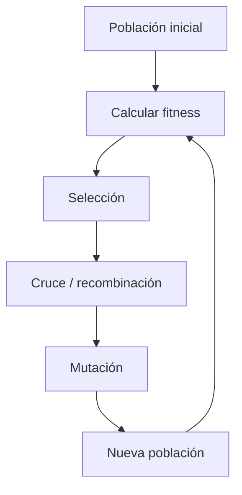

### 13.1. Representación

Una solución puede codificarse de distintas formas:

- bits;
- enteros;
- reales;
- permutaciones;
- estructuras específicas del problema.

Para la mochila:

```text
1 0 1 1
```

Cada bit indica si un objeto se incluye.

### 13.2. Fitness

El **fitness** mide la calidad de cada individuo.

Si estamos maximizando beneficios:

[
fitness(x)=beneficio(x)
]

Si existen restricciones, es necesario comprobar la factibilidad o aplicar penalizaciones.

### 13.3. Selección

Las mejores soluciones tienen mayor probabilidad de utilizarse como padres.

Un método sencillo es el **torneo binario**:

1. seleccionar dos individuos al azar;
2. conservar el mejor;
3. repetir para obtener otro padre.

### 13.4. Cruce

Dos padres pueden combinar partes de sus representaciones:

```text
Padre A:  1 1 | 0 0
Padre B:  0 0 | 1 1

Hijo A:   1 1 | 1 1
Hijo B:   0 0 | 0 0
```

### 13.5. Mutación

La mutación introduce pequeñas variaciones aleatorias.

Por ejemplo:

```text
Antes:   1 0 1 1
              ↓
Después: 1 1 1 1
```

Esto ayuda a mantener diversidad y explorar regiones que no aparecerían únicamente recombinando soluciones existentes.

### 13.6. Modelos poblacionales

Dos variantes habituales son:

| Variante | Funcionamiento |
| --- | --- |
| Generacional | Se genera una población nueva que sustituye a la anterior |
| Estado estacionario | Se generan pocos individuos y se incorporan gradualmente |

---

## 14. Particle Swarm Optimization

**Particle Swarm Optimization (PSO)** está inspirado en el comportamiento colectivo de bandadas o bancos de peces.

Cada partícula representa una solución y mantiene información sobre:

- su posición actual;
- su velocidad;
- la mejor posición que ella misma ha encontrado (`pbest`);
- la mejor posición conocida por el enjambre (`gbest`).

De forma conceptual:

[
v_i leftarrow
	ext{inercia}
+
	ext{atracción hacia } pbest_i
+
	ext{atracción hacia } gbest
]

[
x_i leftarrow x_i + v_i
]

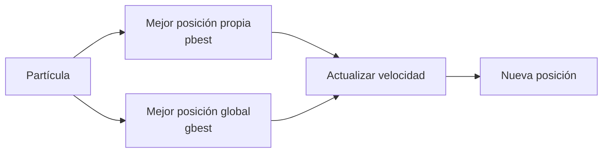

La población permite explorar simultáneamente varias regiones del espacio de búsqueda.

---

## 15. Ant Colony Optimization

**Ant Colony Optimization (ACO)** está inspirado en cómo las hormigas utilizan feromonas para favorecer caminos que han resultado útiles.

A diferencia de muchas técnicas perturbativas, ACO suele ser **constructivo**: una solución se construye paso a paso.

Ejemplo: buscar una ruta desde Málaga hasta Madrid.

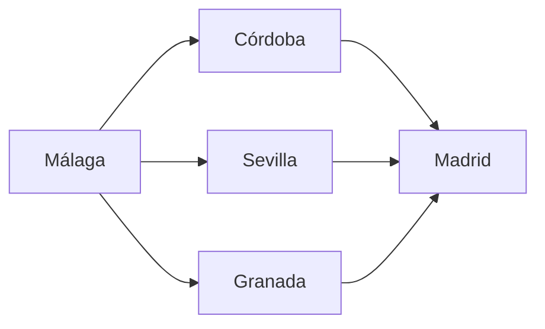

Cada transición posee una cantidad de feromona que influye en su probabilidad de selección.

### Selección probabilística

Si una acción tiene probabilidad (p=0.3), puede generarse un número uniforme (r in [0,1]):

```text
si r < 0.3:
    seleccionar acción
```

Con muchas repeticiones, esa acción se elegirá aproximadamente el 30 % de las veces.

### Feromonas

El algoritmo combina dos procesos:

- **refuerzo**: las buenas rutas reciben más feromona;
- **evaporación**: la feromona existente disminuye con el tiempo.

Esto evita que una decisión inicial domine indefinidamente y permite seguir explorando.

---

## 16. Machine Learning supervisado

En aprendizaje supervisado disponemos de ejemplos con:

- **características de entrada**;
- una **etiqueta objetivo**.

Ejemplo de mantenimiento predictivo:

| Vibración | Temperatura | Etiqueta |
| ---: | ---: | --- |
| Alta | Alta | Fallo |
| Baja | Baja | Normal |
| Alta | Media | Posible fallo |

El objetivo es ajustar los parámetros de un modelo para que su salida se aproxime a las etiquetas conocidas y pueda generalizar a datos nuevos.

---

## 17. Reinforcement Learning

En **aprendizaje por refuerzo** un agente interactúa con un entorno.

En cada paso:

1. está en un estado (s);
2. elige una acción (a);
3. recibe una recompensa (r);
4. pasa a un nuevo estado (s').

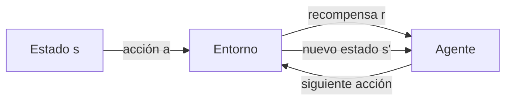

### Q-Learning

Una actualización típica es:

[
Q(s,a)
leftarrow
Q(s,a)
+
alpha
left[
r + gamma max_{a'} Q(s',a') - Q(s,a)

ight]
]

donde:

- (alpha): tasa de aprendizaje;
- (gamma): factor de descuento;
- (r): recompensa inmediata;
- (max Q(s',a')): mejor valor estimado desde el siguiente estado.

Este tipo de algoritmo permite aprender una política sin que el programador tenga que proporcionar directamente el camino correcto.

---

## 18. Redes neuronales

Una neurona artificial combina las entradas mediante pesos:

[
z = sum_i w_i x_i + b
]

y aplica después una función de activación:

[
y=phi(z)
]

### Funciones de activación

| Activación | Idea |
| --- | --- |
| Sigmoid | Produce valores entre 0 y 1 |
| `tanh` | Produce valores entre -1 y 1 |
| ReLU | Devuelve 0 para valores negativos y el propio valor para positivos |

Para ReLU:

[
ReLU(x)=max(0,x)
]

Una de sus ventajas prácticas es que, para valores positivos, su derivada es 1, lo que ayuda a evitar parte del problema de los **gradientes que se desvanecen** presente en activaciones saturantes.

---

## 19. Backpropagation

En una red neuronal se define una **función de pérdida** que mide el error entre la salida esperada y la obtenida.

De forma simplificada:

[
L = 	ext{error}(y,hat y)
]

Backpropagation calcula cómo afecta cada peso a la pérdida mediante la regla de la cadena y permite actualizar los pesos con descenso por gradiente:

[
w_{t+1}=w_t-alpharac{partial L}{partial w}
]

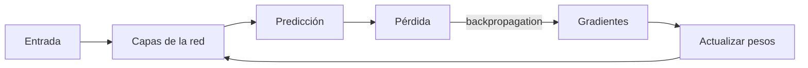

Por tanto, el entrenamiento de muchas redes neuronales puede verse también como un gran problema de **optimización**.

---

## 20. Modelos fundacionales y LLM

Los **modelos fundacionales** son modelos entrenados a gran escala que pueden adaptarse a múltiples tareas.

Un **Large Language Model (LLM)** es un tipo de modelo fundacional especializado en secuencias de lenguaje.

De forma muy simplificada, un modelo autoregresivo genera texto prediciendo el siguiente token:


El token generado se incorpora al contexto y el proceso se repite.

### Atención

Los Transformers utilizan mecanismos de **attention** para que cada token pueda ponderar la relevancia de otros tokens de la secuencia.

La forma habitual de *scaled dot-product attention* es:

[
Attention(Q,K,V)=
softmaxleft(rac{QK^T}{sqrt{d_k}}
ight)V
]

Esto permite construir representaciones dependientes del contexto.

---

## 21. Comparación de familias de técnicas

| Familia | Representación típica | Necesita derivadas | ¿Garantiza óptimo? | Idea principal |
| --- | --- | ---: | ---: | --- |
| Sistemas expertos | Hechos + reglas | No | Depende de la lógica/modelo | Deducción |
| A* | Estados + costes | No | Sí bajo determinadas condiciones | Búsqueda heurística |
| Branch and Bound | Árbol de soluciones | No | Sí si se ejecuta completamente con cotas válidas | Poda por cotas |
| Descenso por gradiente | Vector real | Sí | No en general | Seguir gradiente |
| Newton | Vector real | Sí, hasta segundo orden | No en general | Usar curvatura |
| Hill Climbing | Solución + vecinos | No | No | Solo aceptar mejoras |
| Simulated Annealing | Solución + vecinos | No | No en ejecución finita práctica | Aceptar algunos empeoramientos |
| Algoritmo genético | Población | No | No | Evolución y recombinación |
| PSO | Enjambre de vectores | No | No | Cooperación entre partículas |
| ACO | Soluciones construidas paso a paso | No | No | Feromonas |
| Q-Learning | Estados, acciones y recompensas | No | Depende de condiciones de convergencia | Aprender valores de acciones |
| Redes neuronales | Pesos | Habitualmente sí durante entrenamiento | No | Aprender una función desde datos |

---

## 22. Perturbativo frente a constructivo

Una distinción útil introducida durante la clase es:

### Algoritmos perturbativos

Parten de una solución completa y la modifican.

Ejemplos:

- Hill Climbing;
- Simulated Annealing;
- muchos algoritmos evolutivos.

```text
solución completa
→ modificar
→ evaluar
→ aceptar/rechazar
```

### Algoritmos constructivos

Construyen una solución progresivamente.

Ejemplo:

- Ant Colony Optimization.

```text
solución parcial
→ añadir decisión
→ añadir decisión
→ ...
→ solución completa
```

---

## 23. Exploración frente a explotación

Muchas metaheurísticas deben equilibrar dos comportamientos:

- **exploración**: visitar regiones nuevas;
- **explotación**: profundizar alrededor de soluciones prometedoras.

| Técnica | Mecanismo de exploración | Mecanismo de explotación |
| --- | --- | --- |
| Simulated Annealing | Aceptar empeoramientos | Temperatura baja |
| Algoritmos genéticos | Mutación y diversidad | Selección de mejores individuos |
| PSO | Varias partículas | Atracción a `pbest` y `gbest` |
| ACO | Decisiones probabilísticas | Refuerzo de feromonas |
| Reinforcement Learning | Explorar acciones | Favorecer acciones con alto valor |

Un algoritmo que explota demasiado pronto puede quedar atrapado en una región subóptima. Uno que explora demasiado puede no concentrarse nunca en las mejores soluciones.

---

## 24. Optimización de redes neuronales sin gradientes

Aunque el entrenamiento habitual utiliza backpropagation y gradientes, una red neuronal también puede verse simplemente como un vector de parámetros.

```text
[w1, w2, w3, ..., wn]
```

Por tanto, en principio podemos:

1. generar pesos;
2. ejecutar la red;
3. medir su error;
4. modificar los pesos;
5. conservar configuraciones mejores.

Eso permite utilizar métodos como:

- algoritmos genéticos;
- Simulated Annealing;
- PSO;

aunque para redes grandes suelen ser mucho menos eficientes que los métodos basados en gradientes.

La idea importante es que muchas técnicas de IA pueden reutilizarse si somos capaces de definir:

- una representación;
- una función de evaluación;
- operadores para producir nuevas soluciones.

---

## 25. Profiling de software

La clase termina destacando que implementar un algoritmo no basta: también hay que **medir su comportamiento**.

El **profiling** permite descubrir:

- qué funciones se llaman más;
- cuánto tiempo consume cada función;
- qué partes utilizan más memoria;
- dónde se concentra el coste computacional;
- en algunos entornos, incluso consumo energético u otros contadores de hardware.

Ejemplo:

| Función | Tiempo total | % |
| --- | ---: | ---: |
| `fitness()` | 4.2 s | 42 % |
| `mutation()` | 2.8 s | 28 % |
| `selection()` | 1.7 s | 17 % |
| Resto | 1.3 s | 13 % |

Si `fitness()` consume el 42 % del tiempo, una pequeña optimización en esa función puede afectar mucho más al rendimiento global que optimizar una función que apenas se ejecuta.

!!! important
    No conviene optimizar basándose únicamente en intuición. Primero se mide y después se optimiza la parte que realmente domina el coste.

### Flujo recomendable

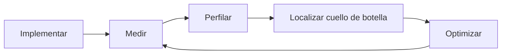

---

## 26. Mapa general de la clase

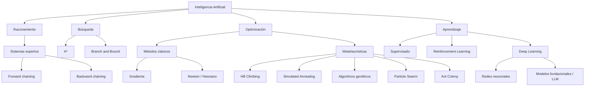

---

## 27. Ideas clave para el examen y las prácticas

1. Un **motor de inferencia** aplica reglas sobre hechos para obtener nuevas conclusiones.
2. **Forward chaining** va de hechos a conclusiones; **backward chaining** parte del objetivo y busca cómo demostrarlo.
3. Muchos problemas pueden formularse como una búsqueda en un **espacio de estados**.
4. **A*** utiliza coste acumulado y heurística: (f=g+h).
5. **Branch and Bound** elimina ramas mediante cotas.
6. En optimización hay que distinguir entre **función objetivo** y **restricciones**.
7. Los métodos basados en derivadas funcionan muy bien cuando la función tiene propiedades matemáticas adecuadas.
8. El **gradiente** utiliza derivadas de primer orden; Newton incorpora información de segundo orden mediante el Hessiano.
9. Las **metaheurísticas** son útiles cuando el problema es discontinuo, discreto, muy complejo o solo evaluable mediante simulación.
10. **Hill Climbing** acepta mejoras y puede atascarse en óptimos locales.
11. **Simulated Annealing** permite aceptar temporalmente soluciones peores para escapar de óptimos locales.
12. Los **algoritmos genéticos** trabajan con poblaciones, selección, recombinación y mutación.
13. **PSO** utiliza información individual y colectiva.
14. **ACO** construye soluciones utilizando feromonas y decisiones probabilísticas.
15. En **Reinforcement Learning** se aprende mediante estados, acciones y recompensas.
16. El entrenamiento de redes neuronales es esencialmente un problema de optimización de parámetros.
17. Los LLM autoregresivos generan texto prediciendo tokens sucesivos y utilizan mecanismos de atención.
18. El **profiling** debe utilizarse para localizar cuellos de botella antes de optimizar código.

---

## 28. Conceptos que conviene memorizar

| Concepto | Idea |
| --- | --- |
| Hecho | Información conocida por un sistema experto |
| Regla | Relación condicional entre hechos |
| Motor de inferencia | Mecanismo que aplica reglas |
| Forward chaining | Inferencia desde datos hacia conclusiones |
| Backward chaining | Inferencia desde un objetivo hacia sus condiciones |
| Espacio de estados | Conjunto de situaciones posibles de un problema |
| Heurística | Estimación utilizada para orientar una búsqueda |
| A* | Búsqueda basada en (f=g+h) |
| Branch and Bound | Exploración con poda mediante cotas |
| Función objetivo | Medida que queremos maximizar o minimizar |
| Restricción | Condición que debe cumplir una solución |
| Solución factible | Solución que cumple las restricciones |
| Gradiente | Vector de derivadas de primer orden |
| Hessiano | Matriz de derivadas de segundo orden |
| Metaheurística | Estrategia general de búsqueda aproximada |
| Hill Climbing | Búsqueda local que acepta mejoras |
| Simulated Annealing | Búsqueda local que puede aceptar empeoramientos |
| Fitness | Medida de calidad en algoritmos evolutivos |
| Cruce | Combinación de material de dos soluciones |
| Mutación | Modificación aleatoria de una solución |
| PSO | Optimización mediante un enjambre de partículas |
| Feromona | Memoria colectiva utilizada en ACO |
| Reinforcement Learning | Aprendizaje mediante recompensas |
| Q-Learning | Aprendizaje de valores estado-acción |
| Backpropagation | Cálculo de gradientes a través de una red neuronal |
| ReLU | Activación (max(0,x)) |
| Modelo fundacional | Modelo grande reutilizable para múltiples tareas |
| Attention | Mecanismo que pondera relaciones entre elementos de una secuencia |
| Profiling | Medición del comportamiento y coste de ejecución del software |
