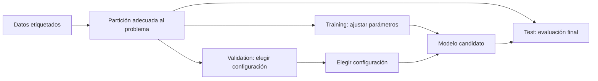

# Apuntes de clase — Miércoles 23 de septiembre de 2026

## Análisis estadístico y gestión de datos para IA

La sesión cierra el bloque sobre ingeniería de software para IA y se centra en el papel de los datos. Un modelo no se evalúa mirando unos pocos resultados aislados: hay que describir los datos, entender la variabilidad, comparar distribuciones y mantener bajo observación los datos que llegan a producción.

> **Fuente:** transcripción automática de la clase del 23 de septiembre de 2026. Se han corregido errores de reconocimiento de voz. Las precisiones estadísticas señaladas como tales aclaran el alcance de lo dicho en clase.

## 1. Describir la geometría de los datos

Para conocer un conjunto de datos conviene analizar tres aspectos: **centralidad** (dónde se sitúan los valores), **dispersión** (cuánto varían) y **forma** (cómo se distribuyen, incluidas la asimetría y las colas).

### 1.1. Medidas de centralidad

Para observaciones (x_1,\ldots,x_n):

- **Media:** \(\bar{x}=\frac{1}{n}\sum_{i=1}^{n}x_i\). Utiliza todos los valores, pero puede desplazarse mucho ante valores extremos.
- **Mediana:** valor central después de ordenar los datos. Si hay un número par de observaciones, suele calcularse como el promedio de las dos centrales. Es más robusta frente a *outliers*.
- **Moda:** valor o categoría más frecuente. Puede haber más de una moda; si todos los valores aparecen el mismo número de veces, aporta poca información.

La media y la mediana responden a preguntas distintas. Por ejemplo, si los tiempos habituales de respuesta son bajos pero aparece un fallo que tarda muchísimo, la media puede aumentar de forma notable, mientras que la mediana describe mejor el caso típico. La elección debe depender de la distribución y del objetivo del análisis.

### 1.2. Dispersión y valores atípicos

La **varianza** mide la dispersión cuadrática respecto de la media. Para una población se define como \(\sigma^2=\frac{1}{N}\sum_i(x_i-\mu)^2\); para estimar la varianza a partir de una muestra se usa habitualmente \(s^2=\frac{1}{n-1}\sum_i(x_i-\bar{x})^2\). La **desviación típica** es la raíz cuadrada de la varianza y queda en las mismas unidades que los datos.

Los **cuartiles** dividen los datos ordenados en cuatro partes. El rango intercuartílico (**Interquartile Range, IQR**) es:

\[
IQR = Q_3-Q_1
\]

Una regla exploratoria habitual marca como posibles valores atípicos los que quedan por debajo de \(Q_1-1.5\,IQR\) o por encima de \(Q_3+1.5\,IQR\). Es una señal para investigar, no una orden automática de eliminar esos valores.

También se puede expresar la distancia a la media en unidades de desviación típica (*z-score*). El umbral de tres sigmas es una regla práctica en ciertos contextos, pero su interpretación depende de la distribución. En una distribución normal, aproximadamente el 68 % de los valores cae a una desviación típica de la media y el 99,7 % a tres; no se debe generalizar esa proporción a cualquier conjunto de datos.

### 1.3. Forma y familias de distribuciones

La **skewness** describe la asimetría; la **kurtosis** caracteriza el peso de las colas y la concentración de valores extremos, aunque a menudo se explique informalmente como la «forma puntiaguda». Cambios en estas propiedades pueden revelar que los datos de producción ya no se parecen a los usados durante el entrenamiento.

La sesión menciona varias distribuciones como patrones que conviene reconocer:

| Distribución | Uso o propiedad básica |
| --- | --- |
| Normal | Valores continuos alrededor de una media, con forma aproximadamente simétrica. |
| Uniforme | Todos los valores de un intervalo tienen la misma densidad; se usa, entre otros casos, para muestreo aleatorio. |
| Poisson | Modela recuentos de eventos en un intervalo bajo ciertos supuestos; su parámetro \(\lambda\) representa el número medio esperado de eventos en ese intervalo. |
| Log-normal | Una variable positiva puede modelarse así cuando su logaritmo sigue aproximadamente una distribución normal. |

**Precisión:** aumentar el tamaño de la muestra no convierte por sí mismo los datos originales en normales. El teorema central del límite describe condiciones bajo las que la distribución de ciertas medias muestrales se aproxima a una normal. Aplicar logaritmos tampoco garantiza normalidad: puede ayudar en distribuciones positivas y sesgadas, pero hay que comprobar si resulta apropiado.

## 2. Preparar y escalar características

Las columnas de un conjunto de entrenamiento pueden tener escalas muy distintas: por ejemplo, una duración en milisegundos, un peso en kilogramos y canales de color entre 0 y 255. Algunos algoritmos, en especial los basados en distancias o en optimización por gradiente, pueden entrenar peor si una característica domina por su escala numérica.

Dos transformaciones comunes son:

- **Estandarización (*z-score*):** \(z=(x-\mu)/\sigma\). Centra usando la media y escala con la desviación típica.
- **Min-max scaling:** \(x'=(x-x_{\min})/(x_{\max}-x_{\min})\), que lleva los valores al intervalo [0, 1] cuando los extremos no coinciden.

Los parámetros de transformación se calculan con el conjunto de entrenamiento y luego se reutilizan sin recalcularlos en validación, prueba y producción. Así se evita que información de esos otros conjuntos se filtre al entrenamiento. En producción, cada nueva observación debe procesarse con los mismos parámetros del modelo.

## 3. Funciones de error: MAE y MSE

Para valores reales \(y_i\) y predicciones \(\hat{y}_i\), dos medidas habituales son:

\[
MAE=\frac{1}{n}\sum_{i=1}^{n}|y_i-\hat{y}_i|,
\qquad
MSE=\frac{1}{n}\sum_{i=1}^{n}(y_i-\hat{y}_i)^2.
\]

El **Mean Absolute Error (MAE)** corresponde al promedio de errores absolutos (relacionado con la norma \(L_1\)); el **Mean Squared Error (MSE)** promedia errores al cuadrado (relacionado con la norma \(L_2\) al cuadrado). El MSE penaliza con más fuerza los errores grandes, por lo que un *outlier* puede dominarlo. Esto no significa que siempre se deba usar MAE para ignorar un caso raro: si el caso es válido y costoso, quizá se quiera penalizarlo; si es un error de medición, hay que corregir la fuente o justificar su tratamiento. La métrica debe reflejar el coste real del error.

## 4. Comparar distribuciones

Una lista de tiempos, errores o resultados de un modelo representa variabilidad, no un único número. Comparar algoritmos requiere considerar cómo se distribuyen sus resultados, además de definir qué significa «mejor» (por ejemplo, menor tiempo o menor error).

Entre las distancias y medidas de cambio mencionadas en clase están:

- **Kullback–Leibler (KL) divergence:** compara distribuciones mediante información relativa y puede ser infinita si una distribución asigna probabilidad cero donde la otra no.
- **Wasserstein distance:** intuitivamente, mide el coste de transportar masa de probabilidad para convertir una distribución en otra.
- **Population Stability Index (PSI):** compara proporciones en intervalos definidos y se usa como indicador de cambio entre una referencia y datos recientes. Sus umbrales dependen del contexto.

No son medidas intercambiables; la representación de los datos, los intervalos, los ceros y el propósito del análisis importan. Véase también [Data Drift y PSI en el temario](../temario/bloque-1/1-2-retos-en-el-desarrollo-de-aplicaciones-basadas-en-ia.md#6-population-stability-index-psi).

## 5. Contrastes de hipótesis para comparar modelos

En un contraste se parte de una **hipótesis nula** y se calcula un estadístico y un *p-value*. Para un nivel de significación elegido \(\alpha\), un *p-value* menor que \(\alpha\) aporta evidencia contra la hipótesis nula. Un valor mayor no demuestra que las distribuciones sean iguales: significa que el análisis no ha encontrado evidencia suficiente para rechazarlas, dados los datos y los supuestos del test.

La sesión menciona estas pruebas:

- **Kolmogorov–Smirnov (KS):** compara una muestra con una distribución de referencia o compara dos muestras. No es, sin más, un test universal para decidir si cualquier conjunto es normal; el tipo de contraste y sus supuestos importan.
- **Mann–Whitney U:** comparación no paramétrica de dos grupos independientes; no debe interpretarse siempre como una prueba de medianas sin supuestos adicionales.
- **Kruskal–Wallis:** alternativa basada en rangos para comparar varios grupos independientes. Si el resultado global es significativo, las comparaciones por pares requieren un procedimiento posterior y corrección por comparaciones múltiples.
- **ANOVA:** contrasta diferencias entre medias de varios grupos bajo supuestos como independencia, comportamiento de residuos y varianzas; la normalidad se refiere principalmente a los residuos dentro del modelo.

La **corrección de Bonferroni** controla el error familiar ajustando el umbral; para \(m\) comparaciones, una forma sencilla es usar \(\alpha/m\). Un test indica si hay evidencia de diferencias según sus supuestos, pero no determina por sí solo qué modelo es mejor ni si la diferencia tiene importancia práctica. También hay que mirar la dirección, el tamaño del efecto y la métrica de interés.

## 6. Particiones de datos y representatividad

En aprendizaje supervisado se suelen separar los datos en:

- **Training set:** ajusta los parámetros del modelo.
- **Validation set:** ayuda a elegir configuraciones y comparar alternativas durante el desarrollo.
- **Test set:** ofrece una evaluación final que se reserva para evitar optimizar indirectamente sobre él.

Las particiones deben representar el problema de evaluación. En clasificación desbalanceada, una partición aleatoria simple puede dejar muy pocos ejemplos de una clase en algún subconjunto; la **estratificación** ayuda a conservar proporciones de clase. En datos temporales no se debe mezclar el futuro con el pasado: la separación ha de respetar el orden cronológico. La distribución de características y etiquetas merece inspección, pero no basta con que resúmenes como media y desviación coincidan.

La calidad de las etiquetas y la cobertura de la población también importan. Si los ejemplos no representan grupos o condiciones relevantes, el modelo puede generalizar mal. La sobremuestra mediante duplicación de la clase minoritaria cambia la frecuencia observada y puede facilitar el sobreajuste; hay técnicas de ponderación y muestreo que deben aplicarse solo dentro del entrenamiento y evaluarse con datos intactos.

## 7. Calidad de datos y seguimiento en producción

Un valor extremo puede corresponder a un fallo de sensor, un error de registro o un caso real poco frecuente. Antes de eliminarlo hay que investigar su origen y decidir si forma parte del comportamiento que el modelo debe aprender. Las reglas de limpieza deben documentarse y aplicarse de manera coherente.

En producción conviene monitorizar características y resultados disponibles para detectar cambios frente a la referencia. Si el cambio afecta al rendimiento, se puede revisar la fuente, revalidar o reentrenar con datos representativos. La sesión también menciona **Retrieval-Augmented Generation (RAG)** para aportar información nueva a un modelo de lenguaje mediante recuperación desde una base de conocimiento: esto no actualiza automáticamente los pesos del modelo ni sustituye el reentrenamiento en todos los casos.

## Ideas clave

- Primero se describe la distribución; una sola media puede ocultar asimetría, colas o clases minoritarias.
- Los *outliers* se investigan antes de eliminarlos, y la elección entre MAE y MSE depende del coste de los errores.
- El preprocesamiento se ajusta con *training* y se reutiliza sin fuga de información.
- Los contrastes estadísticos ayudan a comparar, pero un *p-value* no mide la magnitud ni la utilidad de una diferencia.
- Las particiones deben reflejar el uso real del modelo, respetar el tiempo cuando corresponda y conservar ejemplos suficientes de los casos importantes.
- Los datos y el rendimiento del sistema requieren monitorización tras el despliegue.

## Referencias relacionadas

- [1.1. AI-Based Software Requirements](../temario/bloque-1/1-1-requisitos-de-software-basado-en-ia.md)
- [1.2. Challenges in Developing AI-Based Applications](../temario/bloque-1/1-2-retos-en-el-desarrollo-de-aplicaciones-basadas-en-ia.md)
- [18 de septiembre — Mecanismos de inferencia, búsqueda y optimización](clase-2026-09-18.md)
