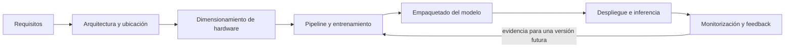
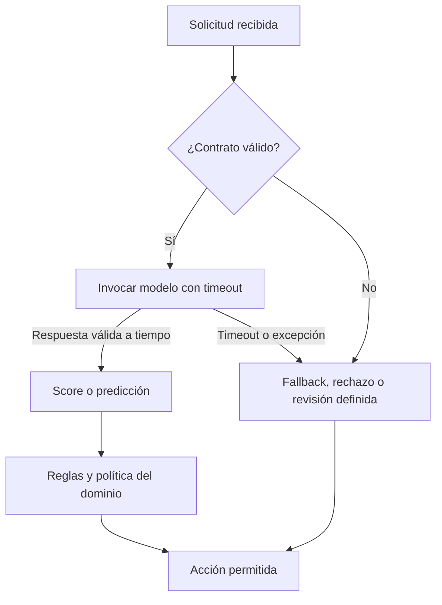
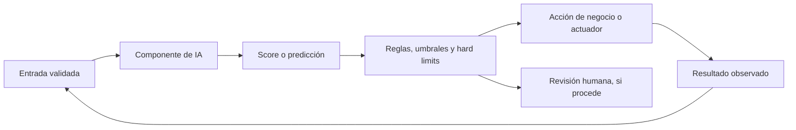
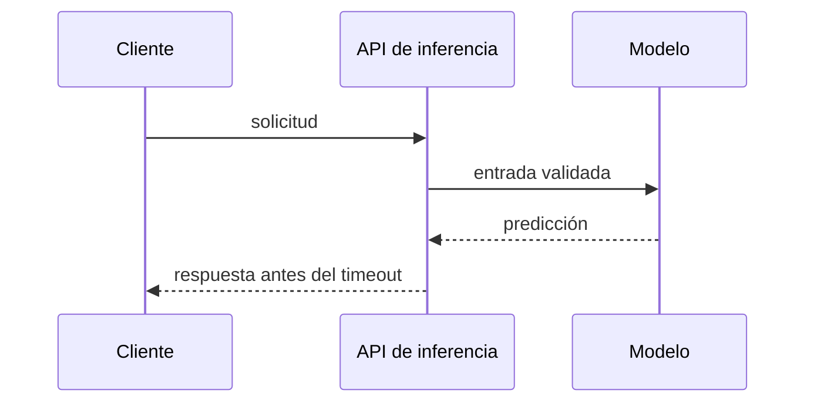
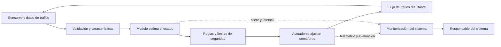

# Apuntes de clase — Miércoles 7 de octubre de 2026

## Del pipeline de entrenamiento al sistema de IA en producción

La clase continúa el **bloque 2 — Architecture and Design**. El recorrido parte del pipeline y del modelo que ya se han entrenado, y llega a su empaquetado, despliegue, operación y monitorización. Después trata los límites de hardware y varias formas de integrar el componente de IA con el software que decide y ejecuta acciones.

> **Fuente:** transcripción automática de `clase-ia-0710.json`, correspondiente al audio `clase-ia-0710.m4a`. Estos apuntes conservan las explicaciones, los términos y los ejemplos técnicos recuperables, pero no reproducen la conversación palabra por palabra. Hay segmentos con reconocimiento muy deteriorado y tramos ajenos al contenido académico; no se reconstruyen ni se incluyen. Las precisiones editoriales se identifican aparte.

## 1. Recorrido de la clase: de requisitos a operación

El profesor sitúa la sesión dentro del pipeline completo de ingeniería para IA. Ya se habían tratado los requisitos, la arquitectura, el dimensionamiento y el modelo. Ahora toca cerrar el trabajo del modelo, incorporarlo al sistema, llevarlo a producción y observar cómo se comporta.

La idea que organiza el resto de la sesión es que el modelo no es el producto completo. El sistema también debe preparar y validar sus entradas, resolver errores, interpretar la predicción, registrar lo que ocurre y respetar límites de tiempo, memoria, energía y seguridad.

## 2. Cerrar el pipeline: transformaciones, ajuste y reproducibilidad

### 2.1. Conservar los parámetros usados en el entrenamiento

El entrenamiento parte de datos divididos en *training*, *validation* y *test*. Durante el preprocesamiento pueden calcularse valores como la media o la mediana para completar huecos y la media y desviación típica para estandarizar características. Esos valores forman parte del pipeline aprendido y deben quedar disponibles junto al modelo.

En el repaso oral, el profesor recuerda la función de cada partición: *training* ajusta los pesos; *validation* sirve para comparar configuraciones, por ejemplo el número de capas ocultas; y *test* se usa para una evaluación final cuando el modelo ya está congelado. El *test set* no se recicla como fuente de parámetros de transformación ni para seguir afinando la versión que se presenta como evaluación final.

La transformación *z-score* a la que alude el profesor es:

\[
z = \frac{x-\mu}{\sigma}
\]

donde (x) es el valor observado, (mu) la media y (sigma) la desviación típica calculadas en el conjunto de entrenamiento. El profesor ilustra que un tiempo expresado originalmente en horas puede representarse como una distancia respecto de la media, por ejemplo (z=1{,}4): el valor está a 1,4 desviaciones típicas por encima de la media.

En producción y en las evaluaciones posteriores se reutilizan esos parámetros. Recalcular la media, la mediana o la desviación con el conjunto de prueba o con los datos que van llegando cambia la transformación con respecto a la que vio el modelo y puede producir *data leakage*.

Si se imputan valores ausentes, también se puede añadir una característica indicadora que señale qué observaciones se rellenaron. Así el modelo puede distinguir un valor medido de uno imputado, cuando esa diferencia sea informativa.

### 2.2. Transformadores para columnas numéricas y categóricas

El ejemplo de clase utiliza la idea de un pipeline con transformadores por columna:

| Tipo de característica | Tratamiento mencionado | Ejemplo de la explicación |
| --- | --- | --- |
| Numérica | Completar huecos con media o mediana y aplicar una transformación como *z-score* | Una duración u otra medida numérica |
| Categórica | Completar si falta un valor y convertir las categorías a columnas numéricas | Tipo de establecimiento: restaurante, hotel u oficina |

Para el tipo de establecimiento, el profesor muestra una codificación *one-hot* de tres categorías: restaurante `100`, hotel `010` y oficina `001`. En la salida, cada categoría ocupa una posición distinta; el modelo recibe columnas numéricas en lugar de una palabra como «hotel».

El pipeline debe conservar los nombres o grupos de columnas (numéricas y categóricas) para saber qué transformador se aplica a cada una y qué características produce. La transcripción describe el ejemplo como demostrativo, no como un fragmento de código listo para ejecutar: el profesor advierte que el orden en que se preparan y suministran los *inputs* en el esquema mostrado tendría que ajustarse.

### 2.3. `fit`, arquitectura de ejemplo y semilla aleatoria

El profesor comenta la terminología de las bibliotecas: `fit` es la operación que ajusta el modelo con `X_train` y aprende sus parámetros o *weights*. En el ejemplo oral se menciona una red neuronal con dos capas ocultas, de tamaños **64 y 22**. Es una configuración ilustrativa de la sesión, no una recomendación general de arquitectura.

También aparece `random_state` y la semilla **42**. El número se usa como guiño a *The Hitchhiker’s Guide to the Galaxy* y como ejemplo de semilla reproducible. La semilla permite repetir una secuencia pseudoaleatoria bajo el mismo generador y configuración; no implica que 42 sea una semilla matemáticamente superior. Se menciona **Mersenne Twister** como generador conocido y el profesor dice que produce «millones y millones» de valores antes de repetir la secuencia, sin aportar una cifra precisa.

> **Precisión editorial:** la semilla inicializa el generador; el periodo es una propiedad del generador, no una propiedad especial del número 42. La transcripción no conserva una cifra precisa del periodo, así que aquí no se añade una.

### 2.4. Persistir el modelo completo y proteger la carga

La persistencia consiste en guardar lo que se ha aprendido. Para que una ejecución posterior sea coherente, no se guardan únicamente los pesos: también hacen falta las transformaciones ajustadas y los valores calculados sobre los datos. El profesor habla de serializar el pipeline como un artefacto unido y usar operaciones de guardado y carga de bibliotecas de Python. La transcripción parece referirse a `joblib.dump` y `joblib.load`, pero el reconocimiento de esos nombres está deformado; se conservan como identificación probable, no como cita segura.

La transcripción sí identifica claramente el riesgo de cargar archivos `pickle` de una fuente no confiable: la deserialización puede ejecutar código incluido en el archivo. Por tanto, no se debe descargar y cargar sin verificar cualquier modelo o fichero de objetos serializados. El profesor alude a otros formatos de almacenamiento, pero sus nombres no se distinguen con suficiente fiabilidad en esta parte de la fuente.

El conjunto que se debe poder reconstruir incluye, como mínimo:

| Elemento | Por qué acompaña al modelo |
| --- | --- |
| Pesos y estructura del modelo | Definen el predictor que se ejecuta |
| Transformaciones ajustadas | Imputación, escalado y codificación deben ser las mismas que durante el entrenamiento |
| Datos y *splits* de referencia | Permiten rastrear entrenamiento, validación y prueba |
| Procedencia y versiones | Identifican qué datos y artefactos produjeron esa versión |

El profesor señala que estos elementos suelen empaquetarse juntos —menciona Docker o un equivalente— para desplegar el modelo con aquello de lo que depende. El formato exacto de empaquetado puede variar; lo esencial es preservar la relación entre modelo y transformaciones.

## 3. Congelar el modelo, validar los datos y controlar el fallback

### 3.1. El contrato de datos es una comprobación de entrada

Una vez desplegado, el modelo de la versión actual está **frozen**: no se vuelve a entrenar automáticamente con cada fila de producción ni se recalculan sus parámetros de preprocesamiento. Cada solicitud se valida antes de llegar al predictor.

Según la explicación de clase, el contrato o esquema debe definir:

1. **Características esperadas:** qué campos deben llegar.
2. **Tipos:** por ejemplo, cuáles son numéricos y cuáles categóricos.
3. **Rangos aceptables:** qué valores puede admitir cada campo.
4. **Orden y correspondencia:** qué valor ocupa cada posición de entrada.

El ejemplo del rango es la edad de una persona: se plantea aceptar edades de **0 a 120**. No basta con aceptar los valores frecuentes; el rango debe contemplar casos extremos plausibles. La transcripción relaciona este cuidado con errores históricos de representación de fechas, como el efecto 2000.

El orden también importa aunque los datos sean numéricos y estén estandarizados. Si se intercambian «edad» y «altura», el modelo puede seguir calculando una salida sin lanzar una excepción, pero esa salida ya no representa la entrada correcta. Por eso se valida el esquema y no solo que «haya números».

### 3.2. Timeout, excepción y valor de respaldo

El profesor contrasta una exigencia de **10 ms** con una respuesta que llega tras **50 ms**: si el requisito temporal ya se ha incumplido, el software debe actuar según un plan definido, no esperar sin límite a que el modelo responda.

El **fallback** es ese plan B. Debe ser conocido, ejecutable y seguro. Ejemplos que aparecen en clase:

- recurrir a un valor previo válido, como la última lectura disponible de una máquina;
- aplicar una *baseline heuristic* sencilla que tenga sentido para el dominio;
- derivar la decisión o generar una alerta para que la revise una persona.

Volver a invocar indefinidamente al mismo modelo que está bloqueado no resuelve el problema. La respuesta de reserva tampoco debe trasladar el fallo a otro componente sin control.

### 3.3. El score no es la acción

El resultado del modelo puede ser una probabilidad o un *score*. El ejemplo recurrente es una transacción bancaria que el modelo marca con probabilidad de fraude, o una máquina con probabilidad de fallo. Ese número no decide por sí solo qué hacer.

Un componente de reglas interpreta el resultado y la situación: puede generar un registro, activar un aviso al administrador, pedir que se revisen los últimos registros o elegir una acción del negocio. La respuesta debe contemplar además valores inválidos, datos fuera de rango y resultados que no cumplen la política.

## 4. Observar producción: deriva, calidad, equidad y telemetría

### 4.1. Comparar los datos nuevos con la referencia

El modelo se evaluó con una distribución conocida. En producción se comparan las características que llegan con esa referencia para detectar si el sistema opera en un régimen distinto.

El profesor explica el **Population Stability Index (PSI)** como una forma de comparar las proporciones de una característica entre la referencia y los datos recientes. En clase menciona **0,25** como un umbral orientativo muy utilizado: si se supera, se marca esa característica para revisión. También da un ejemplo de regla agregada: avisar si **5 de 100 características** rebasan ese umbral. La alerta es una política configurable; no equivale por sí sola a demostrar que el modelo falle.

Como alternativa, se menciona **Kolmogorov–Smirnov (KS)**. La explicación oral lo presenta visualmente mediante las funciones acumuladas: para cada (x) se compara la proporción de valores por debajo de (x) y se toma la mayor distancia entre las curvas. Esa distancia puede alimentar un umbral y una alerta. El uso concreto depende de qué muestras y distribuciones se comparen.

> **Precisión editorial:** PSI 0,25 y la regla «5 de 100» son ejemplos de configuración mencionados por el profesor, no límites universales. El test KS tiene variantes y supuestos distintos; la descripción de clase no debe leerse como si fuese un test universal de normalidad.

### 4.2. Qué medir en servicio, datos y modelo

La clase estructura la monitorización por lo que se observa y por la reacción prevista. No basta con recopilar métricas: para cada una hay que decidir el umbral, quién recibe el aviso y qué procedimiento se sigue.

| Nivel observado | Señales o ejemplos explicados en clase |
| --- | --- |
| Servicio | Latencia, memoria, errores, uso de recursos, disponibilidad y número de clientes o solicitudes por hora o día |
| Datos | Incumplimientos de esquema, columnas ausentes o desordenadas, valores fuera de rango y frecuencia de campos vacíos que hubo que imputar |
| Modelo | Distribución de *scores* y comparación de su comportamiento actual con el que se observó en prueba |
| Decisiones | Reglas activadas, salidas producidas, alertas y acciones tomadas |

El profesor menciona la **telemetría** y el uso de percentiles para describir latencias. `P95 = 1 s` quiere decir que el **95 %** de las llamadas observadas respondió en un segundo o menos. P99 describe el percentil 99. En el ejemplo, un sistema puede considerarse dentro del objetivo si al menos el 95 % queda por debajo del límite acordado. La media sola puede ocultar respuestas lentas que afectan a una parte de los usuarios. Además, se registran las decisiones y se menciona mantener copias de seguridad de la información operacional.

También se pueden observar los *scores*: si en las pruebas la mayoría de los ejemplos se agrupaba alrededor de ciertos resultados —la explicación usa **0,8** y **0,2** como ejemplos—, un cambio persistente de la distribución en producción merece investigación. La transcripción contiene además una explicación incompleta de F1; la precisión técnica se resume más adelante.

### 4.3. Etiquetas retrasadas y fuga temporal

En algunos problemas la etiqueta real solo aparece después. Para mantenimiento predictivo, el modelo puede estimar ahora la probabilidad de fallo, pero quizá se confirme cuál máquina falló **una semana después**. El sistema debe registrar esa etiqueta tardía para evaluar el modelo y preparar un entrenamiento posterior.

No se debe usar esa información como si hubiera estado disponible antes de la predicción original. Hacerlo filtraría información del futuro al pasado y produciría una evaluación engañosa: es **fuga temporal**. La monitorización y el almacenamiento sí deben conservar la correspondencia entre la predicción, su fecha y el resultado que llega después.

### 4.4. Representación de subgrupos y efectos de las decisiones

El profesor introduce la revisión de subgrupos como parte de la responsabilidad de operar sistemas de IA. Menciona el cumplimiento normativo y el **AI Act** como contexto de la discusión; el contenido jurídico no se desarrolla en la sesión.

La comprobación no acaba con confirmar que hay ejemplos de cada grupo en los datos. El profesor enlaza este control con la estratificación que ya se había usado en la práctica para conservar la proporción de transacciones fraudulentas entre particiones. También se revisa:

- si los grupos pertinentes están representados en *training*, *validation* y *test*;
- si el rendimiento del modelo, por ejemplo F1, se mantiene en cada grupo;
- si el contexto de producción difiere del de entrenamiento;
- qué acción dispara una predicción y qué coste puede tener un falso positivo o negativo.

El profesor usa las transacciones nacionales e internacionales como ejemplo: un gasto en el extranjero puede aumentar falsos positivos si el modelo solo aprendió patrones de transacciones españolas. Si el sistema cancela una tarjeta de forma automática, una detección errónea perjudica al titular; por tanto, hay que medir el comportamiento en ese escenario y revisar la política de actuación.

La transcripción menciona que los *splits* deberían mantener una representación adecuada de los grupos y da una cifra de **55 %** en una frase cuyo referente exacto no queda claro. No se interpreta ese 55 % como una regla general: se conserva como cifra de la explicación, pero la recomendación operativa es definir la cobertura esperada según cada conjunto y dominio.

## 5. Requisitos y dimensionamiento del hardware

### 5.1. Requisitos funcionales y no funcionales

Los requisitos **funcionales** describen lo que debe hacer el sistema: clasificar, predecir o detectar los casos de interés con un nivel de calidad evaluado. Los **no funcionales** fijan las condiciones de operación: cuánto tarda, cuánta memoria y energía utiliza, cuánto caudal soporta y qué ocurre si falla.

El profesor contrasta un detector que acierta siempre pero tarda **cinco horas por transacción**: aunque su calidad predictiva fuera perfecta, no cumpliría el requisito de un cajero o de un servicio que necesita respuesta inmediata. En una emergencia o en un dispositivo móvil también importan la batería, el calor y la autonomía.

| Término | Qué significa en esta discusión | Ejemplo de requisito o límite |
| --- | --- | --- |
| Latency | Tiempo hasta recibir una respuesta; en una solicitud agrupada, importa cuánto espera la primera fila | Responder dentro del plazo exigido |
| Throughput | Cantidad de entradas procesadas por unidad de tiempo | Solicitudes o transacciones por segundo/hora |
| RAM | Memoria principal del equipo | Datos, procesos y partes del modelo que no estén en VRAM |
| VRAM | Memoria de la GPU | Pesos, activaciones y cachés de ejecución |
| Energy envelope | Consumo y disipación térmica admisibles | Batería, temperatura, refrigeración y picos de potencia |
| Availability / reliability | Probabilidad de que el servicio completo esté disponible y responda correctamente | Depende de componentes y dependencias encadenadas |

### 5.2. Procesamiento individual y por lotes

El procesamiento inmediato de una fila puede dar una respuesta rápida a esa solicitud, pero ante una ráfaga de **1.000 solicitudes simultáneas** el servidor puede quedarse procesándolas una detrás de otra. El procesamiento por lotes permite aprovechar el modelo: el profesor usa un lote de **32 transacciones** como ejemplo, que el modelo podría procesar con un coste parecido al de una entrada.

El lote añade espera mientras llegan sus elementos. La primera transacción queda esperando hasta completar el lote; si la decisión controla la retención de una tarjeta en un cajero, ese retraso lo experimenta el cliente. Reducir el tamaño de lote puede equilibrar latencia y rendimiento. Procesar de una en una equivale conceptualmente a usar un lote de tamaño 1.

| Estrategia | Ventaja principal | Coste o límite |
| --- | --- | --- |
| Online / fila individual | Respuesta por solicitud sin esperar a completar un lote | Menor eficiencia o caudal en picos de concurrencia |
| Batch / lote | Aprovecha el cómputo al procesar varias entradas juntas | Añade tiempo de espera y puede acumular solicitudes |

Para validar el comportamiento se acuerda una métrica operacional. El ejemplo de clase es comprobar que el **95 %** de las transacciones responda en menos de **un segundo** y avisar a la persona responsable si no se cumple.

Este límite puede expresarse como un **SLO (Service Level Objective)**, es decir, un objetivo medible del servicio. Latencia y throughput pueden entrar en tensión: esperar más para formar lotes puede elevar el número de entradas procesadas, mientras que responder inmediatamente suele exigir capacidad lista para atender cada solicitud.

### 5.3. Memoria: pesos, activaciones y KV cache

La primera estimación para guardar los parámetros es:

\[
\text{bytes de pesos} \approx \text{número de parámetros} \times \text{bytes por parámetro}
\]

El ejemplo oral toma **un millón de parámetros a 8 bits**: como 8 bits son un byte, los pesos ocupan aproximadamente **un millón de bytes** (1 MB decimal, sin contar sobrecargas).

En un modelo grande, especialmente un Transformer o un LLM, la memoria total no se reduce al tamaño de los pesos:

| Componente | Qué ocupa memoria |
| --- | --- |
| Weights | Parámetros aprendidos del modelo |
| Activations | Valores intermedios de las capas mientras se procesa una entrada |
| KV cache | Claves y valores que se guardan para reutilizar el contexto de tokens en un Transformer |
| Workspace y datos | Tensores temporales, entradas, lotes y memoria auxiliar |

El profesor menciona como ejemplo un Transformer de **32 capas**, con bloques de *multi-layer perceptron* y atención (*query*, *key*, *value*). La longitud del contexto y los tokens procesados afectan al espacio necesario para la caché. Por eso, si los pesos ocupan **4,5 GB** y el equipo tiene **8 GB** disponibles, no se puede concluir que el modelo cabe: todavía faltan activaciones, KV cache, lote y espacio de trabajo. En otro ejemplo, la transcripción automática anota un nombre parecido a «Kiri» y la frase «3 trillones de parámetros». No se oye con suficiente claridad para identificar el modelo o interpretar esa cifra como especificación.

Conviene distinguir una comprobación **estática** (parámetros y precisión del artefacto) de la memoria **dinámica** (activaciones y cachés que crecen cuando llegan entradas). El error **Out of Memory** puede aparecer solo al ejecutar una carga real, aunque el archivo de pesos parezca caber.

El profesor subraya que una GPU está diseñada para multiplicaciones de tensores grandes y puede ser mucho más adecuada que la CPU para ese trabajo. Si parte del modelo o del contexto se desborda a memoria principal/CPU, la ejecución puede ralentizarse. En el ejemplo, una herramienta de monitorización indica un desbordamiento de GPU del **5 %** frente a otro que llega aproximadamente al **20 %**; la transcripción no conserva el nombre de la herramienta con claridad. El docente lo ilustra con un monitor de uso de memoria y advierte que al superar cierto desbordamiento la ejecución empieza a ir «a pedales».

### 5.4. Cuantización, precisión y aceptación de una versión

El ejemplo contrasta precisiones de entrenamiento como **FP32** y **FP16** con la cuantización de parámetros a **8 bits** o **4 bits**. Reducir bits disminuye el espacio de los pesos, pero puede perder precisión y cambiar métricas como *accuracy* o **F1**.

El criterio explicado no es elegir automáticamente la cuantización más agresiva. Se comparan las configuraciones disponibles, se mide la memoria que realmente ahorran y se acepta la de menor precisión solo si la métrica sigue por encima del umbral establecido para el producto.

### 5.5. Memoria explícita, gestión de recursos y energía

En código de bajo nivel, una asignación de memoria debe ir emparejada con su liberación. El profesor cita `malloc` y `free` como recordatorio: no dejar un recurso asignado indefinidamente cuando ya no se necesita.

En lenguajes con *garbage collector*, la liberación se gestiona de otra forma, pero las pausas de recolección también pueden afectar a la respuesta. El ejemplo oral es un servicio bancario en el que una pausa larga impide procesar temporalmente transacciones. La lección es medir la latencia del sistema real y gestionar las pausas, no confiar en que la administración automática de memoria haga irrelevante el coste.

La carga computacional también produce calor y consume energía. Ventiladores, refrigeración líquida, disipadores, batería y uso sostenido influyen en la viabilidad de un dispositivo. En sistemas móviles o de emergencia, un equipo que agota la batería o se sobrecalienta deja de ser útil aunque el modelo funcione correctamente.

La transcripción atribuye a determinadas GPU RTX picos de **600–1.000 W**. Se conserva como cifra dicha en la explicación, no como especificación verificada de un modelo concreto: la frase no identifica con claridad la tarjeta ni las condiciones de medida.

### 5.6. Paralelismo y comunicación entre aceleradores

Se distingue la situación en que el modelo cabe en cada GPU de aquella en que hay que repartirlo:

- **Data parallelism:** cada dispositivo mantiene una copia del modelo y procesa una partición distinta de los datos. Es sencillo cuando el modelo cabe en cada dispositivo; luego hay que reunir o sincronizar resultados.
- **Model parallelism:** se reparte el propio modelo entre dispositivos. Permite trabajar con modelos mayores, pero las partes deben comunicarse.
- **Communication bottleneck:** el intercambio entre GPU puede dominar el tiempo. Una conexión rápida entre aceleradores ayuda; si los datos tienen que pasar por un bus más limitado, el reparto puede no dar la aceleración esperada.

Los nombres de buses y algunas cifras de ancho de banda aparecen mezclados o corruptos en la transcripción, por lo que no se presentan como especificación. El concepto que sí se distingue es que los aceleradores no trabajan aislados: la arquitectura de interconexión forma parte del dimensionamiento.

## 6. Cloud y Edge: decidir dónde ejecutar

El **Edge** incluye dispositivos cercanos a donde se producen o usan los datos: móviles, routers, placas como Arduino y otros equipos con recursos limitados. La clase contrasta esa opción con ejecutar el modelo en Cloud.

| Criterio | Cloud | Edge |
| --- | --- | --- |
| Conectividad | Depende de la red para acceder al servicio remoto | Puede seguir operando localmente si la conexión externa falla |
| Latencia | Varía por red, virtualización y carga compartida | Puede ser local y predecible, si el dispositivo tiene capacidad |
| Capacidad | Recursos elásticos y ampliables | Limitada por CPU/GPU, RAM/VRAM, batería y refrigeración del dispositivo |
| Privacidad y flujo de datos | Los datos salen del dispositivo según el diseño; hay que proteger la comunicación | Puede mantener el procesamiento cerca de la fuente y reducir transferencias |
| Operación | Infraestructura centralizada, pago recurrente por uso | Compra y despliegue de hardware; dispositivos dispersos pueden ser difíciles de actualizar |
| Resiliencia | Una caída de conectividad puede interrumpir el servicio | Puede ser útil ante cortes o catástrofes si funciona sin conexión |

La clase ilustra que Edge tampoco significa «gratis»: se invierte en el hardware y hay costes de mantenimiento y distribución. Cloud evita comprar toda la infraestructura propia, pero el uso se paga continuamente. Se debe comparar el coste total y comprobar si el hardware de borde soporta el modelo y su carga real.

El docente menciona como ejemplos de mercado GPU profesionales de **30.000–40.000 €** y tarjetas de consumo en torno a **1.000 €**; también habla de equipos Apple con memoria unificada —CPU y GPU comparten la RAM—, menciona **256 GB** y asocia **512 GB** a un producto futuro. La frase contiene nombres de modelos y cifras de ancho de banda mal reconocidos. Son cifras verbales de contexto, no un catálogo ni un presupuesto actualizado. El criterio técnico más general es evaluar memoria compartida, ancho de banda, consumo, contexto y coste del sistema completo.

## 7. Componer el modelo dentro del software

### 7.1. Capas, reglas y actuadores

El profesor insiste en que el componente de IA es solo una parte —en su explicación oral estima alrededor del **10 %** del sistema en ciertos ejemplos de software o líneas de código— y que la lógica que lo rodea puede ser mayor. Ese porcentaje es ilustrativo, no una ley para cualquier proyecto.

El modelo produce predicciones; el sistema las interpreta y puede actuar. En detección de fraude, ejemplos de acciones son avisar, retener o cancelar una tarjeta. En una ciudad inteligente, una predicción puede influir en el tiempo de los semáforos. En otros sistemas aparecen ascensores, brazos robóticos y máquinas. Los **actuadores** suelen olvidarse en los diagramas aunque ejecutan los cambios físicos o de negocio.

Las reglas tradicionales separan la salida probabilística de la acción. Pueden establecer *hard limits* que la predicción no puede superar. El ejemplo del brazo robótico muestra que una velocidad propuesta de **10 m/s** no se acepta automáticamente: puede dañar el brazo o lo que haya alrededor. El conocimiento físico del sistema —calor, aceleración, desgaste y ruido— debe quedar reflejado en límites y políticas.

### 7.2. Tres patrones para llamar al modelo

La clase presenta tres formas generales de integrar el modelo con el resto del software:

| Patrón | Cómo funciona | Ventaja / coste que señala la clase |
| --- | --- | --- |
| API síncrona | Un cliente llama a un servicio de inferencia y espera la respuesta | Respuesta directa; necesita un `timeout` porque desde el cliente no se puede distinguir indefinidamente entre lentitud y servicio caído |
| Bus asíncrono de eventos | Los productores publican mensajes en una cola o bus; consumidores los leen y procesan | Desacopla productores y consumidores; el procesamiento no tiene por qué completarse en el orden de llegada ni responder al instante |
| Human-in-the-loop (HITL) | Una persona revisa el caso o interviene en una decisión | Aporta criterio humano, pero es lento y la respuesta puede variar entre personas |

El audio deletrea este último patrón como «H-I-T»; aquí se normaliza a **HITL**, forma habitual de *human-in-the-loop*. El reconocimiento automático no permite confirmar si el profesor omitió la última letra al deletrearlo.

El profesor menciona **Kafka** como ejemplo de tecnología para el patrón de eventos. El plazo de una llamada síncrona incluye el tiempo del cliente, red, servicio y modelo. En un ejemplo oral se obtiene una latencia total cercana a **150 ms**; la transcripción de los sumandos (aproximadamente «30» y «140») está deteriorada, así que no se reconstruye un desglose exacto.

## 8. Fiabilidad extremo a extremo y tolerancia a fallos

Una solicitud atraviesa una cadena: sistema que obtiene los datos, red, almacenamiento, transformaciones, modelo y acción. Si todos deben funcionar para completar la operación, la fiabilidad total puede ser menor que la de cada componente.

El profesor calcula un ejemplo suponiendo **seis etapas**, cada una con **99 %** de disponibilidad e independencia entre fallos:

\[
P(\text{todas disponibles}) = 0{,}99^6 \approx 0{,}9415 \approx 94{,}1\,\%
\]

Es decir, seis componentes que individualmente parecen muy disponibles pueden dejar una disponibilidad conjunta menor. Una diferencia de varios puntos porcentuales puede representar bastante tiempo de interrupción; por eso la disponibilidad debe medirse para el servicio completo y relacionarse con el impacto real.

La clase enumera varias formas de mitigar fallos, entre ellas:

- **Redundancia:** disponer de componentes o sensores duplicados para que uno pueda cubrir el fallo de otro.
- **Reintentos:** repetir una petición cuando corresponda; deben tener límite y no convertirse en un ciclo infinito.
- **Caché:** mantener un valor reciente que se pueda usar si una dependencia no responde.
- **Fallback / callback:** ejecutar una alternativa sencilla basada en reglas o conocimiento del dominio.

La respuesta alternativa debe ser rápida, directa y ejecutable. En un caso clínico o industrial, un respaldo no puede basarse en una acción que también dependa del componente caído.

## 9. Ejemplo integrador: control de tráfico con feedback

En el ejemplo de **Smart City**, los datos de tráfico alimentan una decisión sobre los semáforos. El modelo puede estimar o recomendar, pero la salida operacional son parámetros de actuación como el tiempo en rojo o verde. El profesor comenta que en algunos diseños el tiempo en verde queda fijado por el cruce o el paso de peatones, o se deriva del tiempo en rojo; por eso el controlador puede calcular principalmente cuánto dura el rojo. La acción cambia el flujo de tráfico y genera las condiciones de las siguientes mediciones.

Así, el sistema no es solamente una tubería lineal: hay un ciclo de feedback y se monitorizan sus efectos. Cambios pequeños en un sistema complejo pueden acumularse con el tiempo; por ello se deben observar las acciones y los resultados, y evaluar el sistema completo.

## 10. Vocabulario de la sesión

| Término | Sentido en la clase |
| --- | --- |
| `fit` | Ajustar el modelo con datos de entrenamiento |
| MLP / DAG | El profesor usa el perceptrón multicapa como ejemplo de red que avanza de forma dirigida sin ciclos; DAG significa *directed acyclic graph* |
| Pipeline | Secuencia de transformaciones y modelo que se conserva y ejecuta como conjunto |
| Imputation | Rellenar valores ausentes, por ejemplo con la media o mediana |
| Missingness indicator | Característica que señala que un valor se imputó |
| `z-score` | Valor centrado y escalado con parámetros calculados en entrenamiento |
| One-hot encoding | Representación de una categoría mediante varias columnas binarias |
| `random_state` / seed | Configuración inicial del generador pseudoaleatorio para reproducibilidad |
| Persistence / serialization | Guardar modelo y transformaciones para cargarlos posteriormente |
| Data contract / schema | Reglas de campos, tipos, rangos y orden que debe cumplir la entrada |
| Frozen model | Modelo desplegado que no se reentrena con cada solicitud |
| Fallback / baseline heuristic | Respuesta alternativa cuando la ruta habitual falla o no es válida |
| Data drift | Cambio entre los datos de referencia y los observados en producción |
| PSI | Índice para comparar proporciones de distribuciones por intervalos |
| KS | Contraste basado en la máxima diferencia entre funciones de distribución acumulada |
| Telemetry | Métricas y eventos registrados para observar el servicio |
| P95 / P99 | Percentiles usados para describir latencias y otras distribuciones de resultados |
| SLO | Service Level Objective; objetivo cuantificado de calidad del servicio |
| F1 | Métrica citada para revisar la calidad por subgrupo y comparar cuantizaciones; su explicación en la transcripción está deteriorada |
| Throughput | Cantidad de trabajo procesada por unidad de tiempo |
| KV cache | Claves y valores de atención guardados para reutilizar contexto en un Transformer |
| Quantization | Representar parámetros con menos bits, con ahorro de memoria y posible pérdida de calidad |
| Data parallelism | Replicar el modelo y repartir datos entre dispositivos |
| Model parallelism | Repartir el modelo entre dispositivos |
| Cloud / Edge | Ejecución en infraestructura remota / ejecución cerca del origen o usuario |
| Actuator | Componente que ejecuta una acción sobre el sistema o entorno |
| HITL | Human-in-the-loop; persona que interviene en la revisión o decisión |
| Timeout | Límite de espera para detectar que una llamada no responde a tiempo |
| Out of Memory | Fallo por no disponer de memoria suficiente durante la ejecución |

## Ideas clave

- Empaquetar el modelo significa conservar también las transformaciones y parámetros que aprendió el pipeline.
- La entrada de producción debe respetar el contrato completo, incluido el orden de las características.
- Un score requiere reglas de negocio, límites de seguridad y un fallback ejecutable.
- La monitorización abarca esquema, datos, score, latencia, memoria, disponibilidad, acciones y resultados tardíos.
- Los valores mencionados en clase —10 ms, 50 ms, 0,25, 5 de 100, P95, lote de 32 o 0,99⁶— ilustran decisiones que deben definirse para cada sistema.
- La memoria de inferencia incluye pesos, activaciones, cachés y espacio temporal; la cuantización se valida contra métricas.
- Cloud y Edge intercambian conectividad, capacidad, coste, privacidad, latencia y control operativo.
- Redundancia, reintentos limitados, caché y fallback reducen el impacto de fallos si se diseñan para el comportamiento extremo a extremo.
- El modelo no debe controlar directamente acciones físicas o de negocio sin una capa de reglas y límites.

> **Aclaración editorial sobre F1:** la grabación nombra F1, pero la transcripción automática de la explicación sobre cómo combina clases es confusa. En la definición habitual, F1 es la media armónica de *precision* y *recall*: \(F1=2\frac{PR}{P+R}\). Esta precisión no es una cita literal del profesor.

## Referencias relacionadas

- [2. Architecture and Design](../temario/bloque-2/2-arquitectura-y-diseno.md)
- [23 de septiembre — Análisis estadístico y gestión de datos para IA](clase-2026-09-23.md)
- [18 de septiembre — Mecanismos de inferencia, búsqueda y optimización](clase-2026-09-18.md)
