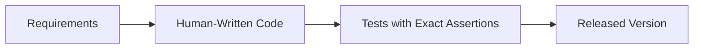
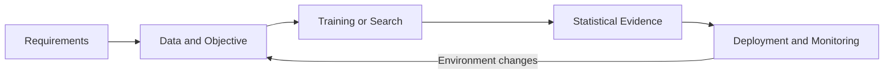
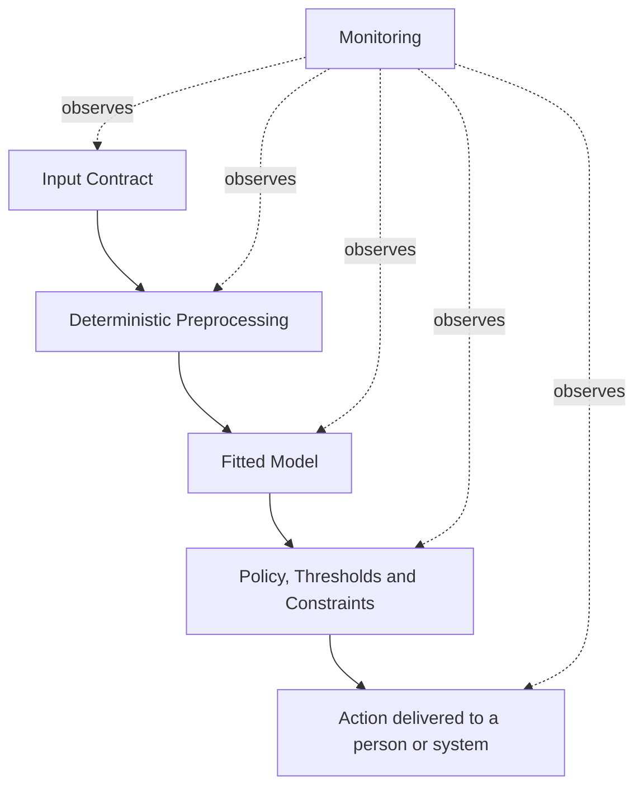
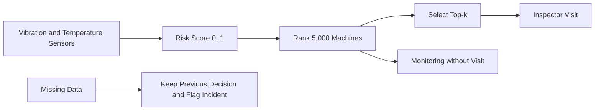

# 1.1. AI-Based Software Requirements

## Learning Objectives

Este apartado explica por qué los requisitos de un sistema basado en IA no pueden limitarse a frases como «el modelo debe ser preciso» o «la predicción debe ser buena». Un sistema de IA debe transformarse en un **contrato verificable** que especifique:

- sobre qué población y ventana temporal opera;
- qué entrada recibe y qué decisión observable produce;
- con qué **Metric**, **Decision Threshold** y **Evaluation Dataset** se acepta;
- qué costes y restricciones operativas debe respetar;
- cuándo caduca la **Validation Evidence**;
- qué **Fallback** se activa cuando el sistema deja de ser fiable;
- quién es responsable de aprobarlo y operarlo.

La idea central es que **el modelo es solo una parte del sistema**. El producto real incluye **Data**, **Preprocessing**, **Decision Policy**, infraestructura, personas, **Monitoring** y procedimientos de contingencia.

---

## Key terminology

| English term | Acronym | Significado en este tema |
| --- | --- | --- |
| Artificial Intelligence | **AI** | Sistemas que realizan tareas asociadas con percepción, razonamiento, aprendizaje u optimización |
| Machine Learning | **ML** | Subcampo de AI en el que el comportamiento se ajusta a partir de datos |
| Requirement | - | Condición verificable que el sistema debe cumplir |
| Verification | - | Comprobación de que el sistema se construyó conforme a su especificación |
| Validation | - | Comprobación de que el sistema resuelve el problema real para el que fue diseñado |
| Dataset | - | Colección estructurada de ejemplos utilizada para entrenar o evaluar |
| Feature | - | Variable de entrada que utiliza el modelo |
| Label | - | Resultado correcto o variable objetivo asociada a un ejemplo |
| Training / Validation / Test Split | - | Separación de datos para ajustar, seleccionar y evaluar el modelo sin reutilizar la misma evidencia |
| Fitted Model | - | Modelo cuyos parámetros ya han sido aprendidos a partir de datos |
| Inference | - | Ejecución del modelo entrenado para producir una predicción |
| Baseline | - | Sistema existente o referencia mínima que un candidato debe superar |
| Decision Threshold | - | Valor que convierte una puntuación continua en una decisión discreta |
| Monitoring | - | Observación continua de entradas, salidas, rendimiento y degradación |
| Evidence Expiry | - | Condición bajo la que la validación histórica deja de considerarse vigente |
| Fallback | - | Comportamiento alternativo seguro cuando el flujo principal no puede utilizarse |
| Service-Level Agreement | **SLA** | Compromiso medible de servicio, por ejemplo una latencia máxima |
| Chief Operating Officer | **COO** | Responsable ejecutivo de operaciones y propietario de determinadas decisiones de negocio |
| Floating-Point 32 / 16-bit | **FP32 / FP16** | Formatos numéricos de 32 y 16 bits utilizados para almacenar parámetros y ejecutar cálculos |
| 8-bit Integer | **INT8** | Formato entero de 8 bits habitual en modelos cuantizados para reducir memoria y latencia |

## 1. Traditional Software vs. Data-Driven Software

### 1.1. Software 1.0

En el software tradicional, una persona escribe explícitamente las reglas que transforman entradas en salidas. Cuando el programa recibe una entrada concreta, se puede seguir el flujo de control y comprobar una condición exacta.

La lógica permanece estable hasta que se modifica el código. Los fallos suelen manifestarse de forma visible: una excepción, un bloqueo o una salida claramente inválida.

### 1.2. Software 2.0

En un sistema basado en IA, parte de la lógica se obtiene ajustando parámetros a partir de datos o buscando una solución que optimice un objetivo.

La salida ya no depende únicamente del código fuente. También depende de:

- la instantánea de datos utilizada;
- los **Labels** y su calidad;
- el **Training / Validation / Test Split**;
- las transformaciones aplicadas;
- los **Learned Weights**;
- la semilla y el entorno de ejecución;
- la población real sobre la que se despliega.

Por eso, la verificación pasa de «esta entrada siempre produce exactamente esta salida» a «sobre esta población y este periodo, el sistema alcanza una calidad mínima con un nivel de evidencia aceptable».

### 1.3. Verification Gap

El espacio de entradas reales suele ser demasiado grande para probarlo exhaustivamente. Una imagen RGB de $224 \times 224$ píxeles puede adoptar:

\[
256^{224 \cdot 224 \cdot 3}
\]

combinaciones distintas. Un conjunto de prueba de decenas de miles de imágenes cubre una fracción despreciable de ese espacio.

La **Verification Gap** es la parte del espacio de entradas que no queda cubierta por las pruebas. Por tanto:

\[
\text{Brecha de verificación}
=
\text{espacio total de entradas}
-
\text{cobertura del conjunto de prueba}
\]

No se puede garantizar el comportamiento para todas las entradas posibles. La ingeniería sustituye esa garantía imposible por:

1. evidencia estadística acotada;
2. límites físicos y operativos;
3. **Continuous Monitoring**;
4. condiciones explícitas de caducidad;
5. mecanismos de **Safe Fallback**.

---

## 2. Abstraction Stack and Requirement Allocation

Un error frecuente consiste en atribuir al modelo propiedades que pertenecen al componente completo o al sistema sociotécnico.

| Layer | Responsabilidad típica | Ejemplo de requirement |
| --- | --- | --- |
| Input Contract | Esquema, tipos, rango, frescura | «La vibración se recibe en mm/s y tiene menos de 24 horas» |
| Preprocessing | Transformaciones reproducibles | «La *rolling mean* usa exactamente los últimos 30 días» |
| Fitted Model | Producción de *scores* o predicciones | «Devuelve un *risk score* entre 0 y 1» |
| Policy / Rules | *Decision threshold*, *ranking* y restricciones | «Se seleccionan como máximo 100 máquinas» |
| Action | Comportamiento observable | «La orden de inspección se publica antes del lunes a las 08:00» |
| Monitoring | Detección de degradación | «Si PSI supera 0,20 se invalida la evidencia» |
| Governance | Autoridad, aprobación y respuesta | «El COO aprueba el cambio de *threshold*» |

Decir «el modelo inspecciona máquinas» es incorrecto: el modelo produce un **Risk Score**; la **Decision Policy** selecciona máquinas; y una persona realiza la inspección.

---

## 3. Eight-Class Requirement Taxonomy

El material propone ocho clases que deben revisarse como mínimo.

| Clase | Pregunta principal | Elementos verificables |
| --- | --- | --- |
| 1. Functional | ¿Qué hace el sistema? | Input, output, decisión y action observables |
| 2. Data / Input | ¿Sobre qué información opera? | Population, schema, freshness, provenance, rights y labeling |
| 3. Predictive Quality | ¿Cómo se mide la utilidad? | Named metric, threshold y evaluation dataset |
| 4. Performance / Resource | ¿Cabe y responde a tiempo? | Latency, throughput, memory, energy y human capacity |
| 5. Reliability / Safety | ¿Cómo falla? | Failure behavior, limits, fallback y safe degradation |
| 6. Security / Privacy | ¿Quién accede y qué daños son posibles? | Access control, misuse, personal data y threats |
| 7. Explainability / Governance | ¿Quién puede entender y aprobar? | Explanations, audit, ownership y traceability |
| 8. Maintainability / Reproducibility | ¿Puede repetirse y actualizarse? | Versions, seeds, data, weights y retraining path |

Un requisito aislado rara vez es suficiente. Por ejemplo, aumentar el *recall* puede incrementar las revisiones humanas, afectar la latencia o exigir más memoria. El contrato debe cubrir el sistema completo.

---

## 4. Case Study: Predictive Maintenance

El documento complementario **B1_1_the_case** fija todos los datos del ejemplo utilizado en el apartado 1.1.

### 4.1. Contexto

| Magnitud | Valor |
| --- | ---: |
| Máquinas activas | 5.000 |
| Fallos no planificados por semana | 46 |
| Failure Base Rate | $46/5000 = 0,0092 = 0,92\%$ |
| Coste de inspeccionar una máquina sana | 2,10 € |
| Coste de no detectar un fallo | 480 € |
| Capacidad del equipo | 100 visitas por semana |

Cada máquina transmite diariamente vibración y temperatura de rodamientos. Todos los lunes se asigna a cada máquina una puntuación de riesgo, se ordenan las 5.000 puntuaciones y se visitan las $k$ máquinas con mayor riesgo.

### 4.2. Stakeholders and Responsibilities

| Actor | Responsabilidad |
| --- | --- |
| Maintenance Engineer | Aplica la **Hand-Written Rule** actual; constituye la **Baseline** que el sistema debe superar |
| Inspector | Visita las máquinas; su tiempo determina el coste de las falsas alarmas y la capacidad máxima |
| Chief Operating Officer (COO) | Asume el coste de las paradas y aprueba o rechaza el sistema |

### 4.3. False Positives vs. False Negatives

- **False Positive (FP):** se visita una máquina que no iba a fallar. Coste: 2,10 €.
- **False Negative (FN):** una máquina que iba a fallar no recibe visita. Coste: 480 €.

Un falso negativo cuesta aproximadamente:

\[
\frac{480}{2,10} \approx 228,57
\]

veces más que un falso positivo. Tratar ambos errores como equivalentes conduce a decisiones económicas incorrectas.

El coste semanal es:

\[
C = 2,10 \cdot FP + 480 \cdot FN
\]

---

## 5. Functional Requirements, Data Contracts and Evidence Expiry

### 5.1. Complete Functional Requirement

Una formulación verificable sería:

> Cada semana, el sistema puntuará todas las máquinas activas. La **Decision Policy** seleccionará como máximo las 100 máquinas con mayor riesgo para inspección. Si faltan datos de una máquina, activará el **Fallback**: conservará la decisión de la semana anterior y marcará la incidencia.

El **Risk Score** no es la **Action**. El **Requirement** debe incluir la **Decision Rule** que conecta ambos.

### 5.2. Population and Label Contract

| Elemento | Formulación comprobable |
| --- | --- |
| Population | Máquinas físicas activas y con transmisión durante los últimos 90 días |
| Unit of Analysis | Una máquina durante una semana |
| Input Window | Telemetría disponible antes de la decisión del lunes |
| Positive Label | Parada no planificada durante los 7 días posteriores |
| Exclusions | Máquinas retiradas, sin historial suficiente o fuera de servicio |

Sin estas definiciones, dos equipos pueden calcular métricas sobre poblaciones distintas y obtener resultados que no son comparables.

### 5.3. Evidence Expiry

La **Validation Evidence** no dura para siempre. Si cambia la distribución de entrada, la relación entre entrada y fallo o el proceso de negocio, las **Historical Metrics** dejan de justificar el comportamiento actual.

Ejemplo de regla:

> La **Validation Evidence** caduca cuando el **Population Stability Index (PSI)** supera 0,20. Al caducar, el sistema activa el **Fallback**, conserva la última decisión válida, marca las salidas afectadas y solicita una nueva **Validation**.

El **Decision Threshold** debe quedar fijado por contrato. No basta con decir «si hay mucho **Drift**».

---

## 6. Confusion Matrix and Evaluation Metrics

### 6.1. Confusion Matrix

|  | Predice fallo | Predice ausencia de fallo |
| --- | ---: | ---: |
| Fallo real | **True Positive (TP):** fallo detectado | **False Negative (FN):** fallo omitido |
| Sin fallo real | **False Positive (FP):** falsa alarma | **True Negative (TN):** descarte correcto |

El número total de casos es:

\[
n = TP + FP + FN + TN
\]

### 6.2. Core Evaluation Metrics

\[
\text{Accuracy} = \frac{TP + TN}{n}
\]

\[
\text{Precision} = \frac{TP}{TP + FP}
\]

\[
\text{Recall} = \frac{TP}{TP + FN}
\]

\[
F_1 = 2 \cdot \frac{\text{Precision} \cdot \text{Recall}}
{\text{Precision} + \text{Recall}}
\]

- **Accuracy** responde: «¿En qué proporción total acertamos?».
- **Precision** responde: «De las alarmas generadas, ¿cuántas eran reales?».
- **Recall** responde: «De los fallos reales, ¿cuántos detectamos?».
- **F1** resume precision y recall mediante su media armónica.

### 6.3. Why Accuracy Fails on Rare Events

Un componente que siempre responde «no habrá fallo» produce:

| TP | FP | FN | TN |
| ---: | ---: | ---: | ---: |
| 0 | 0 | 46 | 4.954 |

Su accuracy es:

\[
\frac{0 + 4954}{5000} = 0,9908 = 99,08\%
\]

Sin embargo, omite todos los fallos y cuesta:

\[
46 \cdot 480 = 22.080\text{ € por semana}
\]

El 99,08 % se obtiene únicamente porque la clase negativa es mayoritaria. No demuestra que el componente aporte valor.

### 6.4. Metric Admissibility Test

Antes de convertir una **Metric** en **Requirement**:

1. se ejecuta el componente trivial que no hace nada sobre los mismos datos;
2. se calcula la **Metric**;
3. solo se admite si ese componente obtiene una puntuación claramente mala.

| Métrica | Resultado del sistema trivial | Valor como requisito aislado |
| --- | ---: | --- |
| Accuracy | 0,9908 | Rechazada: recompensa no actuar |
| Precision | Indefinida (0/0) | Nunca debe exigirse sola |
| Recall | 0 | Admisible |
| F1 | 0 | Admisible |

La precision debe acompañarse de recall: un sistema puede aumentar artificialmente la precision generando muy pocas alarmas.

---

## 7. Baselines, Candidates and Economic Decision

### 7.1. Hand-Written Rule Baseline

La **Hand-Written Rule** inicial marca una máquina si presenta vibración alta durante tres días o picos de temperatura en rodamientos.

| Componente | TP | FP | FN | TN | Accuracy | F1 | Coste semanal |
| --- | ---: | ---: | ---: | ---: | ---: | ---: | ---: |
| No hacer nada | 0 | 0 | 46 | 4.954 | 0,9908 | 0 | 22.080,00 € |
| Regla manual | 22 | 95 | 24 | 4.859 | 0,9762 | 0,2699 | 11.719,50 € |

Aunque tiene peor **Accuracy**, la **Hand-Written Rule** reduce el coste semanal en:

\[
22.080 - 11.719,50 = 10.360,50\text{ €}
\]

La **Baseline** de un nuevo modelo no debe ser cero: debe ser la regla existente que ya utiliza la organización.

### 7.2. Candidate Comparison

| Candidato | TP | FP | FN | TN | F1 | Coste semanal | Revisiones |
| --- | ---: | ---: | ---: | ---: | ---: | ---: | ---: |
| A | 40 | 40 | 6 | 4.914 | 0,6349 | 2.964,00 € | 80 |
| B | 45 | 300 | 1 | 4.654 | 0,2302 | 1.110,00 € | 345 |

F1 prefiere A, mientras que el coste económico prefiere B. No existe una elección universal: el requisito debe declarar qué criterio decide.

Además, B excede la capacidad de 100 visitas semanales. Es económicamente atractivo sobre el papel, pero operacionalmente inviable. Entre los puntos mostrados, A es la mejor alternativa factible.

### 7.3. Decision Threshold Selection

Cambiar el **Decision Threshold** modifica simultáneamente FP, FN y $k$. El valor óptimo minimiza el coste sujeto a las restricciones:

\[
\min_k\; 2,10 \cdot FP(k) + 480 \cdot FN(k)
\]

sujeto a:

\[
k \leq 100
\]

No debe elegirse el **Decision Threshold** únicamente para eliminar todos los FN. A partir de cierto punto, cada nueva inspección cuesta más que el fallo adicional que evita.

!!! warning "Inconsistencia detectada en las diapositivas"
    La diapositiva 13 muestra 1.645,50 € para $k=600$, mientras que la recapitulación indica $TP=46$, $FP=554$ y $FN=0$. Aplicando la fórmula declarada, el coste correcto de esas cuentas es $554 \cdot 2,10 = 1.163,40$ €. La conclusión general no cambia: $k=345$ es el mínimo económico mostrado, pero no es viable con una capacidad de 100 visitas.

---

## 8. Performance and Deployment Requirements

### 8.1. Inference Latency

El tiempo de ejecución puede aproximarse como:

\[
T = \frac{D_{vol}}{BW}
+
\frac{O}{R_{peak}\eta_{hw}}
+
L_{lat}
\]

donde:

- $D_{vol}$ es el volumen de datos movidos;
- $BW$ es el ancho de banda de memoria;
- $O$ es el número de operaciones;
- $R_{peak}$ es el rendimiento máximo de cómputo;
- $\eta_{hw}$ es la eficiencia real del hardware;
- $L_{lat}$ agrupa latencias adicionales.

Un modelo puede estar limitado por cómputo o por movimiento de memoria. Comprar una GPU con más operaciones por segundo no resuelve necesariamente un cuello de botella de ancho de banda.

### 8.2. Model Memory Footprint

Si un modelo tiene $P$ parámetros y cada parámetro utiliza $b$ bits:

\[
M_{modelo} = P \cdot \frac{b}{8}
\]

Para 25 millones de parámetros:

- FP32: $25.000.000 \cdot 4 = 100$ MB;
- FP16: aproximadamente 50 MB;
- INT8: $25.000.000 \cdot 1 = 25$ MB.

La **Quantization** reduce memoria, pero puede degradar la calidad predictiva. Después de cuantizar es obligatorio volver a ejecutar la **Validation** de las **Metrics**.

### 8.3. Hard Acceptance Gates

| Puerta | Servidor edge | Dispositivo TinyML |
| --- | ---: | ---: |
| Memoria | 51,2 MB: cumple | 3,5 MB: cumple |
| Latencia | 12 ms: cumple SLA < 100 ms | 150 ms: no cumple |
| Recall | 94 %: cumple objetivo ≥ 90 % | 88 %: no cumple |
| Veredicto | Aprobado | Rechazado |

Cumplir la memoria no basta. Todas las puertas críticas deben satisfacerse simultáneamente.

---

## 9. Verifiable Engineering Requirement Template

> Dada **[Population y Time Window]**, el sistema ejecutará **[Observable Decision]**, alcanzando **[Metric] ≥ [Decision Threshold]** sobre **[Evaluation Dataset]**, mientras mantiene **[Operational, Memory and Latency Constraints]**. Si la evidencia caduca por **[Drift Condition]**, activará **[Fallback Action]**, cuya responsabilidad corresponde a **[Owner]**.

Aplicada al caso:

> Para todas las máquinas físicas activas durante los últimos 90 días, el sistema generará cada lunes una lista de como máximo 100 inspecciones. En evaluación temporal alcanzará $F1 \geq 0,60$, mantendrá un coste semanal inferior a 11.719,50 € y cumplirá el presupuesto de memoria y latencia de la plataforma aprobada. Si el PSI supera 0,20, se invalidará la evidencia, se conservará la última decisión válida debidamente marcada y el COO será notificado para autorizar la revalidación.

Esta formulación permite obtener un resultado **PASS/FAIL**, identifica el ámbito de la evidencia y conecta el comportamiento técnico con la operación real.

---

## 10. Technical Constraints Checklist

- [ ] Se distingue modelo, componente y sistema.
- [ ] Se define la población, la unidad de análisis y la ventana temporal.
- [ ] El **Label** especifica exactamente qué evento y horizonte representa.
- [ ] La **Metric** supera la prueba del sistema trivial.
- [ ] Se incluye la **Baseline** humana o heurística existente.
- [ ] El **Decision Threshold** se elige según costes y restricciones, no solo por una métrica abstracta.
- [ ] Se comprueba la capacidad humana asociada a FP y alertas.
- [ ] Se fijan límites de memoria, latencia, throughput y energía.
- [ ] Se establece cuándo caduca la evidencia.
- [ ] Existe un fallback verificable y un responsable identificado.
- [ ] Se versionan **Data**, **Code**, **Weights**, **Configuration** y **Environment**.

## Source Material

- **B1.1 Engineering_AI_Software_Requirements.pdf**, diapositivas 1-20.
- **B1_1_the_case.pdf**, caso de la planta con 5.000 máquinas, utilizado para contextualizar y comprobar los cálculos del apartado 1.1.
