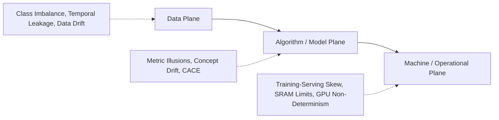
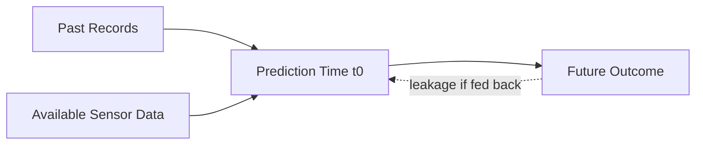
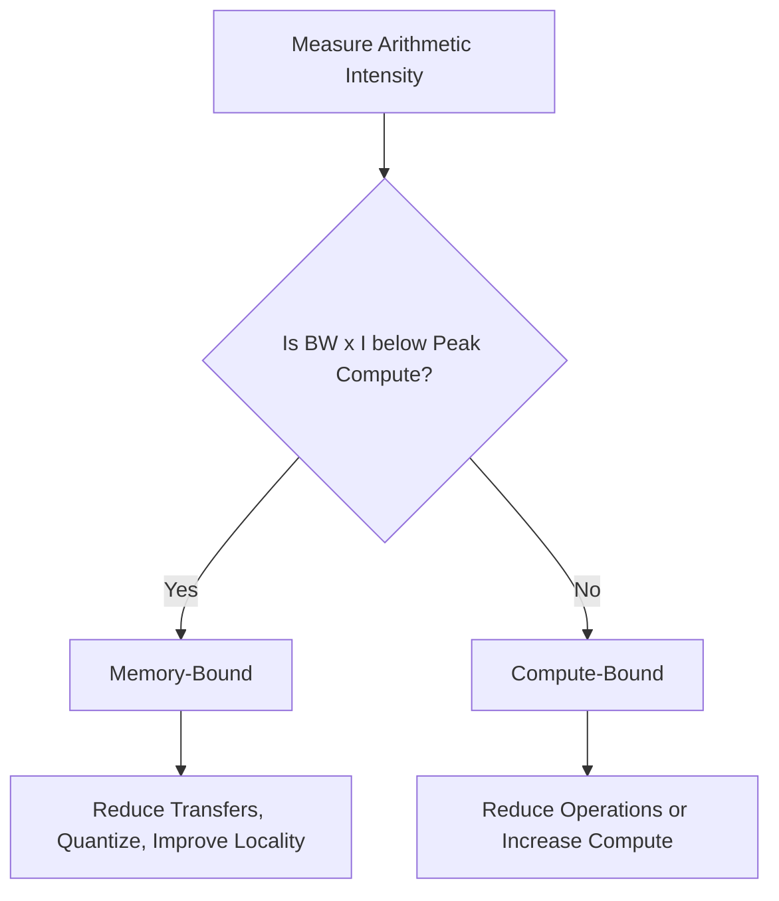
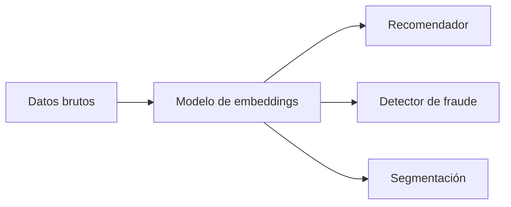
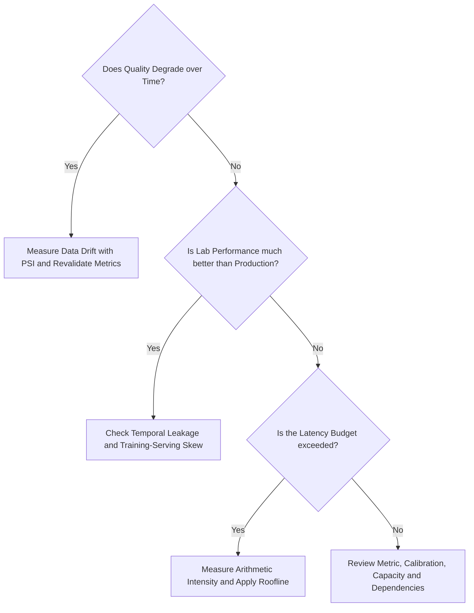

# 1.2. Challenges in Developing AI-Based Applications

## Learning Objectives

Un modelo con buena puntuación en el laboratorio todavía no es un producto desplegable. Los fallos de un sistema de IA pueden originarse en tres planos distintos:

1. **Data:** ingestión, estado y significado de las variables.
2. **Algorithm / Model:** **Objective Function**, ajuste, **Metrics** y dependencias entre modelos.
3. **Machine / Operations:** hardware, integración, latencia, reproducibilidad y escala.

El objetivo es aprender a diagnosticar los fallos por su causa y por el momento del ciclo de vida en el que deben detectarse.

## Key terminology

| English term | Acronym | Significado en este tema |
| --- | --- | --- |
| Data-Algorithm-Machine Failure Autopsy | **D-A-M** | Método que separa las causas de fallo entre datos, lógica del modelo y plataforma física |
| Class Imbalance | - | Distribución en la que una clase tiene muchos más ejemplos que otra |
| Imbalance Ratio | **IR** | Cociente entre el número de ejemplos de la clase mayoritaria y la minoritaria |
| Weighted Cross-Entropy | **WCE** | Loss function que asigna más penalización a los errores de clases escasas o importantes |
| Temporal Leakage | - | Uso durante el training de información que solo existiría después del prediction time |
| Data Drift / Covariate Shift | - | Cambio en la distribución de inputs entre training y production |
| Concept Drift | - | Cambio en la relación entre inputs y la variable objetivo |
| Population Stability Index | **PSI** | Indicador que compara una distribución actual con una baseline |
| Training-Serving Skew | - | Diferencia entre las features calculadas en training y las utilizadas en production |
| Arithmetic Intensity | **AI** | Número de operaciones de coma flotante ejecutadas por byte movido |
| Floating-Point Operations | **FLOPs** | Medida del trabajo numérico realizado por un algoritmo o hardware |
| Static Random-Access Memory | **SRAM** | Memoria rápida y limitada habitual en microcontroladores |
| Changing Anything Changes Everything | **CACE** | Principio que describe cómo un cambio en un modelo puede degradar modelos dependientes |
| Graphics Processing Unit | **GPU** | Procesador paralelo utilizado para ejecutar grandes volúmenes de operaciones numéricas |
| Large Language Model | **LLM** | Modelo de lenguaje de gran escala, normalmente basado en Transformer |
| Feature Store | - | Sistema compartido que define, calcula y sirve features de forma coherente en training y production |
| Canary Deployment | - | Despliegue gradual sobre una pequeña fracción del tráfico para limitar el riesgo |
| Shadow Deployment | - | Ejecución del modelo nuevo en paralelo sin que sus salidas controlen todavía el sistema |

!!! note "Acrónimo contextual"
    En este apartado, **AI** puede significar *Artificial Intelligence* o *Arithmetic Intensity*. El contexto permite distinguirlos; cuando se hable de rendimiento de hardware se usará *Arithmetic Intensity* explícitamente.

---

## 1. D-A-M Failure Autopsy

| Plano | Pregunta diagnóstica | Fallos representativos |
| --- | --- | --- |
| Data Plane | ¿La información representa correctamente la realidad y está disponible a tiempo? | Class Imbalance, Temporal Leakage, Data Drift |
| Algorithm / Model Plane | ¿El objective y la metric reflejan el problema real? | Metric Illusions, Concept Drift, CACE cascades |
| Machine / Operational Plane | ¿El sistema entrenado puede ejecutarse de forma equivalente y dentro de límites físicos? | Training-Serving Skew, SRAM Limits, GPU Non-Determinism |

Esta clasificación evita buscar todas las soluciones en el modelo. Por ejemplo, aumentar capas no corrige **Label Contamination** causada por información futura, y una mejor **Metric** no hace que el modelo quepa en un microcontrolador.

---

## 2. Class Imbalance and Metric Illusions

### 2.1. Fraud Detection Case

Se observan 10.000 transacciones:

- 9.950 legítimas;
- 50 fraudulentas;
- clase positiva: fraude.

El **Imbalance Ratio (IR)** es:

\[
IR = \frac{N_{majority}}{N_{minority}}
= \frac{9950}{50} = 199
\]

Un sistema trivial que clasifica todo como legítimo obtiene:

|  | Predice fraude | Predice legítima |
| --- | ---: | ---: |
| Fraude real | TP = 0 | FN = 50 |
| Legítima real | FP = 0 | TN = 9.950 |

### 2.2. Global Accuracy vs. Balanced Accuracy

\[
\text{Accuracy} = \frac{TP + TN}{TP + TN + FP + FN}
= \frac{9950}{10000} = 0,995
\]

El resultado aparente es 99,5 %, pero el sistema no detecta ningún fraude.

La **specificity** mide la proporción de negativos correctamente identificados:

\[
\text{Specificity} = \frac{TN}{TN + FP}
\]

La **balanced accuracy** concede el mismo peso a ambas clases:

\[
\text{Balanced Accuracy}
=
\frac{\text{Recall} + \text{Specificity}}{2}
\]

Para el sistema trivial:

\[
\frac{0 + 1}{2} = 0,5
\]

La puntuación revela que su capacidad real equivale a la referencia más básica, no a un sistema fiable.

### 2.3. Metric Selection

| Métrica | Fórmula | Sistema trivial | Interpretación |
| --- | --- | ---: | --- |
| Accuracy | $(TP+TN)/n$ | 0,995 | Engañosa con **Severe Class Imbalance** |
| Precision | $TP/(TP+FP)$ | Indefinida | Debe combinarse con recall |
| Recall | $TP/(TP+FN)$ | 0 | Detecta que se omiten todos los positivos |
| Specificity | $TN/(TN+FP)$ | 1 | Solo evalúa la clase negativa |
| F1 | Media armónica de precision y recall | 0 | Ignora TN y penaliza omitir positivos |
| Balanced accuracy | Media de recall y specificity | 0,5 | Equilibra el peso de las clases |

!!! note "Regla práctica"
    Una **Candidate Metric** debe calcularse también para el **Do-Nothing System**. Si ese sistema obtiene una puntuación excelente, la métrica no es adecuada como criterio principal.

---

## 3. Weighted Cross-Entropy for Class Imbalance

### 3.1. Binary Cross-Entropy (BCE)

Para un **Label** $y \in \{0,1\}$ y una probabilidad estimada $\hat{y} \in [0,1]$:

\[
L = -\left[y\log(\hat{y}) + (1-y)\log(1-\hat{y})\right]
\]

Con muchas más observaciones legítimas, la **Majority Class** domina la **Loss Function**. El modelo puede minimizarla aprendiendo a favorecer sistemáticamente la **Negative Class**.

### 3.2. Weighted Binary Cross-Entropy

\[
L = -\left[w_1 y\log(\hat{y}) + w_0(1-y)\log(1-\hat{y})\right]
\]

Una forma de calcular los **Class Weights** es:

\[
w_j = \frac{N}{C \cdot N_j}
\]

donde $N$ es el número total de observaciones, $C$ el número de clases y $N_j$ el número de observaciones de la clase $j$.

En el ejemplo:

\[
w_1 = \frac{10000}{2 \cdot 50} = 100
\]

\[
w_0 = \frac{10000}{2 \cdot 9950} \approx 0,5025
\]

La relación $w_1/w_0 \approx 199$ coincide con el **Imbalance Ratio**. Un error sobre un fraude genera un **Gradient** aproximadamente 199 veces mayor que un error sobre una transacción legítima.

### 3.3. Capabilities and Limitations

La ponderación cambia la geometría de optimización, pero no crea información nueva. Puede ayudar a que el modelo atienda a la clase minoritaria, aunque también puede:

- elevar los falsos positivos;
- amplificar **Label Noise** en la **Minority Class**;
- producir probabilidades mal calibradas;
- requerir un nuevo ajuste del **Decision Threshold**.

Por eso deben evaluarse tanto la discriminación como la calibración y el coste operativo.

---

## 4. Temporal Leakage

Existe **Temporal Leakage** cuando el **training** utiliza una variable que no estaría disponible en el **prediction time** real.

Ejemplo: se quiere predecir si una máquina se detendrá durante los próximos siete días. Son válidos:

- telemetría histórica;
- registros anteriores;
- datos de sensores disponibles antes de $t_0$.

No es válido usar el tiempo medio de reparación calculado después de producirse el fallo, porque requiere conocer el futuro.

Si se mezclan aleatoriamente filas de diferentes fechas, una variable futura puede aparecer tanto en **Training** como en **Test**. El modelo parece alcanzar un F1 extraordinario en laboratorio, pero falla en **Production**.

### Prevention

1. documentar qué significa cada columna;
2. registrar cuándo se conoce realmente;
3. aplicar un **Time-Based Training / Validation / Test Split**;
4. simular el estado exacto de los datos en el instante de decisión;
5. revisar las transformaciones agregadas, porque también pueden incorporar futuro.

---

## 5. Data Drift and Concept Drift

### 5.1. Data Drift or Covariate Shift

La distribución de las entradas cambia:

\[
P(X_{live}) \neq P(X_{train})
\]

mientras que la relación entre entrada y objetivo puede mantenerse:

\[
P(Y \mid X)_{live} = P(Y \mid X)_{train}
\]

Ejemplo: un sensor envejece y empieza a producir voltajes con una distribución distinta, aunque la relación física entre vibración y avería no haya cambiado.

### 5.2. Concept Drift

Cambia la relación condicional:

\[
P(Y \mid X)_{live} \neq P(Y \mid X)_{train}
\]

Ejemplo: una modificación del proceso de fabricación hace que una misma vibración deje de indicar el mismo riesgo de fallo.

### 5.3. Operational Difference

| Señal | Data drift | Concept drift |
| --- | --- | --- |
| Distribución de entrada | Cambia | Puede no cambiar |
| **Metrics** con **Recent Labels** | Pueden degradarse | Se degradan |
| PSI sobre entradas | Puede detectarlo | Puede permanecer estable |
| Typical Action | Investigar el input, recalibrar o ejecutar **Retraining** | Obtener **New Labels** y reaprender la relación |

Un PSI estable no demuestra ausencia de **Concept Drift**. Para detectarlo hacen falta **Recent Labels** y **Outcome Metrics**.

---

## 6. Population Stability Index (PSI)

El PSI compara la proporción de observaciones que cae en cada intervalo antes y después del despliegue:

\[
PSI = \sum_{i=1}^{B}(A_i-E_i)\ln\left(\frac{A_i}{E_i}\right)
\]

donde:

- $E_i$: proporción esperada o de referencia en el intervalo $i$;
- $A_i$: proporción actual en **Production**;
- $B$: número de intervalos.

### Worked Example

| Intervalo | Esperado $E$ | Actual $A$ | Componente mostrado |
| --- | ---: | ---: | ---: |
| 1 | 0,50 | 0,30 | 0,1022 |
| 2 | 0,30 | 0,20 | 0,0405 |
| 3 | 0,20 | 0,50 | 0,2749 |

La suma directa de los componentes mostrados es:

\[
0,1022 + 0,0405 + 0,2749 = 0,4176
\]

Los **Conventional Thresholds** incluidos en el material son:

| PSI | Interpretación orientativa |
| ---: | --- |
| (< 0,10) | Población estable |
| $0,10 \leq PSI < 0,25$ | Cambio moderado; investigar y monitorizar |
| $PSI \geq 0,25$ | Cambio crítico; ejecutar **Revalidation** y valorar **Retraining** |

!!! warning "Dos matices importantes"
    La diapositiva de cálculo muestra un resultado final de 0,4410, pero los tres componentes visibles suman 0,4176. Ambos superan 0,25, por lo que la decisión cualitativa no cambia. Además, 0,10 y 0,25 son convenciones, no leyes universales: el **System Requirement** debe fijar sus propios **Thresholds**, **Bins**, **Reference Population** y respuesta.

El PSI tampoco indica por qué cambió una variable ni si el cambio perjudica al modelo. Es una alarma, no un diagnóstico completo.

---

## 7. Training-Serving Skew

Hay **Training-Serving Skew** cuando el cálculo de **Features** durante **Training** difiere del utilizado en **Production**.

Ejemplo:

- laboratorio: Pandas calcula de forma instantánea una media móvil exacta de 30 días sobre un CSV completo;
- **Production:** un servicio en tiempo real recibe eventos individuales, maneja retrasos y quizá no conserva 30 días de estado.

Aunque ambas variables se llamen `rolling_mean_30d`, no representan necesariamente lo mismo.

### Mitigation

- compartir el mismo código de transformación;
- utilizar un **Feature Store** común;
- versionar definiciones y ventanas;
- ejecutar pruebas de paridad con datos reales;
- definir fallbacks cuando falta historial;
- medir diferencias entre **Offline Features** y **Online Features**.

Las pruebas unitarias pueden aprobar y aun así existir skew, porque cada implementación puede ser internamente correcta pero semánticamente distinta.

---

## 8. Hardware Physics and Performance Sizing

### 8.1. Arithmetic Intensity

\[
I = \frac{\text{FLOPs}}{\text{bytes movidos}}
\]

- Un valor alto indica una carga **compute-bound**: el límite está en las unidades de cálculo.
- Un valor bajo indica una carga **Memory-Bound**: el límite está en mover **Weights** y **Activations** desde memoria.

Las **Convolutional Neural Networks (CNNs)** densas suelen aprovechar más cómputo; la generación token a token de un **Large Language Model (LLM)** puede quedar limitada por ancho de banda de memoria.

### 8.2. Roofline Model

El rendimiento alcanzable se limita por el menor de dos techos:

\[
R_{alcanzable} = \min(R_{pico}, BW \cdot I)
\]

### 8.3. Deployment Scale Limits

| Plataforma | Orden de cómputo | Memoria aproximada | Potencia |
| --- | --- | --- | --- |
| Cloud ML | TeraFLOPs | 80 GB o más | Más de 300 W |
| Servidor edge | GigaFLOPs | 16-32 GB | Aproximadamente 50 W |
| Mobile ML | GigaFLOPs | 2-4 GB compartidos | Menos de 5 W |
| TinyML | MegaFLOPs | Menos de 256 KB SRAM | Milivatios |

**Pruning** y **Quantization** no son simples optimizaciones opcionales cuando el destino es **Tiny Machine Learning (TinyML)**: forman parte de los requisitos de viabilidad.

---

## 9. GPU Non-Determinism

En números reales, la suma es asociativa; en coma flotante, el redondeo hace que el orden importe:

\[
\operatorname{Float32}((a+b)+c)
\neq
\operatorname{Float32}(a+(b+c))
\]

Una **Graphics Processing Unit (GPU)** distribuye reducciones y sumas entre miles de hilos cuyo orden puede variar. Incluso con los mismos datos y **Random Seed**, dos ejecuciones de **Training** pueden producir **Weights** binariamente distintos.

### Engineering Consequences

- pequeñas diferencias pueden acumularse durante **Training**;
- repetir exactamente un experimento puede ser costoso o imposible;
- una semilla fija es necesaria, pero no siempre suficiente;
- la reproducibilidad debe definirse mediante tolerancias y artefactos versionados.

En **Production** debe registrarse el modelo exacto que se despliega, incluyendo el **Weights Hash**, no solo el script que podría ejecutar de nuevo el **Training**.

---

## 10. CACE: Changing Anything Changes Everything

Los modelos suelen consumir salidas de otros modelos. Si cambia un modelo situado aguas arriba, cambia la distribución de entrada de todos sus consumidores.

Actualizar el **Embedding Model** puede mejorar su **Local Metric** y, al mismo tiempo, destruir la **Calibration** del recomendador o del detector de fraude.

### Required Controls

- registro de dependencias entre modelos;
- versionado de contratos de salida;
- pruebas de integración y regresión aguas abajo;
- **Canary Deployment** o **Shadow Deployment**;
- posibilidad de rollback coordinado;
- propietario responsable de aprobar el cambio sistémico.

---

## 11. Regulatory Boundaries

El material resume una pirámide de riesgo inspirada en el Reglamento Europeo de IA:

| Nivel | Ejemplos del material | Consecuencia general |
| --- | --- | --- |
| Inaceptable | *Social scoring*, determinadas vigilancias biométricas | Uso prohibido o fuertemente restringido |
| High Risk | Dispositivos médicos, infraestructura crítica, empleo | **Human Oversight**, registros, **Risk Management** y **Monitoring** |
| Riesgo limitado | Chatbots y *deepfakes* | Obligaciones de transparencia |
| Riesgo mínimo | Filtros de spam o IA en videojuegos | Obligaciones menores |

!!! note
    Esta tabla sirve como mapa conceptual del material docente, no como asesoramiento jurídico. La clasificación real depende del uso previsto, el contexto, las excepciones y la normativa vigente.

---

## 12. Nine Failure Causes Across Build, Deploy and Operate

| Momento | Causa | Plano | Comprobación mínima |
| --- | --- | --- | --- |
| Build | Class Imbalance | Data | Contar clases y calcular IR |
| Build | Metric Illusions | Algorithm | Evaluar el *do-nothing system* |
| Build | Temporal Leakage | Data | Auditar significado y disponibilidad temporal; usar *time-based split* |
| Build | SRAM Limits | Machine | Calcular memory footprint y compararlo con el dispositivo |
| Deploy | Training-Serving Skew | Machine / Integration | Reutilizar transformación o Feature Store |
| Deploy | GPU Non-Determinism | Machine | Registrar los weights exactos publicados |
| Deploy | CACE | Algorithm / System | Registrar dependencias y revalidar consumidores |
| Operate | Data Drift | Data | Monitorizar PSI y distribuciones |
| Operate | Concept Drift | Algorithm | Medir performance con labels recientes |

---

## 13. ML Diagnostic Tree

Este árbol no sustituye el análisis causal, pero evita tres errores comunes:

- reentrenar automáticamente cuando el problema está en la integración;
- comprar hardware cuando el cuello de botella es memoria;
- celebrar una accuracy alta cuando la clase importante nunca se detecta.

## Source Material

- **B1.2 Challenges in Developing AI Based Applications.pdf**, diapositivas 1-20.
- Los ejemplos de máquinas y los conceptos de coste y métrica enlazan con **B1.1 Engineering_AI_Software_Requirements.pdf**.
