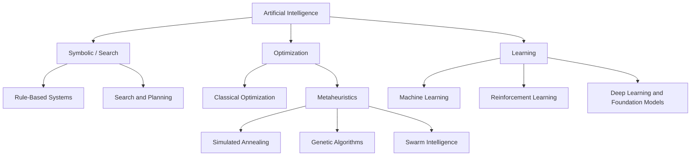
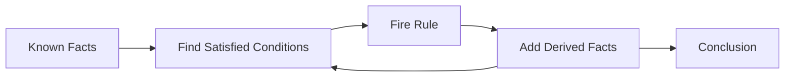
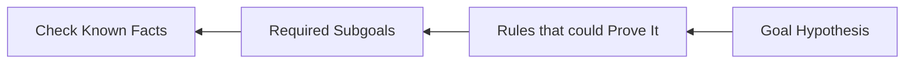
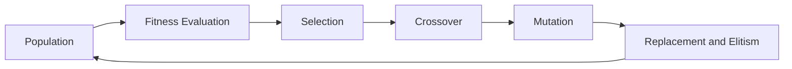
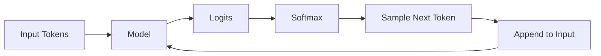

# 1.3. AI Families

## Learning Objectives

La inteligencia artificial no es una técnica única. Distintas familias representan el conocimiento, buscan soluciones y aprenden de formas diferentes. Elegir una arquitectura adecuada exige identificar:

- qué información entra en el sistema;
- qué forma tiene una solución;
- si existe una **Objective Function**;
- si hay **Labels** o **Rewards**;
- qué garantías se necesitan;
- qué límites de tiempo, memoria y explicabilidad existen.

La regla fundamental es: **no se debe forzar Deep Learning en todos los problemas; se debe hacer coincidir la estructura matemática del problema con las restricciones del sistema**.

---

## Key terminology

| English term | Acronym | Significado en este tema |
| --- | --- | --- |
| Artificial Intelligence | **AI** | Campo que reúne técnicas simbólicas, de búsqueda, optimización y aprendizaje |
| Machine Learning | **ML** | Familia que aprende parámetros o patrones a partir de datos |
| Reinforcement Learning | **RL** | Aprendizaje basado en interacción, actions y rewards acumuladas |
| Rule-Based System | **RBS** | Sistema que representa conocimiento mediante facts y rules explícitas |
| Inference Engine | - | Componente que decide qué reglas pueden aplicarse y deriva conclusiones |
| Search Space / State Space | - | Conjunto de estados o soluciones que un algoritmo puede explorar |
| Heuristic | - | Estimación que guía la búsqueda hacia estados prometedores |
| Objective Function | - | Función matemática que se intenta minimizar o maximizar |
| Metaheuristic | - | Estrategia general de búsqueda aproximada sin garantía de óptimo |
| Multilayer Perceptron | **MLP** | Neural Network formada por capas densamente conectadas |
| Convolutional Neural Network | **CNN** | Neural Network especializada en datos espaciales, especialmente imágenes |
| Particle Swarm Optimization | **PSO** | Metaheuristic inspirada en el movimiento colectivo de partículas |
| Ant Colony Optimization | **ACO** | Metaheuristic inspirada en rastros de feromonas sobre grafos |
| Upper Bound | **UB** | Cota máxima optimista utilizada para decidir si una rama puede podarse |
| Temporal-Difference Error | **TD Error** | Diferencia entre el valor estimado y el objetivo actualizado en RL |
| Foundation Model | - | Modelo de gran escala preentrenado que puede adaptarse a muchas tareas |
| Genetic Algorithm | **GA** | Metaheuristic que evoluciona una población mediante selection, crossover y mutation |
| Rectified Linear Unit | **ReLU** | Activation Function definida como $\max(0,z)$ |
| Adaptive Moment Estimation | **Adam** | Optimizer que adapta cada actualización mediante momentos del gradient |
| Video Random-Access Memory | **VRAM** | Memoria de la GPU utilizada por parameters, activations, gradients y optimizer states |

## 1. Symbolic Software vs. Connectionist Software

### 1.1. Symbolic and Deterministic Approach

El conocimiento se codifica explícitamente mediante **Facts**, **Rules**, **States**, **Operators** o **Constraints**.

\[
\text{Facts} + \text{Logic} \longrightarrow \text{Answers}
\]

Características:

- razonamiento trazable;
- **Rules** verificables;
- posibilidad de garantías exactas en espacios acotados;
- fragilidad frente a casos no previstos;
- elevado coste de capturar manualmente todo el conocimiento.

### 1.2. Connectionist and Data-Driven Approach

Las reglas internas se ajustan mediante **Optimization**:

\[
\text{Data} + \text{Expected Answers}
\longrightarrow
\text{Optimization}
\longrightarrow
\text{Weights}
\]

Características:

- adaptación a patrones complejos y ambiguos;
- escalabilidad a datos de alta dimensión;
- comportamiento estadístico, no lógico absoluto;
- menor explicabilidad directa;
- dependencia de datos representativos y **Monitoring**.

Ambos enfoques pueden combinarse. Por ejemplo, una **Neural Network** reconoce señales visuales y un **Rule Engine** aplica restricciones legales o de seguridad sobre sus resultados.

---

## 2. AI Family Map



| Familia | Entrada típica | Mecanismo | Salida |
| --- | --- | --- | --- |
| Rule-Based Systems | Facts y Rules | Inference Engine | Deductive proof o action |
| Search and Planning | State Space y operators | Pathfinding | Action sequence |
| Classical Optimization | Objective y constraints | Exact mathematical methods | Mathematical optimum bajo ciertos supuestos |
| Metaheuristics | Candidate solutions | Stochastic search | Best approximation encontrada |
| Supervised Learning | Features y Labels | Parameter fitting | Prediction |
| Unsupervised Learning | Features sin Labels | Structure discovery | Clusters o representations |
| Reinforcement Learning | State, Action y Reward | Policy / Value update | Optimal action o policy |
| Deep Learning | High-dimensional data | Neural Networks y Gradient Descent | Learned representations o generated content |

---

## 3. Rule-Based Systems and Expert Engines

Un **Expert System** contiene:

- **Facts**, que describen el estado conocido;
- **Rules**, normalmente `IF condition THEN conclusion`;
- un **Inference Engine**, que decide qué rules ejecutar;
- una **Working Memory** con facts derivados.

### 3.1. Forward Chaining (Data-Driven)

Es **Data-Driven**. Parte de **Known Facts** y aplica **Rules** hasta alcanzar conclusiones.



Ejemplo:

```text
Fact: temperature > 90 °C
Fact: fan = OFF
Rule: IF temperature > 90 °C AND fan = OFF
      THEN activate fan
```

Es apropiado para **Monitoring** y reacción continua.

### 3.2. Backward Chaining (Goal-Driven)

Es dirigido por objetivos. Parte de una hipótesis y busca qué condiciones tendrían que cumplirse.



Es útil en diagnóstico: «¿El paciente tiene la enfermedad X?» conduce a investigar síntomas y pruebas requeridas.

### 3.3. Strengths and Limitations

| Ventajas | Limitaciones |
| --- | --- |
| Explicación explícita | Reglas difíciles de mantener a gran escala |
| Auditoría y cumplimiento | No generaliza a casos no codificados |
| Comportamiento determinista | **Rule Conflicts** |
| Adecuado para restricciones duras | Adquisición manual de conocimiento |

---

## 4. Search and Planning

Un problema de búsqueda define:

- estado inicial;
- acciones disponibles;
- función de transición;
- prueba de objetivo;
- coste de las acciones.

### 4.1. A* and Heuristic Search

El algoritmo A* evalúa cada nodo con:

\[
f(n) = g(n) + h(n)
\]

donde:

- $g(n)$: coste exacto desde el origen hasta $n$;
- $h(n)$: estimación desde $n$ hasta el objetivo;
- $f(n)$: coste total estimado del camino que pasa por $n$.

Para garantizar optimalidad en **Tree Search**, la **Heuristic** debe ser **Admissible**:

\[
0 \leq h(n) \leq h^*(n)
\]

Es decir, nunca debe sobreestimar el coste real restante.

!!! example "Ejemplo de navegación"
    La distancia en línea recta hasta el destino es una **Admissible Heuristic** cuando el coste real es la distancia recorrida por carretera: normalmente no puede ser mayor que la ruta disponible. Una heurística más informativa reduce nodos explorados, pero una sobreestimación puede perder la garantía de encontrar la ruta óptima.

### 4.2. When to Use Search

- planificación de rutas y tareas;
- juegos con estados discretos;
- secuenciación de operaciones;
- resolución de puzles;
- problemas en los que se necesita una secuencia explícita de acciones.

Su limitación principal es la explosión combinatoria del **State Space**.

---

## 5. Classical Continuous Optimization

Se busca minimizar o maximizar una función definida sobre variables continuas.

### 5.1. First-Order Gradient Descent

\[
x_{k+1} = x_k - \eta \nabla f(x_k)
\]

- $\eta$: **Learning Rate** o **Step Size**;
- $\nabla f(x_k)$: **Gradient**, dirección de máxima subida; su negativo indica descenso.

Es barato por iteración y escala a muchos parámetros, pero puede necesitar numerosos pasos. Un $\eta$ demasiado grande provoca oscilación o divergencia; uno demasiado pequeño ralentiza el proceso.

### 5.2. Second-Order Newton-Raphson

\[
x_{k+1}
=
x_k - H_f(x_k)^{-1}\nabla f(x_k)
\]

La matriz Hessiana $H_f$ contiene segundas derivadas y representa la curvatura local. Puede converger en menos pasos cerca del óptimo, pero calcular, almacenar e invertir la Hessiana resulta muy costoso en alta dimensión.

| Método | Información | Coste por paso | Comportamiento típico |
| --- | --- | --- | --- |
| Gradient Descent | Primera derivada | Bajo | Muchos pasos, sensible al Learning Rate $\eta$ |
| Newton | Primera y segunda derivada | Alto | Pasos más informados por la curvatura |

---

## 6. Discrete Optimization and Branch and Bound

Cuando las decisiones son discretas, no siempre se puede aplicar cálculo diferencial. **Branch and Bound** divide el espacio de soluciones y elimina ramas que no pueden superar la mejor solución conocida.

### 6.1. Core Elements

- **Branch:** crear subproblemas tomando decisiones parciales.
- **Bound:** calcular una cota optimista del mejor valor que podría alcanzar una rama.
- **Incumbent:** mejor solución factible encontrada.
- **Prune:** descartar la rama si su cota no supera al incumbent.

Para maximización:

\[
UB \leq V_{incumbent}
\quad \Longrightarrow \quad
\text{Prune Branch}
\]

### 6.2. Worked Example: 0/1 Knapsack

Con capacidad de 7 kg:

| Objeto | Peso | Valor | Valor/peso |
| --- | ---: | ---: | ---: |
| 1 | 2 kg | 40 € | 20,0 |
| 2 | 3 kg | 50 € | 16,7 |
| 3 | 4 kg | 60 € | 15,0 |
| 4 | 5 kg | 70 € | 14,0 |

Una relajación fraccional permite obtener una cota superior, aunque la solución final solo admita objetos completos.

!!! note "Comprobación del ejemplo"
    La combinación de los objetos 1 y 4 pesa exactamente 7 kg y vale 110 €. También los objetos 2 y 3 pesan 7 kg y valen 110 €. Una traza de poda solo es correcta si sus cotas nunca descartan una rama capaz de alcanzar ese valor.

Branch and Bound puede garantizar el óptimo, pero en el peor caso continúa siendo exponencial. Su eficacia depende de la calidad de las cotas y del orden de exploración.

---

## 7. Metaheuristics

Las **Metaheuristics** sacrifican garantías exactas para explorar espacios demasiado grandes o irregulares. Producen soluciones buenas dentro de un **Time Budget**.

### 7.1. Simulated Annealing

Se inspira en el enfriamiento de metales. Al principio acepta movimientos peores para escapar de mínimos locales; con el tiempo se vuelve más conservador.

Si el nuevo estado mejora el objetivo:

\[
P(aceptar)=1
\]

Si empeora en $\Delta E > 0$:

\[
P(aceptar)=e^{-\Delta E/T}
\]

Cuando $T$ es alta, todavía son probables saltos grandes. Cuando $T \to 0$, el algoritmo se aproxima a una búsqueda codiciosa.

### 7.2. Genetic Algorithms (GA)



Componentes:

- representación del individuo;
- función de fitness;
- selección;
- cruce;
- mutación;
- elitismo y criterio de parada.

El coste no está únicamente en evaluar el fitness. Copiar poblaciones y aplicar mutaciones puede dominar el tiempo de ejecución; por eso es necesario perfilar la implementación real.

### 7.3. Particle Swarm Optimization (PSO)

Cada partícula conserva su mejor posición personal y conoce la mejor posición global:

\[
v_i(t+1)
=
w v_i(t)
+ c_1r_1(p_{best}-x_i)
+ c_2r_2(g_{best}-x_i)
\]

\[
x_i(t+1)=x_i(t)+v_i(t+1)
\]

- $w$: inercia;
- $c_1$: influencia de la experiencia individual;
- $c_2$: influencia social;
- $r_1,r_2$: factores aleatorios.

### 7.4. Ant Colony Optimization (ACO)

Las hormigas artificiales refuerzan rutas cortas mediante feromonas:

\[
\tau_{ij}(t+1)
=
(1-\rho)\tau_{ij}(t) + \Delta\tau_{ij}
\]

- $\rho$: evaporación que evita convergencia prematura;
- $\Delta\tau_{ij}$: depósito, normalmente mayor en rutas mejores.

ACO es especialmente natural en rutas, grafos y problemas combinatorios.

---

## 8. Machine Learning Paradigms

### 8.1. Supervised Learning

Entrada: **Features** $X$ y **Labels** $y$.

Objetivo: minimizar la **Prediction Error** sobre **Labeled Examples**.

Ejemplos:

- clasificación de fraude;
- predicción de averías;
- regresión de demanda;
- reconocimiento de imágenes.

### 8.2. Unsupervised Learning

Entrada: $X$, sin **Labels**.

Objetivo: descubrir estructura interna, grupos, factores latentes o anomalías.

Ejemplos:

- segmentación de clientes;
- reducción de dimensionalidad;
- detección exploratoria de comportamientos atípicos.

### 8.3. Reinforcement Learning (RL)

Entrada: **State** $s$, **Action** $a$ y **Reward** $r$.

Objetivo: aprender una **Policy** que maximice la **Cumulative Reward**, teniendo en cuenta consecuencias futuras.

La diferencia esencial es que las acciones del agente cambian los datos que observará posteriormente.

---

## 9. Tabular Q-Learning

Q-learning aprende el valor esperado de ejecutar una acción $a$ en un estado $s$:

\[
Q(s,a)
\leftarrow
Q(s,a)
+
\alpha
\left[
r + \gamma \max_{a'}Q(s',a') - Q(s,a)
\right]
\]

| Símbolo | Significado |
| --- | --- |
| $Q(s,a)$ | Valor actual estimado |
| $\alpha$ | **Learning Rate**: cuánto modifica cada experiencia el valor actual |
| $r$ | **Immediate Reward** recibida después de ejecutar la acción |
| $\gamma$ | **Discount Factor**: importancia asignada a recompensas futuras |
| $s'$ | **Next State** alcanzado tras la transición |
| $\max Q(s',a')$ | **Highest Q-Value** disponible desde el siguiente estado |

La expresión entre corchetes es el **Temporal-Difference Error (TD Error)**.

### Q-Value Backpropagation Example

Con $\alpha = 0,5$, $\gamma = 0,9$ y **Terminal Reward** $r=10$:

1. al entrar en la meta desde A, si los valores eran cero:

\[
Q(A, derecha) = 0 + 0,5[10 + 0,9(0)-0] = 5
\]

2. al entrar en A desde B sin **Immediate Reward**:

\[
Q(B, derecha) = 0 + 0,5[0 + 0,9(5)-0] = 2,25
\]

El valor de la meta se propaga hacia estados anteriores.

---

## 10. Neural Networks

### 10.1. Multilayer Perceptron (MLP)

Una **Layer** ejecuta un **Forward Pass** y calcula:

\[
z = W^TX + b
\]

y aplica una función no lineal:

\[
a = f(z)
\]

Aquí $W$ es la **Weight Matrix**, $b$ el **Bias** y $f$ la **Activation Function**. Sin no linealidad, apilar capas lineales seguiría siendo equivalente a una única transformación lineal.

### 10.2. Activation Functions

| Activación | Expresión o rango | Uso y limitación |
| --- | --- | --- |
| Sigmoid | $1/(1+e^{-z})$, rango [0,1] | Probabilidades binarias; puede sufrir **Vanishing Gradient** |
| Tanh | Rango [-1,1] | Centrada en cero; también puede saturarse |
| ReLU | $\max(0,z)$ | Simple y eficiente; estándar en capas ocultas |

### 10.3. Backpropagation

La **Chain Rule** permite calcular cómo afecta cada **Weight** a la **Loss Function**:

\[
\frac{\partial L}{\partial W}
=
\frac{\partial L}{\partial a}
\cdot
\frac{\partial a}{\partial z}
\cdot
\frac{\partial z}{\partial W}
\]

Durante **Training** se almacenan **Intermediate Activations** para calcular **Gradients**. Por eso Training suele requerir bastante más memoria que **Inference**.

---

## 11. Adam Optimizer

**Adaptive Moment Estimation (Adam)** combina una media móvil del **Gradient** con una media móvil de su cuadrado.

Primer momento:

\[
m_t = \beta_1m_{t-1} + (1-\beta_1)g_t
\]

Segundo momento:

\[
v_t = \beta_2v_{t-1} + (1-\beta_2)g_t^2
\]

**Bias Correction**:

\[
\hat{m}_t = \frac{m_t}{1-\beta_1^t},
\qquad
\hat{v}_t = \frac{v_t}{1-\beta_2^t}
\]

Actualización:

\[
\theta_t
=
\theta_{t-1}
-
\alpha\frac{\hat{m}_t}{\sqrt{\hat{v}_t}+\varepsilon}
\]

Adam mantiene dos **Optimizer States** adicionales por parámetro. En modelos grandes, estos estados y los **Gradients** elevan notablemente el consumo de **Video Random-Access Memory (VRAM)**.

---

## 12. Deep Learning and Foundation Models

### 12.1. Self-attention

\[
\operatorname{Attention}(Q,K,V)
=
\operatorname{softmax}
\left(
\frac{QK^T}{\sqrt{d_k}}
\right)V
\]

- **Queries $Q$:** qué busca cada token.
- **Keys $K$:** con qué contenido puede compararse.
- **Values $V$:** información que se combina.
- **$d_k$:** dimensión de las claves.

La escala $1/\sqrt{d_k}$ evita que los productos escalares crezcan demasiado y saturen **Softmax**, lo que produciría **Gradients** poco útiles.

La matriz $QK^T$ compara cada token con los demás. En **Dense Attention**, su memoria y tiempo crecen aproximadamente de forma cuadrática con la longitud de la secuencia.

### 12.2. Autoregressive Generation and Softmax Temperature

Un modelo generativo repite:



La temperatura modifica la distribución:

\[
p_i
=
\frac{\exp(z_i/T)}{\sum_j \exp(z_j/T)}
\]

- $T=1$: distribución original.
- $T<1$: distribución más concentrada y predecible.
- $T>1$: distribución más plana y diversa.

Temperatura baja no garantiza corrección; solo reduce la aleatoriedad. El modelo puede repetir con gran confianza una respuesta equivocada.

---

## 13. Library Ecosystem

| Familia | Herramientas representativas |
| --- | --- |
| Rule-Based Systems | Experta, Drools |
| Search and Graphs | NetworkX, implementaciones específicas de A* |
| Classical Optimization | SciPy Optimize, L-BFGS |
| Evolutionary Algorithms | DEAP |
| Traditional Machine Learning | scikit-learn, XGBoost |
| Reinforcement Learning | Ray RLlib, Stable-Baselines3 |
| Deep and Generative Learning | PyTorch, Hugging Face Transformers |

La biblioteca debe elegirse después de identificar la estructura matemática. Que una herramienta sea popular no la convierte en adecuada para todos los problemas.

---

## 14. Architectural Choice

| Necesidad dominante | Familia adecuada | Motivo |
| --- | --- | --- |
| Explicación absoluta y reglas regulatorias | Rule-Based System | Razonamiento trazable y verificable |
| Ruta óptima en un grafo con buena Heuristic | A* | Puede garantizar optimalidad |
| Función continua y diferenciable | Classical Optimization | Aprovecha Gradients y curvatura |
| Restricciones combinatorias exactas | Branch and Bound | Bounds y Pruning con garantía |
| Espacio enorme, irregular y presupuesto limitado | Metaheuristic | Busca aproximaciones útiles |
| Labeled Data y predicción | Supervised Learning | Aprende relación $X \to y$ |
| Estructura sin Labels | Unsupervised Learning | Descubre Clusters o Representations |
| Decisiones secuenciales con Reward | Reinforcement Learning | Optimiza consecuencias acumuladas |
| Visión, lenguaje o señales de alta dimensión | Deep Learning | Aprende representaciones jerárquicas |

### Choice Scenarios

1. **Triaje clínico con reglas estrictas y auditoría:** **Rule Engine** y **Forward Chaining**.
2. **Rutas logísticas globales con límites de capacidad:** **Discrete Optimization** o **Swarm Metaheuristics**.
3. **Reconocimiento visual en tiempo real:** **Deep Neural Network**, siempre que cumpla latencia, memoria y regulación.

En sistemas reales es frecuente una **Hybrid Architecture**: una **Neural Network** estima probabilidades, un **Optimizer** asigna recursos y un **Rule Engine** impone **Hard Constraints**.

---

## 15. Final Comparison

| Familia | Garantía | Explicabilidad | Datos necesarios | Escala típica | Riesgo principal |
| --- | --- | --- | --- | --- | --- |
| Rule-Based Systems | Alta dentro de Rules | Alta | Structured Facts | Media | Fragilidad y mantenimiento |
| A* | Óptimo con condiciones | Alta | Modelo de estados | Limitada por combinatoria | Memoria y explosión de nodos |
| Classical Optimization | Depende de convexidad | Media-alta | Objective Function | Alta en continuo | Local Minima o coste Hessiano |
| Branch and Bound | Óptimo si termina | Alta | Restricciones discretas | Pequeña-media | Peor caso exponencial |
| Metaheuristics | Sin garantía exacta | Media | Fitness / Objective Function | Espacios grandes | Sensibilidad a Hyperparameters |
| Supervised Learning | Estadística | Variable | Labeled Data | Alta | Bias, Drift y mala Generalization |
| Reinforcement Learning | Policy aproximada | Baja-media | Interacción o simulador | Costosa | Unsafe Exploration y Reward mal diseñada |
| Deep / Generative Learning | Estadística | Baja | Grandes volúmenes de Data | Muy alta | Coste, opacidad y salidas no fiables |

## Source Material

- **B1.3 AI Families.pdf**, diapositivas 1-21 del PDF, numeradas como 4-24 en el diseño de la presentación.
- Las restricciones de recursos y verificación deben interpretarse junto con **B1.1 Engineering_AI_Software_Requirements.pdf** y **B1.2 Challenges in Developing AI Based Applications.pdf**.
