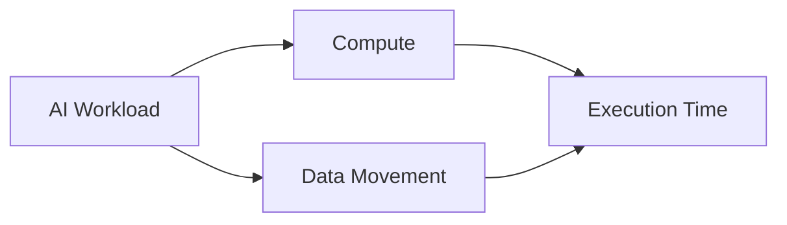
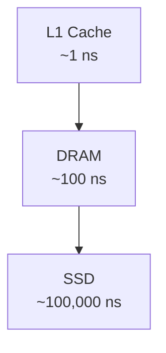
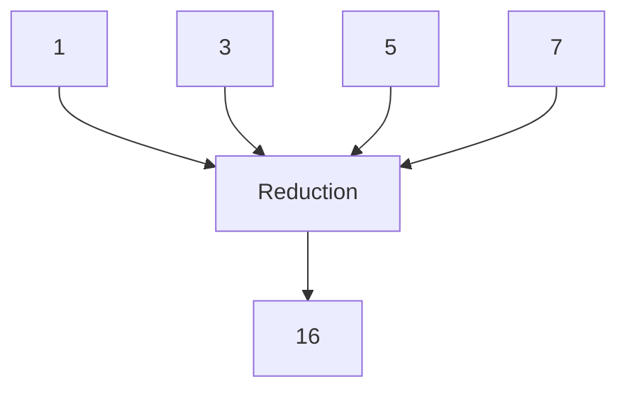
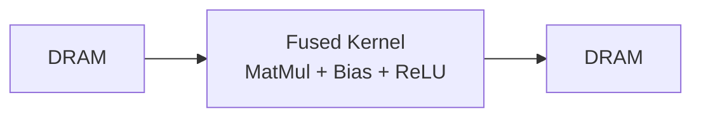
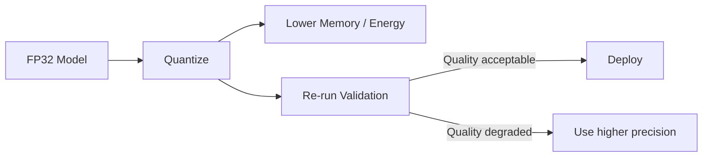
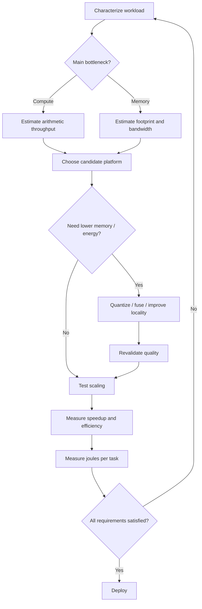

# 1.4. Hardware Platforms and Basic Sizing

## Learning Objectives

Este apartado estudia cómo dimensionar una plataforma de hardware para ejecutar cargas de inteligencia artificial. La idea central es que el rendimiento no depende únicamente de cuántas operaciones por segundo puede realizar un procesador: también depende del **movimiento de datos**, de la **jerarquía de memoria**, del grado de **paralelismo útil**, de la **precisión numérica** y del **consumo energético total**.

Al terminar el tema se debe poder:

- distinguir entre coste de **Compute** y coste de **Data Movement**;
- entender por qué CPU, GPU y TPU favorecen cargas distintas;
- razonar sobre la **Memory Hierarchy** y la localidad;
- interpretar **Speedup** y **Parallel Efficiency**;
- aplicar **Amdahl's Law**;
- calcular la memoria ocupada por los pesos de un modelo;
- analizar el efecto de la **Quantization**;
- comparar plataformas mediante energía total por tarea.

---

## Key Terminology

| English term | Símbolo / unidad | Significado |
| --- | --- | --- |
| Compute | FLOPs / operaciones | Trabajo aritmético realizado por el procesador |
| Data Movement | Bytes, GB/s | Transferencia de datos entre niveles de memoria o dispositivos |
| Memory Bandwidth | BW, GB/s | Datos transferibles por unidad de tiempo |
| Latency | ns, ms, s | Tiempo necesario para completar un acceso u operación |
| Locality | - | Reutilización de datos cercanos en espacio o tiempo |
| Kernel | - | Unidad de trabajo ejecutada en un acelerador |
| Kernel Fusion | - | Unión de operaciones para evitar lecturas y escrituras intermedias |
| Speedup | S(p) | Aceleración obtenida con p procesadores |
| Parallel Efficiency | E(p) | Fracción del paralelismo teórico realmente aprovechada |
| Serial Fraction | f | Parte del programa que no puede ejecutarse en paralelo |
| Quantization | - | Reducción de la precisión numérica |
| Power | W | Energía consumida por unidad de tiempo |
| Energy | J | Energía total consumida para completar una tarea |

---

## 1. Compute vs. Data Movement

Una ejecución de IA combina dos costes fundamentales:

1. **Compute:** realizar operaciones matemáticas.
2. **Memory / Data Movement:** localizar, leer, escribir y transferir los datos que esas operaciones necesitan.

Una aproximación conceptual es:

\[
T_{AI} \approx T_{compute} + T_{data\ movement}
\]

Esto implica que mejorar únicamente el rendimiento aritmético no garantiza una mejora proporcional. Si la mayor parte del tiempo se dedica a transportar datos, aumentar los FLOPs disponibles puede tener un impacto pequeño.

!!! important "Regla de ingeniería"
    Antes de optimizar o comprar hardware hay que identificar si el cuello de botella está en el cálculo o en el movimiento de datos.

---

## 2. CPU, GPU and TPU

Una misma operación tensorial se adapta de forma diferente a las distintas arquitecturas.

### 2.1. CPU

La **CPU** dispone de relativamente pocos núcleos muy potentes y flexibles. Está optimizada para:

- control complejo;
- bifurcaciones;
- lógica irregular;
- baja latencia;
- código secuencial o con poco paralelismo regular.

Su principal ventaja es la **flexibilidad**.

### 2.2. GPU

La **GPU** dispone de un gran número de unidades de ejecución más simples que trabajan en paralelo. Está especialmente adaptada a:

- tensores densos;
- operaciones matriciales;
- grandes lotes;
- cargas con muchas operaciones regulares independientes;
- alto throughput.

Su eficiencia disminuye cuando los hilos siguen caminos de ejecución muy diferentes o el acceso a memoria es irregular.

### 2.3. TPU

La **TPU** utiliza hardware todavía más especializado para operaciones tensoriales y matriciales. Favorece:

- matrices densas de tamaño conocido;
- grafos de ejecución relativamente estáticos;
- aritmética de baja precisión;
- cargas compilables y altamente regulares.

El coste de esta especialización es una menor flexibilidad.

### 2.4. Comparison

| Dimensión | CPU | GPU | TPU |
| --- | --- | --- | --- |
| Workload óptimo | Branching intenso, datos pequeños o irregulares | Tensores regulares y batches altos | Matrices densas y grafos estructurados |
| Fortaleza | Lógica general y baja latencia | Paralelismo masivo | Cálculo matricial especializado |
| Aritmética típica | Escalar, enteros, operaciones generales | Operaciones matriciales densas | Matrices de baja precisión |
| Límite típico | Throughput máximo | Transferencia host-device y memoria | Flexibilidad y ecosistema |

La regla general es: las operaciones matriciales densas se benefician de mucho paralelismo regular; las bifurcaciones irregulares favorecen el control de una CPU.

---

## 3. Memory Hierarchy and the Memory Wall

Los sistemas modernos presentan una jerarquía en la que los niveles pequeños y cercanos al procesador son rápidos, mientras que los niveles grandes son progresivamente más lentos.

| Nivel | Latencia aproximada | Escala humana usada en el material |
| --- | ---: | --- |
| L1 Cache | 1 ns | 1 segundo |
| DRAM | 100 ns | 3 minutos |
| SSD local | 100.000 ns | 2 días |

Un acceso a DRAM puede ser aproximadamente **100 veces más lento** que una lectura desde caché L1.

Este fenómeno se conoce como **Memory Wall**. La optimización debe intentar:

- reutilizar datos ya cargados;
- favorecer accesos contiguos;
- reducir viajes a DRAM;
- mantener resultados intermedios en registros o cachés;
- aumentar la **Locality**.

---

## 4. Energy Cost of Data Movement

Mover datos no solo consume tiempo: también consume energía.

La diapositiva compara:

- una operación **FP16**: aproximadamente **1,1 pJ**;
- leer un valor de 32 bits desde **DRAM**: aproximadamente **640 pJ**.

La conclusión cualitativa es que un acceso a memoria externa puede costar mucho más que una operación aritmética.

!!! warning "Inconsistencia numérica del material"
    La diapositiva afirma que mover un valor desde DRAM cuesta aproximadamente **173 veces** más energía que una operación Multiply-Accumulate. Sin embargo, utilizando literalmente los dos valores mostrados, \(640 / 1,1 \approx 582\). Por tanto, esos números no producen la relación indicada. La conclusión de ingeniería sí permanece: **mover datos puede dominar ampliamente el consumo energético**.

La principal palanca de eficiencia energética es la localidad: cada movimiento de datos evitado puede ahorrar más energía que optimizar una operación matemática individual.

---

## 5. Data Movement Patterns

Las cargas paralelas utilizan patrones recurrentes:

- **Broadcast:** un origen distribuye el mismo dato a múltiples destinos.
- **Scatter:** un conjunto de datos se divide y cada fragmento se envía a un destino distinto.
- **Gather:** varios trabajadores envían información a un destino común.
- **Reduction:** varios valores se combinan mediante una operación como suma, máximo o mínimo.

Los accesos secuenciales suelen ser energéticamente eficientes porque el hardware puede anticipar el siguiente acceso. En cambio, los patrones irregulares, como determinados Gather usados en mecanismos de atención, pueden reducir la eficacia de las cachés y forzar accesos frecuentes a DRAM.

---

## 6. Kernel Fusion

Supongamos una secuencia:

\[
MatMul \rightarrow Bias \rightarrow ReLU
\]

Si cada operación se ejecuta como un kernel independiente, cada etapa puede volver a escribir y leer resultados desde DRAM.

Con **Kernel Fusion**, las tres operaciones pueden ejecutarse dentro de un único kernel, manteniendo los resultados intermedios en almacenamiento local cuando sea posible.

Beneficios:

- menos lanzamientos de kernels;
- menos lecturas y escrituras a DRAM;
- menor latencia;
- menor energía;
- mejor utilización del hardware.

La optimización importante no consiste necesariamente en acelerar cada operación de forma aislada, sino en **eliminar movimientos de datos intermedios**.

---

## 7. Parallel Speedup and Efficiency

Sea:

- \(p\): número de procesadores paralelos;
- \(T_1\): tiempo de ejecución con un procesador;
- \(T_p\): tiempo con \(p\) procesadores.

El **Speedup** es:

\[
S(p)=\frac{T_1}{T_p}
\]

La **Parallel Efficiency** es:

\[
E(p)=\frac{S(p)}{p}
\]

### Worked Example

Si:

\[
T_1=100\ s
\]

y con ocho procesadores:

\[
T_8=17\ s
\]

entonces:

\[
S(8)=\frac{100}{17}\approx5,88
\]

y:

\[
E(8)=\frac{5,88}{8}\approx0,74
\]

La eficiencia es aproximadamente del **74 %**. El resto del potencial se pierde en coordinación, sincronización, comunicación, reparto desigual del trabajo o acceso a memoria.

---

## 8. Linear, Sublinear and Superlinear Scaling

### 8.1. Linear Scaling

El ideal es:

\[
S(p)=p
\]

Duplicar procesadores duplicaría el rendimiento.

### 8.2. Sublinear Scaling

Es el comportamiento habitual:

\[
S(p)
p
\]

Una causa posible es que, al dividir el problema, cada fragmento pase a caber completamente en una caché rápida y se reduzcan drásticamente los accesos a memoria lenta.

---

## 9. Amdahl's Law

La **Amdahl's Law** establece que el escalado está limitado por la parte del programa que continúa siendo secuencial.

Sea:

- \(f\): fracción serial;
- \(1-f\): fracción paralelizable;
- \(p\): número de procesadores.

El tiempo paralelo es:

\[
T_p=T_1\left(f+\frac{1-f}{p}\right)
\]

El speedup es:

\[
S(p)=\frac{1}{f+\frac{1-f}{p}}
\]

Cuando \(p\rightarrow\infty\):

\[
S_{max}=\frac{1}{f}
\]

### Worked Scenario

Si el 5 % del programa es secuencial:

\[
f=0,05
\]

Con ocho GPUs:

\[
S(8)=\frac{1}{0,05+\frac{0,95}{8}}\approx5,93
\]

Con un número infinito de procesadores:

\[
S_{max}=\frac{1}{0,05}=20
\]

Por tanto, añadir GPUs después de cierto punto produce rendimientos decrecientes. Si el escalado se estanca, la acción adecuada es localizar y reducir la **Serial Fraction**.

---

## 10. Model Weight Memory

Si un modelo contiene \(P\) parámetros y cada parámetro utiliza \(b\) bits:

\[
M_w=P\times\frac{b}{8}
\]

Para 25 millones de parámetros:

| Formato | Bits por peso | Memoria | Implicación |
| --- | ---: | ---: | --- |
| FP32 | 32 | 100 MB | Baseline de referencia |
| BF16 / FP16 | 16 | 50 MB | Reduce memoria; debe validarse precisión |
| INT8 | 8 | 25 MB | Cuantización significativa |
| INT4 | 4 | 12,5 MB | Reducción agresiva y mayor riesgo de pérdida |

Esta fórmula calcula únicamente los **pesos**. En un sistema real también pueden consumir memoria las activaciones, buffers, cachés, gradients, optimizer states y el runtime.

---

## 11. Quantization as a Quality-Resource Gate

La **Quantization** disminuye el número de bits utilizado para representar pesos y, dependiendo del hardware, también puede reducir el coste de las operaciones.

Por ejemplo:

\[
FP32 \rightarrow INT8
\]

reduce teóricamente la memoria de los pesos a una cuarta parte:

\[
\frac{8}{32}=0,25
\]

El material muestra que bajar la precisión reduce de forma importante memoria y energía, pero que por debajo de cierto punto la calidad predictiva puede caer rápidamente.

!!! important
    La cuantización es una **Quality-Resource Gate**. No puede aceptarse únicamente porque el modelo sea más pequeño. Después de cambiar la precisión deben volver a evaluarse las métricas exigidas.

---

## 12. Energy: Power and Execution Time

La energía total es:

\[
E=P_{avg}\times t
\]

donde \(P_{avg}\) es la potencia media y \(t\) el tiempo de ejecución.

### CPU vs. GPU Example

| Plataforma | Potencia | Tiempo | Energía |
| --- | ---: | ---: | ---: |
| CPU | 65 W | 40 s | 2.600 J |
| GPU | 220 W | 8 s | 1.760 J |

\[
E_{CPU}=65\times40=2600\ J
\]

\[
E_{GPU}=220\times8=1760\ J
\]

Aunque la GPU consume más potencia instantánea, termina la tarea mucho antes y en este ejemplo utiliza menos energía total.

La comparación correcta es **joules por tarea**, no únicamente watts.

---

## 13. Matching Goals to Engineering Levers

| Objetivo | Palanca de ingeniería |
| --- | --- |
| Evitar acceder a RAM en cada predicción | **Operator / Kernel Fusion** y respetar la jerarquía de memoria |
| Ejecutar el mismo modelo con menor presupuesto | **Quantization** y revalidación |
| Procesar muchas más transacciones por segundo | Llevar la carga adecuada a **GPU / TPU** y aumentar **Batch Size** |
| El speedup se ha estancado | Identificar la **Serial Fraction** y aplicar Amdahl's Law |

La selección de hardware debe surgir del cuello de botella observado y no de una regla genérica como «una GPU más grande será mejor».

---

## 14. Basic Hardware Sizing Workflow

### Checklist

- [ ] ¿La carga es Compute-Bound o Memory-Bound?
- [ ] ¿La arquitectura favorece CPU, GPU o TPU?
- [ ] ¿Los accesos presentan buena localidad?
- [ ] ¿Es posible aplicar Kernel Fusion?
- [ ] ¿Cuál es \(S(p)\)?
- [ ] ¿Cuál es \(E(p)\)?
- [ ] ¿Existe una Serial Fraction que limite el escalado?
- [ ] ¿Los pesos caben en memoria?
- [ ] ¿La Quantization mantiene la calidad?
- [ ] ¿Cuál es la energía total por tarea?
- [ ] ¿Se cumplen simultáneamente latencia, throughput, memoria, calidad y energía?

---

## 15. Final Synthesis

El dimensionamiento de hardware para IA es un equilibrio entre cuatro límites:

1. **Compute:** cuántas operaciones pueden ejecutarse.
2. **Memory:** cuánto cuesta almacenar y mover los datos.
3. **Parallel Limits:** qué parte de la carga puede paralelizarse realmente.
4. **Energy:** cuántos joules requiere completar la tarea.

No existe una plataforma universalmente óptima:

- la CPU destaca en control complejo y cargas irregulares;
- la GPU en operaciones tensoriales altamente paralelas;
- la TPU sacrifica flexibilidad para especializar la ejecución matricial;
- la memoria puede limitar el sistema incluso cuando sobra potencia aritmética;
- añadir procesadores no supera el techo impuesto por la fracción secuencial;
- reducir precisión ahorra recursos, pero obliga a revalidar calidad;
- la potencia instantánea por sí sola no determina la eficiencia energética.

La conclusión del tema puede resumirse como:

> **Hardware sizing is not about buying the biggest chip. It is an optimization problem balancing Compute, Memory, Parallel Limits and Energy.**

---

## Source Material

- **B1.4 AI_Hardware_Sizing_and_Scaling.pdf**, 16 diapositivas.
