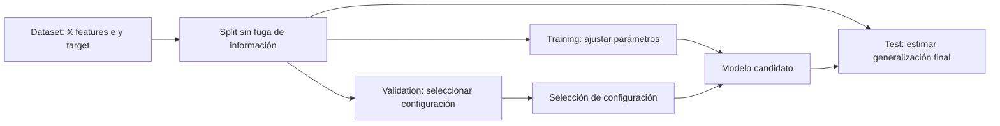

# 1.5. Basic Concepts on Statistics

## Learning Objectives

Este tema presenta las herramientas estadísticas que permiten describir datos de IA, entender errores de predicción, comparar modelos y comprobar si los conjuntos usados durante el desarrollo son adecuados.

Al terminar, se debe poder:

- describir centralidad, dispersión y forma de una distribución;
- elegir entre media, mediana y moda conociendo sus limitaciones;
- reconocer las distribuciones normal, log-normal, uniforme, Poisson y exponencial;
- estandarizar características sin contaminar la evaluación;
- interpretar las normas \(L_1\) y \(L_2\), MAE y MSE;
- comparar distribuciones y explicar correctamente un *p-value*;
- organizar conjuntos de entrenamiento, validación y prueba;
- analizar calidad, representatividad y cambios de los datos.

> **Contexto del material:** capítulo elaborado a partir de las 19 diapositivas de *B1.5. Basic Concepts on Statistics*. La transcripción de la clase del 23 de septiembre amplía algunos puntos, como PSI, comparación de modelos y reentrenamiento; esas conexiones se enlazan al final.

## 1. Los datos como parte del sistema de IA

En software tradicional suele ser posible inspeccionar el código para entender el comportamiento. En sistemas de *Machine Learning* también es necesario estudiar la huella estadística de los datos y de las predicciones. Los datos determinan qué patrones puede aprender el modelo, cómo se evalúa y hasta qué punto la evaluación representa el uso real.

Una primera descripción observa tres propiedades:

1. **Centralidad:** dónde se encuentran los valores.
2. **Dispersión:** cuánto varían.
3. **Forma:** simetría, colas y concentración de valores.

## 2. Centralidad: mean, median y mode

Para observaciones \(x_1,\ldots,x_n\):

### Mean

La **media aritmética** es:

\[
\bar{x}=\frac{1}{n}\sum_{i=1}^{n}x_i
\]

Es un centro útil cuando la distribución y el objetivo hacen razonable resumir mediante un promedio. Es sensible a valores extremos: un tiempo de ejecución excepcionalmente largo puede elevar la media y dejar de representar el tiempo habitual.

### Median

La **mediana** es el valor central al ordenar las observaciones. Si hay un número par de valores, se suele promediar los dos centrales. Resiste mejor que la media el efecto de observaciones extremas y puede ser una descripción más representativa en distribuciones sesgadas.

### Mode

La **moda** es el valor o categoría que aparece con mayor frecuencia. Es especialmente útil para variables categóricas. Puede haber varias modas o no ser informativa cuando casi todos los valores aparecen una sola vez.

La media, la mediana y la moda no son sustitutos automáticos: se eligen de acuerdo con la forma de los datos y con la pregunta que se intenta responder.

## 3. Dispersión y observaciones atípicas

### Variance y standard deviation

La **varianza** mide la distancia cuadrática promedio respecto de la media. Para una población:

\[
\sigma^2=\frac{1}{N}\sum_{i=1}^{N}(x_i-\mu)^2
\]

Para estimarla a partir de una muestra, suele utilizarse:

\[
s^2=\frac{1}{n-1}\sum_{i=1}^{n}(x_i-\bar{x})^2
\]

La **desviación típica** (*standard deviation*) es la raíz cuadrada de la varianza. A diferencia de la varianza, queda expresada en las mismas unidades que los datos.

### Interquartile Range (IQR)

Los cuartiles \(Q_1\), \(Q_2\) y \(Q_3\) marcan los percentiles 25, 50 y 75. El **IQR** mide el ancho del 50 % central:

\[
IQR=Q_3-Q_1
\]

La regla de Tukey señala como posibles *outliers* los valores fuera de:

\[
[Q_1-1.5\,IQR,\;Q_3+1.5\,IQR]
\]

Es una regla exploratoria: un valor fuera de esos límites merece investigación, pero no se elimina automáticamente. Puede ser un error de medición o un caso real que el sistema deba aprender a tratar.

### La regla 68–95–99,7

Si los datos siguen aproximadamente una **distribución normal**, la proporción aproximada que queda dentro de una, dos y tres desviaciones típicas es:

| Intervalo alrededor de la media | Proporción aproximada |
| --- | ---: |
| \(\mu\pm1\sigma\) | 68,27 % |
| \(\mu\pm2\sigma\) | 95,45 % |
| \(\mu\pm3\sigma\) | 99,73 % |

Por ejemplo, con media \(\mu=50\) y desviación típica \(\sigma=10\), el intervalo 40–60 representa \(\pm1\sigma\), 30–70 representa \(\pm2\sigma\), y 20–80 representa \(\pm3\sigma\). Un valor 85 está a 3,5 desviaciones típicas sobre la media; bajo ese modelo normal sería inusual, pero no una imposibilidad matemática. En un sistema real hay que investigar los límites físicos y la calidad de la medición.

Esta regla depende de la normalidad. No se debe interpretar que cualquier valor situado a más de tres sigmas sea automáticamente erróneo ni que el mismo porcentaje se aplique a distribuciones sesgadas.

## 4. Shape: skewness y kurtosis

- **Skewness** mide la asimetría. Una cola más larga a la derecha o a la izquierda puede hacer que la media se aparte de la mediana.
- **Kurtosis** caracteriza especialmente el peso de las colas y la presencia de valores extremos. Describirla solo como «puntiagudez» es una simplificación: dos distribuciones pueden diferir sobre todo en sus colas.

Estos descriptores ayudan a comparar los datos actuales con los de referencia. Un cambio de forma puede señalar *data drift* aunque la media permanezca parecida.

## 5. Common distributions

| Distribución | Qué representa | Ejemplo o relación |
| --- | --- | --- |
| **Normal (Gaussian)** | Variable continua simétrica alrededor de una media, descrita por \(\mu\) y \(\sigma\). | Ruido de sensor que se aproxima a una campana. |
| **Log-normal** | Variable positiva cuyo logaritmo sigue aproximadamente una normal. | Magnitudes positivas y sesgadas, como algunos tamaños o duraciones. |
| **Uniform** | Todos los valores de un intervalo tienen la misma densidad. | Muestreo de números aleatorios sin preferencia dentro del intervalo. |
| **Poisson** | Recuento de eventos en una ventana cuando se cumplen sus supuestos. | Número de fallos por hora; \(\lambda\) es la tasa media por intervalo. |
| **Exponential** | Tiempo de espera entre eventos de un proceso de Poisson bajo sus supuestos. | Tiempo entre llegadas o entre fallos. |

La distribución debe elegirse por el mecanismo generador de los datos, no por conveniencia. En particular:

- El teorema central del límite no afirma que los datos originales se vuelvan normales al reunir muchas observaciones; describe la distribución de determinadas medias muestrales bajo condiciones apropiadas.
- Aplicar logaritmos puede ayudar con variables positivas y sesgadas, pero no garantiza que el resultado sea normal.
- Poisson describe recuentos; la exponencial se relaciona con tiempos entre eventos. \(\lambda\) es una tasa o número esperado por intervalo, no una promesa de que el siguiente evento ocurra exactamente cada \(1/\lambda\) unidades.

## 6. Standardization y feature scaling

Las columnas pueden usar escalas muy diferentes: milisegundos, kilogramos o canales RGB entre 0 y 255. Algoritmos basados en distancias o en optimización por gradiente pueden verse afectados si una característica domina solo por sus unidades.

### Z-score standardization

Para una característica con media \(\mu\) y desviación típica \(\sigma\):

\[
z=\frac{x-\mu}{\sigma}
\]

El resultado expresa cuántas desviaciones típicas separan \(x\) de la media. Por ejemplo, con \(\mu=70\), \(\sigma=10\) y una lectura \(x=84\), se obtiene \(z=1.4\).

La estandarización da media cero y desviación típica uno cuando se aplican esos parámetros a la población usada para calcularlos. **No convierte por sí misma una distribución arbitraria en una normal estándar**: conserva la forma de la distribución.

### Min-max scaling

La transformación min-max es:

\[
x'=\frac{x-x_{\min}}{x_{\max}-x_{\min}}
\]

Con extremos válidos, lleva los datos observados al intervalo [0, 1]. Los datos nuevos pueden quedar fuera de ese intervalo si superan los extremos originales.

### Evitar data leakage

Los parámetros \(\mu\), \(\sigma\), \(x_{\min}\) y \(x_{\max}\) se calculan solo en *training*. Luego se aplican sin recalcular en *validation*, *test* y producción. Así la preparación no utiliza indirectamente información reservada para evaluar el modelo.

## 7. Vector norms y loss metrics

Sea \(e_i=y_i-\hat{y}_i\) el error entre el valor real y la predicción.

### L1 y L2 norms

\[
\lVert e\rVert_1=\sum_i|e_i|,
\qquad
\lVert e\rVert_2=\sqrt{\sum_i e_i^2}
\]

La norma \(L_1\) suma magnitudes absolutas y corresponde a la distancia Manhattan. La norma \(L_2\) es la distancia euclídea. Al elevar los errores al cuadrado, los errores grandes adquieren mucho más peso.

### Mean Absolute Error (MAE) y Mean Squared Error (MSE)

\[
MAE=\frac{1}{n}\sum_{i=1}^{n}|y_i-\hat{y}_i|,
\qquad
MSE=\frac{1}{n}\sum_{i=1}^{n}(y_i-\hat{y}_i)^2
\]

MAE promedia errores absolutos; MSE promedia errores cuadrados. MSE enfatiza más las desviaciones grandes y se expresa en unidades al cuadrado. La raíz del MSE, **Root Mean Squared Error (RMSE)**, vuelve a las unidades originales.

| Situación de error | MAE | MSE |
| --- | --- | --- |
| Errores pequeños | Penalización lineal | Penalización cuadrática |
| Error extremo | Aumenta proporcionalmente | Puede dominar la métrica |
| Elección | Si se quiere limitar el peso de extremos | Si los errores grandes deben resultar especialmente costosos |

La métrica no decide si un dato extremo es válido. Si es un error del sensor, hay que corregirlo o tratarlo justificadamente; si es un caso real importante, ignorarlo puede empeorar el sistema.

## 8. Measuring distance between distributions

Comparar dos listas de observaciones requiere considerar la distribución completa, no solo dos promedios.

### Kullback–Leibler (KL) divergence

La **KL divergence** compara distribuciones según su información relativa. No es, en general, simétrica y puede ser infinita si una distribución asigna probabilidad cero en una región donde la otra asigna masa positiva. En la práctica puede requerir suavizado o una representación probabilística adecuada.

### Wasserstein distance

La **Wasserstein distance** (también llamada *Earth Mover's Distance* en ciertos casos) se puede imaginar como el coste mínimo de mover masa de probabilidad hasta transformar una distribución en otra. Considera la distancia entre las posiciones donde se concentra la masa.

### Kolmogorov–Smirnov (KS) statistic

El estadístico KS entre funciones de distribución acumulada \(F\) y \(G\) es la máxima diferencia vertical:

\[
D=\sup_x|F(x)-G(x)|
\]

El test KS puede comparar una muestra con una distribución de referencia o dos muestras, según la variante. No todo uso de `kstest` es una prueba válida de normalidad: hay que elegir la hipótesis, la variante y los supuestos apropiados. Estimar parámetros de la distribución de referencia con los mismos datos también afecta a la calibración del test.

La transcripción conecta además el **Population Stability Index (PSI)** con la comparación entre la distribución de referencia y datos recientes. PSI depende de cómo se definan los intervalos y es un indicador de cambio, no una demostración de que el rendimiento se haya degradado. Véase [Data Drift y PSI](1-2-retos-en-el-desarrollo-de-aplicaciones-basadas-en-ia.md#6-population-stability-index-psi).

## 9. Hypothesis tests y p-values

Los contrastes estadísticos formulan una hipótesis nula \(H_0\), que suele representar ausencia de diferencia bajo un modelo estadístico, y una alternativa \(H_1\). El **p-value** es la probabilidad, suponiendo que \(H_0\) y los supuestos del test sean válidos, de observar un resultado al menos tan extremo como el obtenido.

Fijado un nivel \(\alpha\), si \(p<\alpha\), se rechaza \(H_0\) de acuerdo con ese procedimiento. Si \(p\ge\alpha\), no se ha obtenido evidencia suficiente para rechazarla; esto **no demuestra igualdad** ni mide el tamaño o la importancia práctica de una diferencia. El umbral 0,05 es una convención frecuente, no una frontera universal de verdad.

### Comparar dos o más grupos

- **Mann–Whitney U:** prueba basada en rangos para dos grupos independientes. No es automáticamente una prueba de igualdad de medianas en todos los casos; esa interpretación requiere condiciones adicionales.
- **Kruskal–Wallis:** comparación basada en rangos para varios grupos independientes. Un resultado global no especifica qué pares difieren.
- **ANOVA:** compara medias de varios grupos bajo supuestos como independencia, varianza adecuada y comportamiento de los residuos. Es mencionado en la transcripción de clase; la prueba no debe describirse como un test que solo «exige que los datos sean normales» sin más matices.

Tras un resultado global se pueden realizar comparaciones por pares, con corrección por pruebas múltiples. La corrección de **Bonferroni** usa, como forma sencilla, \(\alpha_{ajustado}=\alpha/m\), donde \(m\) es el número de comparaciones. Para tres contrastes y \(\alpha=0.05\), el umbral ajustado es aproximadamente 0.0167.

La evidencia estadística no define el criterio de calidad: para elegir un modelo también se debe especificar si se optimiza tiempo, error, coste, seguridad u otra magnitud, y se debe valorar el tamaño del efecto.

## 10. Dataset anatomy y evaluación

En un conjunto supervisado, \(X\) es la matriz de características (*features*) y \(y\) el vector objetivo o etiqueta (*target*). Las filas son observaciones y las columnas son características.

Se suelen separar tres conjuntos:

| Partición | Propósito | Uso típico |
| --- | --- | --- |
| **Training set** | Ajustar parámetros del modelo. | El modelo aprende con estos datos. |
| **Validation set** | Elegir configuraciones, comparar variantes y aplicar *early stopping*. | Se consulta durante el desarrollo. |
| **Test set** | Estimar la generalización final. | Se mantiene reservado y se usa al final. |

La diapositiva muestra 70 % / 15 % / 15 % como ejemplo, no como reparto obligatorio. El tamaño apropiado depende de la cantidad de datos, el método de evaluación y el problema.

### Mantener una evaluación representativa

Es deseable que las particiones reflejen la población o el escenario de evaluación previsto, pero «tener la misma distribución» no se certifica con una única prueba estadística. Se revisan clases, características, periodos y resúmenes; la forma de separar los datos debe respetar el proceso que se quiere simular.

- En clasificación desbalanceada, la **estratificación** ayuda a conservar las proporciones de clase cuando el muestreo aleatorio es apropiado.
- En datos temporales se suele separar por tiempo, evitando que observaciones futuras filtren información al entrenamiento.
- La partición debe mantener suficientes ejemplos de las clases o condiciones importantes.
- Una evaluación sin ejemplos representativos puede ser engañosa aunque sus tamaños sean correctos.

## 11. Real-world representation challenges

### Labeling y representatividad

Las etiquetas pueden ser costosas y requieren criterios consistentes. Si las producen personas, pueden incorporar desacuerdos o sesgos. Una muestra debe cubrir las poblaciones y condiciones relevantes para el uso del modelo; de lo contrario, sus métricas no describen bien el comportamiento en los grupos ausentes.

### Data staleness y drift

Las distribuciones cambian con el tiempo. Un modelo entrenado con transacciones de un periodo puede recibir patrones distintos después. Conviene conservar una referencia, monitorizar características y, cuando haya etiquetas, resultados y métricas del sistema.

Una señal de cambio no obliga por sí sola a reentrenar. Se investiga el origen, se comprueba el efecto sobre la tarea y se decide si corregir los datos, revalidar el modelo, reentrenar o ajustar el proceso de captura. El capítulo [1.2 sobre retos del desarrollo de aplicaciones de IA](1-2-retos-en-el-desarrollo-de-aplicaciones-basadas-en-ia.md) desarrolla el seguimiento de *data drift*.

### Redundancy, class imbalance y limpieza

Filas duplicadas o una clase mayoritaria repetida muchas más veces pueden ocultar los casos minoritarios. Duplicar sin criterio la clase pequeña puede provocar sobreajuste y no aporta diversidad real. La ponderación de clases o técnicas de muestreo se aplican durante entrenamiento y se evalúan sobre datos reservados, preservando una evaluación que refleje el uso real.

La limpieza tampoco debe eliminar a ciegas todos los *outliers*: hacerlo puede borrar justamente los fallos raros que el sistema debería detectar. Investigar su procedencia, validar unidades y rangos físicos y documentar el tratamiento son parte de la calidad de los datos.

## 12. Inconsistencias y precisiones del material

Las diapositivas son material visual y el PDF no incluye una capa de texto extraíble. En la revisión visual se identificaron estas afirmaciones que requieren contexto:

1. En el ejemplo con \(\mu=50\) y \(\sigma=10\), 30–70 corresponde a dos desviaciones típicas, no a tres. Tres desviaciones cubren 20–80.
2. La diapositiva de *z-score* afirma que la transformación convierte «cualquier distribución normal» en \(N(0,1)\). La forma precisa es que la estandarización centra y escala; solo una variable normal mantiene una distribución normal estándar tras esa transformación.
3. Un valor fuera de tres sigmas puede ser inusual bajo un modelo normal, pero no es automáticamente imposible ni demuestra que haya un error de sensor.
4. La regla 68–95–99,7 y los contrastes de normalidad dependen de supuestos; deben acompañarse de inspección del problema y del proceso de generación de datos.

## Ideas clave

- Resume los datos con medidas acordes a su forma; la media puede ser sensible a valores extremos.
- Distingue variabilidad natural, error de medición y casos raros pero importantes antes de limpiar datos.
- MAE y MSE penalizan errores de manera distinta; escoge la métrica según el coste de cada fallo.
- La estandarización cambia la escala, no la forma, y sus parámetros se ajustan solo con *training*.
- Un *p-value* pequeño puede aportar evidencia contra \(H_0\); uno grande no prueba igualdad.
- Mantén *validation* y *test* sin fuga de información y diseña las particiones para representar la evaluación prevista.
- Supervisa datos y resultados tras el despliegue: los patrones pueden cambiar.

## Referencias relacionadas

- [1.2. Challenges in Developing AI-Based Applications](1-2-retos-en-el-desarrollo-de-aplicaciones-basadas-en-ia.md)
- [Apuntes de clase del 23 de septiembre de 2026 — Análisis estadístico y gestión de datos para IA](../../notas-clase/clase-2026-09-23.md)
