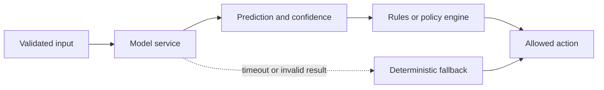
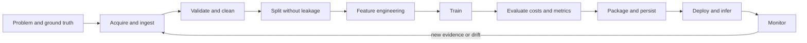
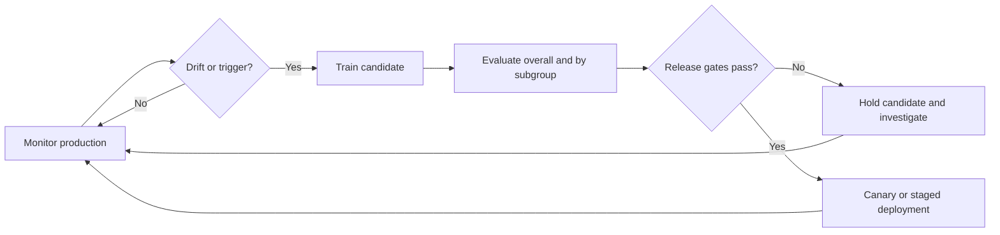

# Block 2. Architecture and Design

## Learning objectives

Este bloque presenta la ingeniería de un sistema de software que incorpora inteligencia artificial. El modelo es solo una parte del sistema: también hacen falta contratos de datos, componentes deterministas, gestión de fallos, despliegue, operación y evaluación continua.

Al terminar el bloque se debería poder:

- diseñar una arquitectura que separe la predicción de la decisión y de la acción;
- construir un pipeline reproducible desde la adquisición de datos hasta el despliegue;
- traducir requisitos no funcionales a límites físicos y elegir entre Cloud y Edge;
- estimar la memoria necesaria para ejecutar un modelo;
- combinar componentes de IA probabilísticos con controles deterministas;
- distinguir Training, Inference y Prediction, y planificar la operación y actualización del modelo.

## Key terminology

| English term | Significado |
| --- | --- |
| Architecture | Organización de componentes, interfaces, flujos de datos, límites de ejecución y responsabilidades |
| Data Contract | Esquema y reglas acordadas para los datos intercambiados entre componentes |
| Pipeline | Secuencia reproducible de transformaciones que convierte entradas en resultados |
| Data Leakage | Uso accidental de información que no estaría disponible al predecir en producción |
| Inference | Ejecución de un modelo ya entrenado sobre una entrada |
| Prediction | Resultado producido por la ejecución del modelo para una entrada concreta |
| Policy Engine | Componente que convierte resultados y reglas en una decisión operativa |
| Graceful Degradation | Continuación del servicio con una capacidad reducida y un modo seguro definido |
| Concept Drift | Cambio de la relación entre las entradas y el resultado que se desea predecir |
| Model Decay | Pérdida de calidad observada del modelo con el paso del tiempo |

---

## 2.1. Software Architecture and Domain Modeling

### Architecture as an executable blueprint

La arquitectura define **componentes**, sus **interfaces**, los **flujos de datos**, los **límites de despliegue** y las **responsabilidades**. Debe poder reconstruirse como un plano ejecutable: una caja con el nombre de un modelo no explica sus entradas, salidas, fallos ni relación con el resto del sistema.

Conviene examinar la arquitectura desde cuatro vistas complementarias:

1. **Component view:** qué piezas existen y qué responsabilidad tiene cada una.
2. **Data-flow view:** de dónde vienen los datos, cómo se transforman y dónde se guardan.
3. **Composition view:** qué servicios y reglas se coordinan para atender una solicitud.
4. **Deployment view:** en qué proceso, dispositivo o entorno se ejecuta cada componente y qué latencia introduce la comunicación.

La forma general depende de la carga de trabajo. Una arquitectura **Layered / Pipeline** organiza etapas de forma secuencial; **Microservices** separa servicios desplegables con interfaces propias; un diseño **Event-Driven** conecta productores y consumidores mediante eventos. Las restricciones de latencia, caudal, disponibilidad y volumen de datos determinan cuál encaja mejor.

### Data contracts and physical boundaries

Un **Data Contract** es una frontera ejecutable entre componentes. Debe fijar campos, tipos, unidades, rangos, valores ausentes y condiciones de aceptación. Separar el contrato del código ayuda a detectar datos mal formados en la entrada en vez de permitir que contaminen etapas posteriores.

Por ejemplo, un evento de tráfico puede especificar `sensor_id`, `event_timestamp` y `vehicle_count`; la validación puede rechazar un identificador vacío, un recuento negativo o una marca de tiempo imposible. El esquema y su versión también forman parte de la trazabilidad.

### Probabilistic prediction, deterministic action

Una predicción es evidencia probabilística; el software debe controlar la acción. El **Model Service** propone una puntuación o clase, mientras un **Rules Engine / Policy Engine** aplica umbrales, límites y excepciones explícitas. La acción debe tener una ruta de respaldo determinista si el modelo no responde, el resultado no es válido o la confianza queda fuera del rango permitido.

Una predicción puede, por ejemplo, detectar riesgo de deterioro de un paciente. Una política clínica separada decide si alerta, solicita una revisión humana o continúa con el procedimiento normal. El modelo no debe ejecutar por sí mismo una acción física o clínica que requiera límites de seguridad.

### Reproducibility and release gates

La identidad de un modelo desplegado debe permitir recuperar al menos:

- el **code** y la versión de las dependencias;
- el conjunto de **data** usado y su procedencia;
- la estrategia de **split** entre entrenamiento, validación y prueba;
- la **config** del entrenamiento y del pipeline;
- el **environment** de ejecución;
- los **weights** o artefactos del modelo.

Si cambia cualquiera de estas piezas, cambia la evidencia que respalda el modelo. Antes de publicar una versión, se revisan los contratos de datos, el aislamiento de componentes, las rutas de fallo, las condiciones de reproducibilidad y la responsabilidad operativa. La arquitectura es una garantía de resiliencia solo cuando permite gestionar de forma explícita la incertidumbre estadística.

---

## 2.2. Data Science Pipelines

El pipeline no es una secuencia informal de scripts: cada etapa transforma datos bajo condiciones que deben conservarse en entrenamiento y producción.

### Stages 1–3: define, acquire, validate

**Stage 1 — Problem and ground truth.** Define the observation unit, prediction time, label window, target outcome, useful time limits, and measurable acceptance criteria. An ambiguous label produces an ambiguous model, regardless of the algorithm.

**Stage 2 — Acquisition and ingestion.** Preserve both **event time** (when something happened) and **ingestion time** (when the platform received it). In an event-stream system such as Kafka, delayed and out-of-order records make this distinction essential. Record source and schema version.

**Stage 3 — Validation and cleaning.** Check types, ranges, missing values, duplicates, and label consistency. Missingness may be **MCAR** (independent of observed and missing values), **MAR** (explained by observed values), or **MNAR** (related to the missing value itself). These cases have different implications; imputing a value is a modeling assumption and should be documented. Track how many raw rows survive each filter so the usable-row yield is visible.

### Stages 4–6: split, transform, train

**Stage 4 — Split.** Separate train, validation, and test data before fitting learned transformations. For time-dependent data, split chronologically; for grouped observations, keep related records in the same partition. Otherwise **Data Leakage** can make evaluation unrealistically optimistic.

**Stage 5 — Features and transformations.** Fit preprocessing on training data and reuse the fitted transformation during inference. A `ColumnTransformer` can apply numeric scaling and categorical encoding to the appropriate columns while preserving one consistent feature layout.

**Stage 6 — Model training.** Keep the data preparation and estimator together as a versioned pipeline where possible. Store random seeds and training configuration for reproducibility. Training may optimize model parameters, but it cannot repair a badly defined target or unrepresentative data.

### Stages 7–8: evaluate and package

**Stage 7 — Evaluation and decision costs.** Report metrics suited to the task and operating point. For a binary classifier:

|  | Actual positive | Actual negative |
| --- | --- | --- |
| Predicted positive | True Positive (TP) | False Positive (FP) |
| Predicted negative | False Negative (FN) | True Negative (TN) |

\[
\mathrm{Precision}=\frac{TP}{TP+FP},\qquad
\mathrm{Recall}=\frac{TP}{TP+FN},\qquad
F_1=2\frac{\mathrm{Precision}\cdot\mathrm{Recall}}{\mathrm{Precision}+\mathrm{Recall}}
\]

Precision answers what fraction of alerts were correct; recall answers what fraction of actual positives were found. The threshold depends on the relative cost of false positives and false negatives. A high aggregate score is insufficient if a critical subgroup or failure mode is hidden.

**Stage 8 — Packaging and persistence.** Persist the complete fitted pipeline, feature schema, model version, and required metadata. Loading executable model artifacts (for example, pickle files) from an untrusted source can execute code; accept artifacts only from a trusted, controlled release path.

### Stages 9–10: deploy and monitor

**Stage 9 — Deployment and inference.** Validate request schema, model compatibility, latency, and failure behavior at the service boundary. If the model is unavailable, use the documented safe fallback or return a controlled failure rather than silently returning an invalid action.

**Stage 10 — Monitoring and feedback.** Monitor input quality, latency, error rates, prediction distributions, and (when delayed ground truth becomes available) model quality. Separate **data drift** (input distribution changed) from **concept drift** (input-to-outcome relationship changed). Retraining should be triggered by evidence and pass the same evaluation and release gates as the initial model.

---

## 2.3. Hardware Sizing and Deployment Constraints

### Non-functional requirements become physical limits

Un **Non-Functional Requirement (NFR)** must traducirse a una magnitud verificable. Latency queda limitada por el tiempo de respuesta; throughput, por el caudal que admite el sistema; memory footprint, por RAM o VRAM disponible; energy envelope, por potencia, temperatura o batería. Cada límite puede bloquear el despliegue aunque el modelo tenga buena precisión.

### Latency versus throughput

El procesamiento **síncrono / batch 1** responde a cada solicitud de inmediato y prioriza baja latencia; es apropiado para interacción o control sensible al tiempo. El procesamiento **batch** agrupa entradas para aprovechar mejor el acelerador y aumentar throughput, a cambio de esperar a que se forme el lote.

La selección debe considerar la distribución de latencia y el límite de servicio (por ejemplo, el percentil 95), no solo el promedio. Un sistema rápido en promedio puede incumplir repetidamente su objetivo bajo picos de carga.

### Distributed solutions: data and model parallelism

- **Data Parallelism:** cada dispositivo mantiene una copia del modelo y procesa una partición distinta del lote; se intercambian gradientes o resultados. Requiere que el modelo quepa en cada dispositivo y añade sincronización.
- **Model / Pipeline Parallelism:** el modelo se divide entre dispositivos o etapas, y los datos atraviesan esas partes. Permite modelos mayores, pero la comunicación y el equilibrio entre etapas pueden convertirse en cuellos de botella.

La comunicación por red forma parte del coste de cómputo total: distribuir un modelo no acelera una carga si los datos transferidos dominan el tiempo.

### Cloud versus Edge

| Factor | Cloud deployment | Edge deployment (local device) |
| --- | --- | --- |
| Dependencia de red | Necesita conectividad para el servicio | Puede operar sin red continua |
| Latencia | Depende de red y servicio remoto | Latencia local y más predecible |
| Privacidad | Los datos salen del dispositivo según el diseño | Los datos pueden permanecer localmente |
| Actualizaciones | Control centralizado y capacidad elástica | Despliegue y mantenimiento por dispositivo |
| Recursos | Más capacidad escalable | Límites estrictos de memoria, energía y cómputo |

La elección combina requisitos de privacidad, conectividad, latencia, operación y coste. Cloud y Edge también pueden coexistir: una ruta local cubre el caso inmediato mientras servicios remotos ejecutan tareas que admiten más latencia.

### VRAM estimate

El coste de memoria incluye pesos, activaciones, cache y temporales; durante training también intervienen gradientes y estado del optimizer. Para inferencia, una estimación inicial es:

\[
\text{VRAM total}\approx\text{weights}+\text{activations}+\text{KV cache}+\text{workspace/overhead}
\]

Los pesos solos ocupan aproximadamente:

\[
\text{weight bytes}=\text{parameter count}\times\text{bytes per parameter}
\]

Así, 8 mil millones de parámetros en FP16 requieren aproximadamente 16 GB decimales (unos 14.9 GiB) solo para los pesos. La **KV cache** crece con la longitud de contexto y el número de secuencias concurrentes; por ello, un modelo cuyos pesos caben justo en una GPU puede fallar al atender una carga real. La cuantización puede reducir memoria y tráfico, pero se deben reevaluar precisión, latencia y compatibilidad.

Antes de dar por válido el dimensionamiento, comprobar el tamaño máximo de entrada, el contexto, concurrencia, lotes, memoria temporal, fragmentación y margen operativo. Los tamaños de pantalla son aproximaciones: medir con la configuración de producción.

---

## 2.4. Component Composition and Reliability

### Keep prediction separate from control

En el sistema compuesto, los componentes de IA (por ejemplo, Model Service, Feature Store o Vector Database) producen evidencia; las piezas de software convencional (Rules Engine, almacenamiento y colas) hacen cumplir contratos y políticas. La frontera mantiene visible qué decisiones son probabilísticas y cuáles son deterministas.

Un modelo puede tener alta precisión y aun así dar la respuesta equivocada en un caso concreto. Las reglas deben controlar admisibilidad, umbrales y acciones permitidas, además de especificar lo que ocurre ante ausencia, demora o corrupción de la predicción.

### Coupling patterns and total latency

| Pattern | Uso habitual | Consecuencia |
| --- | --- | --- |
| Synchronous API | Respuesta inmediata y operación de bajo retardo | El solicitante espera a todos los servicios de la ruta |
| Asynchronous / event-driven | Tareas que admiten cola y ejecución diferida | Mayor desacoplamiento, pero se debe gestionar orden, reintento e idempotencia |
| Fallback / circuit breaker | Dependencia remota poco fiable | Se evita bloquear indefinidamente y se activa una ruta degradada explícita |

Una descomposición útil de latencia síncrona es:

\[
T_{sync}=T_{client}+T_{service}+T_{network}
\]

La cifra real debe incluir colas, serialización, reintentos y los percentiles altos, además del tiempo de inferencia.

### Reliability compounds across dependencies

Si cada etapa independiente de una ruta debe funcionar para responder, la fiabilidad de la cadena es el producto de las fiabilidades de las etapas. Cuatro dependencias con 99% de disponibilidad cada una dan:

\[
0.99^4\approx0.9606\quad(96.06\%)
\]

Es una ilustración bajo el supuesto de independencia; fallos correlacionados alteran el cálculo. Reintentos limitados, redundancia y rutas alternativas pueden mejorar la disponibilidad, mientras que un fallback definido reduce el impacto de una dependencia fallida.

### End-to-end example: traffic signal control

Una secuencia de extremo a extremo para un sistema de semáforos inteligentes puede organizarse así:

1. Sensores en el Edge recogen recuentos y marcas de tiempo; un contrato valida su forma y unidades.
2. La ingestión conserva event time e ingestion time y guarda registros auditables.
3. El pipeline calcula features en ventanas temporales compatibles con la latencia prevista.
4. Un modelo predice el estado o la demanda de tráfico.
5. Un Policy Engine aplica ciclos mínimos y máximos, prioridades y límites seguros; genera una acción admisible.
6. El controlador ejecuta el cambio en un **closed loop** y registra la orden y la respuesta observada.
7. Si la predicción falta, llega tarde o es inválida, la política activa el ciclo fijo seguro.

La predicción no gobierna directamente el hardware. La política determinista restringe la acción y mantiene la operación incluso durante un fallo del servicio de IA.

---

## 2.5. Operating Patterns and Retraining Loops

### Training, inference and prediction

| Operation | Qué sucede | Escala temporal típica |
| --- | --- | --- |
| Training | Se ajustan los parámetros con datos y cómputo intensivo | Horas o días; puede ejecutarse por lotes |
| Inference | Se ejecuta el modelo fijo sobre una entrada | Milisegundos o segundos, sujeto al SLA |
| Prediction | Se obtiene la salida para una entrada concreta | Una decisión o evento puntual |

La distinción ayuda a ubicar hardware y responsabilidades: el entrenamiento pesado puede ocurrir en Cloud, mientras inference sucede en Edge; un predictor no implica entrenamiento continuo.

### Model decay and retraining strategies

Los cambios de población, sensores, políticas o contexto pueden degradar el modelo. Para actualizarlo se pueden usar estrategias distintas:

- **Retrain from scratch:** volver a entrenar con el histórico seleccionado y el modelo actual, lo que puede descartar patrones antiguos.
- **Warm start:** conservar pesos o estado previo y continuar el entrenamiento con datos nuevos; requiere vigilar que no herede errores.
- **Fine-tuning:** adaptar un modelo a un dominio o conjunto nuevo con un ajuste controlado.
- **Incremental learning:** incorporar ejemplos de manera continua o en pequeños lotes; reduce demora, pero eleva el riesgo de olvidar conocimiento previo.

Los disparadores pueden ser programados, motivados por volumen de datos, por degradación observada en métricas o por un cambio significativo del contexto. Un trigger inicia una evaluación, no una publicación automática.

### Regression prevention and release control

Comparar el modelo candidato con una baseline en el total y en subgrupos relevantes. Una mejora agregada puede ocultar una regresión peligrosa —por ejemplo, un subgrupo que cae de 0.82 a 0.65—; definir umbrales de bloqueo por segmento antes del despliegue.

Un ciclo de actualización seguro es:

### Batch and online serving

**Batch inference** procesa muchas entradas en intervalos definidos: aumenta throughput y es adecuado para cálculos diferibles, pero añade retraso y genera picos de recursos. **Online serving** procesa cada solicitud en el momento: favorece respuestas inmediatas con recursos estables, pero demanda capacidad disponible continuamente y baja latencia.

Se pueden combinar: online para las decisiones interactivas y batch para agregados, recalculo de features o análisis diferido. La selección depende del SLA, del patrón de carga y del coste de mantener recursos activos.

### Human-in-the-loop confidence policy

Una política basada en confianza puede definir tres zonas, con umbrales calibrados y documentados:

| Zone | Confidence | Acción propuesta |
| --- | ---: | --- |
| Auto-allow | 85–100% (ejemplo del material) | Ejecutar la acción permitida por la política |
| Human audit | 40–84% (ejemplo del material) | Solicitar revisión humana antes de continuar |
| Auto-block | 0–39% (ejemplo del material) | Rechazar o usar la ruta segura |

Los valores son ilustrativos, no umbrales universales. Deben calibrarse con datos y costes del dominio; el score del modelo no siempre equivale a una probabilidad calibrada. La revisión humana también necesita plazos, información suficiente y registro de su decisión.

### Retrieval-Augmented Generation

En **Retrieval-Augmented Generation (RAG)**, el sistema recupera documentos relevantes y los añade al contexto del modelo. El índice offline y la consulta online tienen responsabilidades distintas: indexar y versionar documentos por un lado; recuperar evidencia reciente y generar una respuesta por otro. El retrieval no es fine-tuning: puede actualizar conocimiento documental sin volver a entrenar el modelo base.

La evaluación del retriever debe medir **Recall@k** (si los documentos relevantes aparecen en los primeros *k*) y **Precision@k** (qué fracción de los recuperados es relevante). Por ejemplo, si hay 4 documentos relevantes y el sistema recupera 3 documentos, de los cuales 2 son relevantes, Recall es 2/4 = 0.5 y Precision es 2/3 ≈ 0.67. La calidad de generación no puede superar sistemáticamente la calidad de la evidencia disponible.

### Tooling follows system boundaries

El ecosistema de herramientas se elige por función: librerías de ML como Scikit-learn; tracking de experimentos como MLflow; feature stores gestionados; motores de serving como Hugging Face TGI; y bases vectoriales como Pinecone o FAISS. La selección depende de interfaz, escala, despliegue y operación; el nombre de una herramienta no reemplaza el diseño del sistema.

---

## Production readiness checklist

- [ ] El pipeline no presenta leakage y el split refleja el uso futuro.
- [ ] Data provenance y versiones de contratos, código, configuración y modelo están registradas.
- [ ] El modelo, sus transforms y el esquema de entrada se despliegan juntos y son compatibles.
- [ ] La latencia, concurrencia y consumo de memoria se han medido bajo la carga prevista.
- [ ] Hay fallback determinista y comportamiento explícito ante timeout, dato inválido y dependencia caída.
- [ ] Métricas, umbrales, subgrupos y coste de falsos positivos y negativos están definidos.
- [ ] La política de revisión humana, si existe, está operativa y auditable.
- [ ] El despliegue gradual permite detectar regresiones y volver a la versión anterior.
- [ ] El plan de monitorización y reentrenamiento exige evaluación antes de publicar.

## Ideas clave

- Un sistema basado en IA se diseña alrededor del modelo y de sus límites, contratos, dependencias y políticas de actuación.
- La reproducibilidad requiere versionar datos, splits, código, configuración, entorno y pesos.
- Los pipelines deben evitar leakage y medir tanto la calidad del modelo como los costes de las decisiones.
- El dimensionamiento incluye activaciones, cache y concurrencia, además de los pesos.
- Arquitectura probabilística y control determinista se complementan: la segunda limita y gobierna las acciones.
- El modelo desplegado necesita monitorización, evaluación de regresiones, actualización gradual y una ruta de fallback.

## Referencias relacionadas

- [Bloque 1. Ingeniería del software para IA](../bloque-1/1-1-requisitos-de-software-basado-en-ia.md)
- [AI Families](../bloque-1/1-3-familias-de-inteligencia-artificial.md)
- [Hardware Platforms and Basic Sizing](../bloque-1/1-4-plataformas-hardware-y-dimensionamiento-basico.md)
- [PDF original — Block 2. Architecture and Design](fuentes/Block%202.%20Architecture%20and%20Design.pdf)
