# Apuntes de clase — Miércoles 16 de septiembre de 2026

## Modelos de red y protocolos

Esta clase profundiza en cómo se organizan las comunicaciones de red, especialmente en el modelo por capas y en la pila TCP/IP. El objetivo principal es entender qué responsabilidad tiene cada capa, cómo se encapsulan los datos y qué diferencias existen entre protocolos como IP, TCP y UDP.

!!! note "Idea principal"
    Una red funciona porque todos los participantes comparten **convenciones y protocolos**. Direcciones, puertos, formatos de cabecera y reglas de comunicación permiten que sistemas distintos se entiendan entre sí.

---

## 1. El modelo por capas

Las comunicaciones se estructuran en **capas**. Cada capa ofrece un servicio a la capa superior y utiliza los servicios de la capa inferior.

Cuando una aplicación envía información, los datos bajan por la pila de protocolos. Cada capa añade información de control antes de entregar el resultado a la siguiente capa. En el receptor sucede el proceso inverso.

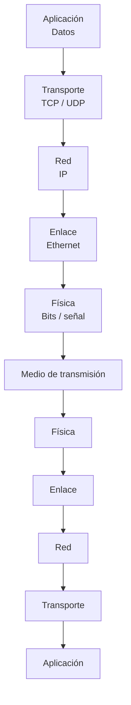

Este proceso se denomina **encapsulación**.

### PDU (*Protocol Data Unit*)

La unidad de información utilizada por una capa se denomina **PDU**.

Cada protocolo utiliza un nombre concreto para su PDU:

| Protocolo / capa | PDU |
| --- | --- |
| Ethernet | Trama (*frame*) |
| IP | Datagrama IP |
| TCP | Segmento |
| UDP | Datagrama UDP |

La terminología importa porque cada una de estas estructuras tiene un formato y unas propiedades concretas.

---

## 2. Encapsulación y cabeceras

Cada protocolo añade una **cabecera** con la información necesaria para realizar su trabajo.

Por ejemplo:

- IP añade las direcciones IP de origen y destino.
- TCP añade puertos, números de secuencia, confirmaciones y otros campos de control.
- UDP añade puertos, longitud y checksum.
- Ethernet añade la información necesaria para transportar la trama por el enlace.

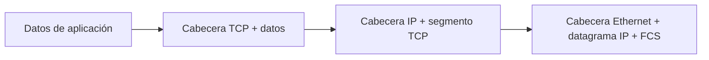

### Overhead

Las cabeceras consumen ancho de banda y generan **overhead**.

Si una aplicación envía mensajes extremadamente pequeños, la proporción de bytes utilizados para control puede ser muy alta respecto a los datos útiles.

!!! example "Ejemplo"
    Enviar 4 bytes de información dentro de una estructura que añade decenas de bytes de cabeceras resulta mucho menos eficiente que agrupar una cantidad mayor de información en cada envío.

Por eso, cuando se transmiten cantidades grandes de datos, el tamaño de los mensajes tiene impacto en el rendimiento global.

---

## 3. Modelo OSI y modelo TCP/IP

El modelo **OSI** define siete capas:

1. Física.
2. Enlace.
3. Red.
4. Transporte.
5. Sesión.
6. Presentación.
7. Aplicación.

TCP/IP utiliza una organización más compacta y agrupa varias de las funciones de OSI.

| OSI | Función principal | Ejemplos |
| --- | --- | --- |
| 7. Aplicación | Servicios utilizados por las aplicaciones | HTTP, DNS, SMTP, MQTT |
| 6. Presentación | Representación y transformación de datos | Codificación, serialización, formatos |
| 5. Sesión | Gestión de sesiones | Apertura, negociación y control de sesión |
| 4. Transporte | Comunicación entre procesos | TCP, UDP |
| 3. Red | Comunicación entre redes | IP |
| 2. Enlace | Comunicación dentro de un enlace | Ethernet, Wi-Fi |
| 1. Física | Transmisión física de bits | Cable, fibra, radio |

### Qué ocurre en los routers

Un router trabaja principalmente en la **capa 3**.

El datagrama IP puede atravesar varios routers antes de llegar al destino. En cada salto se elimina la trama de enlace recibida, se procesa IP y después se crea una nueva trama para el siguiente enlace.

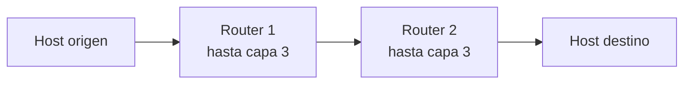

Las capas de transporte y aplicación normalmente solo se procesan en los extremos de la comunicación.

---

## 4. Service Access Point: direcciones y puertos

Cada capa necesita alguna forma de identificar el punto al que debe entregar la información.

En este contexto aparece el concepto de **SAP (*Service Access Point*)**.

En Internet:

- La capa IP utiliza **direcciones IP**.
- TCP y UDP utilizan **puertos**.

Para identificar de forma práctica una comunicación se utiliza la llamada **5-tupla**:

- protocolo de transporte;
- IP origen;
- puerto origen;
- IP destino;
- puerto destino.

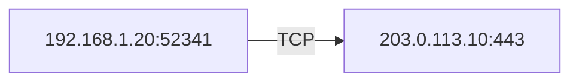

Esta combinación permite al sistema operativo distinguir muchas conexiones simultáneas.

---

## 5. IP: servicio de datagramas

IP proporciona un servicio basado en **datagramas**.

Un datagrama es una unidad independiente que se intenta transportar desde el origen hasta el destino.

IP ofrece un servicio **best effort**:

- intenta entregar el datagrama;
- no garantiza que llegue;
- no garantiza que llegue una sola vez;
- no garantiza el orden;
- no establece una conexión antes de enviar datos.

Por tanto, IP por sí solo no proporciona una comunicación fiable.

---

## 6. TCP

**TCP (*Transmission Control Protocol*)** proporciona un servicio **orientado a conexión y fiable** sobre IP.

Esto es especialmente importante porque TCP construye una comunicación fiable encima de una red IP que, por sí misma, no ofrece esas garantías.

TCP proporciona:

- establecimiento de conexión;
- entrega ordenada;
- retransmisión de datos perdidos;
- números de secuencia;
- ACK (*acknowledgements*);
- control de flujo;
- mecanismos de control de congestión;
- detección de errores mediante checksum;
- comunicación bidireccional (*full duplex*).

### 6.1. Apertura de conexión: three-way handshake

TCP establece la conexión mediante tres segmentos:

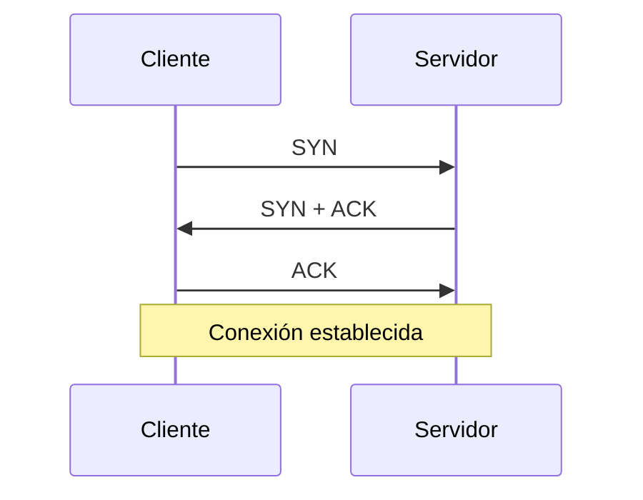

Durante este proceso también se sincronizan los **números iniciales de secuencia** de ambos extremos.

### 6.2. Números de secuencia y ACK

TCP numera los bytes enviados.

El receptor utiliza los ACK para indicar cuál es el siguiente byte que espera recibir.

!!! example "Ejemplo conceptual"
    Si el receptor confirma `ACK = 900`, está indicando que ha recibido correctamente todo lo anterior y espera que la transmisión continúe desde el byte 900.

Si se detecta una pérdida, TCP puede retransmitir la información necesaria sin que la aplicación tenga que gestionar el problema directamente.

### 6.3. Control de flujo

El receptor dispone de buffers limitados.

TCP utiliza una **ventana de recepción** para indicar al emisor cuánto puede seguir enviando. Si el receptor no puede aceptar más datos, puede anunciar una ventana de tamaño cero y el emisor debe detener temporalmente la transmisión.

### 6.4. Cierre de conexión

El cierre utiliza principalmente las banderas `FIN` y `ACK`.

Como TCP es full duplex, cada dirección puede cerrarse independientemente.

Un cierre típico puede requerir cuatro segmentos:

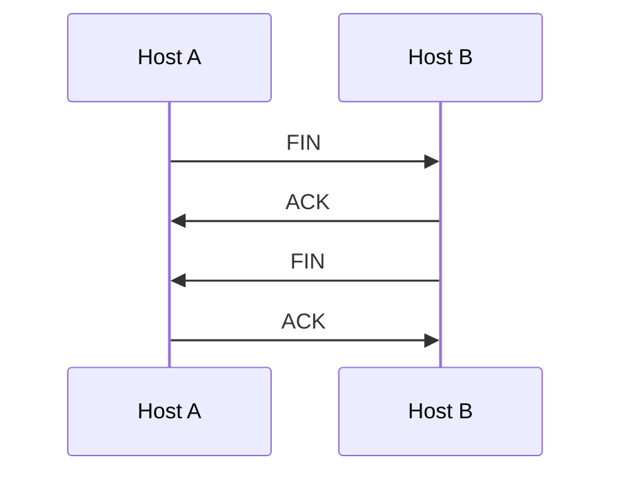

Si algunas respuestas pueden combinarse, el cierre puede completarse con menos segmentos.

---

## 7. Cabecera TCP

La cabecera TCP es relativamente compleja porque debe implementar todas las garantías anteriores.

Entre sus campos principales aparecen:

- puerto origen;
- puerto destino;
- número de secuencia;
- número de ACK;
- tamaño de cabecera;
- flags como `SYN`, `ACK`, `FIN`, `RST`, `URG`;
- tamaño de ventana;
- checksum;
- puntero urgente;
- opciones.

### Datos urgentes

TCP contempla mecanismos para indicar información urgente o fuera del flujo normal mediante el bit `URG` y el **urgent pointer**.

La idea es poder señalar determinados datos de control sin esperar necesariamente a procesar todo el flujo anterior.

---

## 8. UDP

**UDP (*User Datagram Protocol*)** ofrece un servicio mucho más sencillo que TCP.

No establece una conexión previa y no garantiza:

- entrega;
- orden;
- ausencia de duplicados;
- retransmisión automática.

Su cabecera contiene fundamentalmente:

- puerto origen;
- puerto destino;
- longitud;
- checksum.

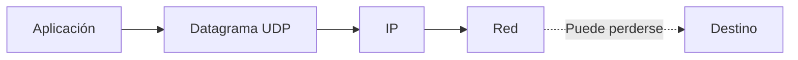

### Responsabilidad de la aplicación

Al utilizar UDP, cualquier mecanismo adicional de fiabilidad debe implementarlo la propia aplicación si lo necesita.

!!! example "Sensor IoT"
    Un sensor que envía la temperatura una vez por segundo puede utilizar UDP. Si se pierde una lectura de `25 °C`, probablemente un segundo después llegará otra lectura actualizada y la retransmisión de la anterior ya no aporta demasiado valor.

En cambio, para datos críticos donde perder una medida puede tener consecuencias importantes, la aplicación necesita garantías adicionales.

---

## 9. TCP frente a UDP

| Característica | TCP | UDP |
| --- | --- | --- |
| Orientado a conexión | Sí | No |
| Garantiza entrega | Sí, mientras la conexión sea viable | No |
| Mantiene el orden | Sí | No |
| Retransmisiones | Sí | No |
| Control de flujo | Sí | No |
| Control de congestión | Sí | No incorporado como TCP |
| Overhead | Mayor | Menor |
| Unidad | Segmento | Datagrama |
| Uso típico | Ficheros, web, SSH | DNS, telemetría, tiempo real |

La elección no depende de cuál sea "mejor", sino de las necesidades de la aplicación.

### Casos habituales

TCP resulta apropiado cuando todos los datos deben llegar correctamente, como:

- transferencia de ficheros;
- SSH;
- páginas web tradicionales;
- correo electrónico.

UDP puede ser útil cuando prima la baja latencia o un dato antiguo deja de tener valor, como:

- determinadas consultas DNS;
- telemetría;
- sensores IoT;
- determinados protocolos multimedia y de tiempo real.

!!! warning "Audio y vídeo no implican siempre UDP"
    Aplicaciones como servicios de vídeo bajo demanda pueden utilizar buffers grandes y protocolos fiables. La elección del transporte depende del comportamiento que se quiera conseguir.

---

## 10. Puertos

Los puertos identifican servicios o procesos dentro de una máquina.

Los servicios conocidos utilizan convencionalmente números de puerto concretos.

| Servicio | Transporte habitual | Puerto |
| --- | --- | ---: |
| SSH | TCP | 22 |
| SMTP | TCP | 25 |
| DNS | UDP / TCP | 53 |
| HTTP | TCP | 80 |
| HTTPS | TCP | 443 |
| MQTT | TCP | 1883 |

Los clientes suelen utilizar **puertos efímeros**, asignados temporalmente por el sistema operativo.

!!! note
    El mismo número de puerto puede existir tanto en TCP como en UDP porque ambos protocolos mantienen espacios de puertos independientes.

### Puertos y servicios conocidos

Los números estándar permiten que un cliente sepa dónde encontrar determinados servicios sin tener que preguntar previamente por su ubicación.

En sistemas Unix y Linux existe, por ejemplo, el fichero `/etc/services`, que mantiene asociaciones entre nombres de servicios, números de puerto y protocolos.

---

## 11. Timeouts y errores en sistemas distribuidos

En una interacción cliente-servidor pueden fallar diferentes etapas:

1. La petición no llega al servidor.
2. El servidor falla o tarda durante el procesamiento.
3. La respuesta no llega al cliente.

Desde la perspectiva del cliente, los tres casos pueden parecer exactamente iguales: **no se recibe respuesta**.

Por ello los sistemas distribuidos utilizan **timeouts**.

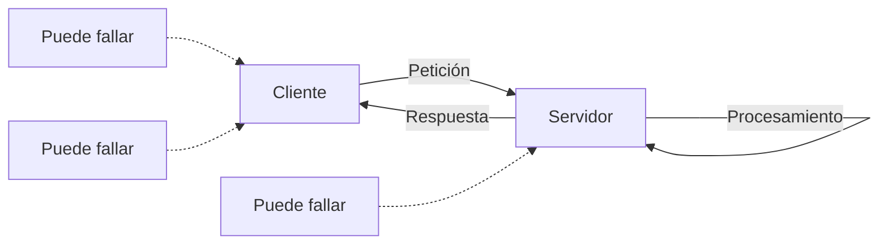

Los timeouts suelen combinarse con políticas de reintento.

Esto hace que los programas distribuidos tengan más estados de error que un programa puramente secuencial o local.

---

## 12. Estado de los puertos y `TIME_WAIT`

Cuando una conexión TCP termina, el sistema operativo no siempre elimina inmediatamente todo su estado interno.

Una conexión puede permanecer temporalmente en estados como **`TIME_WAIT`** para evitar que segmentos antiguos de una conexión anterior interfieran con una nueva conexión que utilice los mismos identificadores.

Por eso, al desarrollar servidores, es posible cerrar un programa e intentar volver a lanzarlo inmediatamente y recibir un error indicando que la dirección o el puerto todavía está en uso.

---

## 13. Ethernet y detección de errores

Ethernet trabaja con **tramas**.

Además de cabeceras, una trama Ethernet incluye un mecanismo de comprobación mediante **FCS (*Frame Check Sequence*)**, calculado normalmente a partir de un CRC.

El emisor calcula el valor antes de enviar la trama y el receptor lo vuelve a calcular al recibirla.

Si ambos valores no coinciden, se detecta que la trama ha sufrido corrupción.

!!! note
    Detectar un error no implica necesariamente que esa misma capa sea responsable de retransmitir la información. La política de recuperación depende del protocolo y de la tecnología utilizada.

---

## 14. Checksum en TCP y UDP

TCP y UDP incorporan su propio **checksum**.

En ambos casos se utiliza para detectar corrupción en la información transportada.

El cálculo incluye información de la cabecera, los datos y una **pseudo-cabecera IP** con información como las direcciones IP.

Este último detalle muestra que los modelos por capas son una abstracción útil, pero en implementaciones reales existen dependencias entre capas cuando son necesarias para garantizar determinadas propiedades.

---

## 15. MTU y fragmentación

Cada tecnología de red impone límites sobre el tamaño máximo de los datos que puede transportar una trama.

En Ethernet es habitual una **MTU de 1500 bytes**.

Cuando una cantidad de información supera los límites de la red es necesario dividirla.

TCP segmenta el flujo de datos antes de enviarlo. IPv4 también puede fragmentar datagramas, aunque en redes modernas normalmente se intenta evitar la fragmentación IP mediante mecanismos como el descubrimiento de MTU del camino.

!!! important
    Enviar bloques razonablemente grandes suele ser más eficiente que realizar enormes cantidades de transmisiones diminutas, porque cada unidad transportada tiene su propio overhead.

---

## 16. NAT

**NAT (*Network Address Translation*)** permite que varias máquinas de una red privada compartan una misma dirección IPv4 pública.

El router mantiene asociaciones entre conexiones internas y externas.

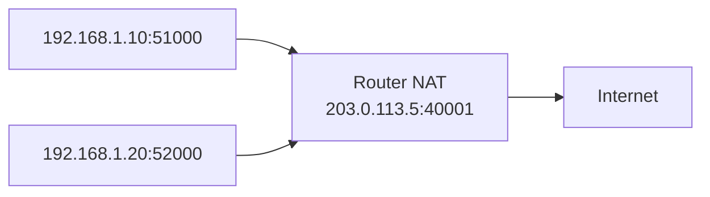

De forma simplificada, el router mantiene una tabla similar a:

| IP privada | Puerto privado | IP pública | Puerto externo |
| --- | ---: | --- | ---: |
| 192.168.1.10 | 51000 | 203.0.113.5 | 40001 |
| 192.168.1.20 | 52000 | 203.0.113.5 | 40002 |

El puerto externo permite distinguir las conexiones de los diferentes dispositivos internos.

### Consecuencia de NAT

Normalmente es sencillo iniciar una comunicación **desde dentro hacia fuera**, porque el router puede crear la asociación correspondiente.

En cambio, recibir conexiones iniciadas espontáneamente desde Internet requiere que el router sepa previamente a qué dispositivo interno debe enviarlas, por ejemplo mediante reglas explícitas de redirección de puertos o mecanismos equivalentes.

---

## 17. ICMP y `ping`

**ICMP (*Internet Control Message Protocol*)** se utiliza para transmitir mensajes de control y errores relacionados con IP.

La herramienta `ping` suele utilizar:

- `ICMP Echo Request`;
- `ICMP Echo Reply`.

Esto permite comprobar si un host responde y medir aproximadamente el **RTT (*Round Trip Time*)**.

Que un host no responda a `ping` no demuestra necesariamente que esté desconectado, porque los mensajes ICMP pueden estar filtrados.

---

## 18. `traceroute`

`traceroute` permite descubrir los routers atravesados hasta alcanzar un destino aprovechando el campo **TTL (*Time To Live*)** de IP.

El proceso básico consiste en enviar paquetes con valores crecientes de TTL:

```text
TTL = 1
TTL = 2
TTL = 3
...
```

Cada router reduce el TTL en uno. Cuando alcanza cero, el paquete se descarta y normalmente se devuelve un mensaje ICMP indicando que el tiempo de vida ha expirado.

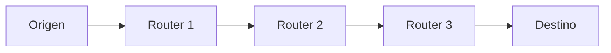

Repitiendo el envío con TTL crecientes se pueden descubrir progresivamente los saltos de la ruta.

!!! note
    Existen implementaciones de `traceroute` que utilizan UDP, ICMP o incluso TCP dependiendo del sistema y de las opciones utilizadas.

---

## 19. Sockets

Desde el punto de vista del programador, la comunicación de red se maneja habitualmente mediante **sockets**.

### Servidor TCP

El flujo básico de un servidor es:

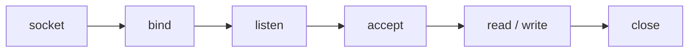

- `socket`: crea el punto de comunicación.
- `bind`: asocia el socket a una dirección y un puerto local.
- `listen`: pone el socket en modo escucha.
- `accept`: acepta una conexión entrante.
- `read/write` o equivalentes: intercambian información.
- `close`: cierra el socket.

### Cliente TCP

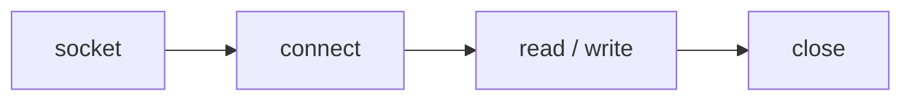

### Lecturas y escrituras parciales

Una llamada a `read()` o `write()` **no garantiza procesar todos los bytes solicitados**.

La aplicación debe comprobar el valor devuelto y repetir las operaciones cuando sea necesario.

!!! warning
    Asumir que un único `read` recibe todo un mensaje o que un único `write` envía todos sus bytes es un error frecuente en programación de red.

---

## 20. Seguridad y TLS

La seguridad es un aspecto fundamental de cualquier sistema distribuido.

**TLS (*Transport Layer Security*)** proporciona mecanismos como:

- confidencialidad;
- integridad;
- autenticación.

HTTPS combina HTTP con TLS.

En criptografía aparecen dos grandes familias:

- **criptografía simétrica**, como AES;
- **criptografía asimétrica**, como RSA.

En los sistemas reales suelen combinarse ambas técnicas: la criptografía asimétrica facilita procesos como autenticación e intercambio de secretos, mientras que la criptografía simétrica permite cifrar grandes cantidades de información de forma eficiente.

La evolución de la computación cuántica también motiva el desarrollo y la adopción de **criptografía poscuántica**.

---

## 21. Relación con IoT

Muchos de los conceptos anteriores tienen impacto directo en IoT.

Los dispositivos IoT suelen estar condicionados por:

- poca memoria;
- CPU limitada;
- consumo energético;
- conexiones inestables;
- poco ancho de banda;
- necesidad de baja latencia.

Por ello, elegir entre TCP y UDP o decidir con qué frecuencia se transmiten datos puede afectar directamente al consumo y al funcionamiento del dispositivo.

### MQTT

**MQTT** es un protocolo muy utilizado en IoT y tradicionalmente utiliza TCP, normalmente en el puerto `1883` cuando no hay TLS.

Permite desacoplar productores y consumidores mediante un modelo **publish/subscribe** y un broker intermedio.

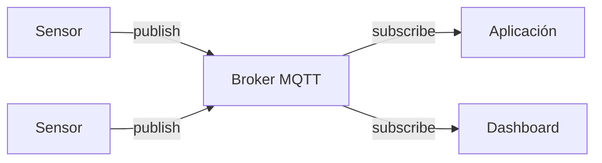

---

## 22. Ideas clave de la clase

1. Internet funciona gracias a protocolos y convenciones compartidas.
2. Las redes se organizan mediante capas que encapsulan información.
3. Cada capa tiene su propia PDU.
4. IP trabaja con datagramas y ofrece un servicio *best effort*.
5. TCP construye una comunicación fiable y orientada a conexión sobre IP.
6. UDP ofrece un mecanismo simple y sin conexión, delegando más responsabilidad en la aplicación.
7. IP identifica máquinas o interfaces; los puertos identifican servicios o procesos.
8. La 5-tupla permite distinguir comunicaciones individuales.
9. Las cabeceras producen overhead y afectan al rendimiento.
10. Los sistemas distribuidos necesitan timeouts porque la ausencia de respuesta puede tener múltiples causas.
11. NAT permite compartir una IPv4 pública entre múltiples dispositivos privados.
12. ICMP, `ping` y `traceroute` permiten diagnosticar el comportamiento de la red.
13. Los sockets son la interfaz habitual que utilizan los programas para comunicarse mediante TCP o UDP.
14. La seguridad debe formar parte del diseño desde el principio.

---

## 23. Conceptos que conviene memorizar

| Concepto | Idea |
| --- | --- |
| PDU | Unidad de datos manejada por una capa |
| Trama | PDU de Ethernet |
| Datagrama IP | PDU de IP |
| Segmento | PDU de TCP |
| Datagrama UDP | PDU de UDP |
| SAP | Punto de acceso a un servicio de una capa |
| Puerto | Identificador de un servicio/proceso en TCP o UDP |
| TCP | Transporte fiable y orientado a conexión |
| UDP | Transporte sin conexión y sin garantías de entrega |
| SYN | Inicio/sincronización de conexión TCP |
| ACK | Confirmación TCP |
| FIN | Solicitud de cierre TCP |
| Checksum | Comprobación para detectar corrupción |
| MTU | Tamaño máximo permitido por un enlace |
| NAT | Traducción entre direcciones/conexiones privadas y públicas |
| ICMP | Mensajes de control y error de IP |
| TTL | Límite de saltos de un datagrama IP |
| Socket | Interfaz de programación para comunicaciones de red |
| Timeout | Tiempo máximo de espera antes de considerar que una operación puede haber fallado |
