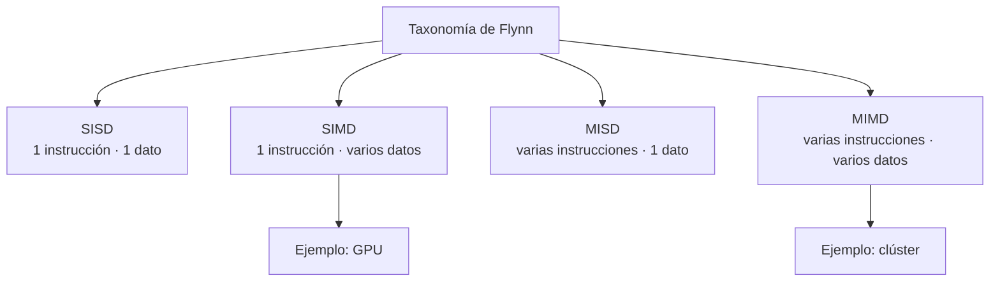
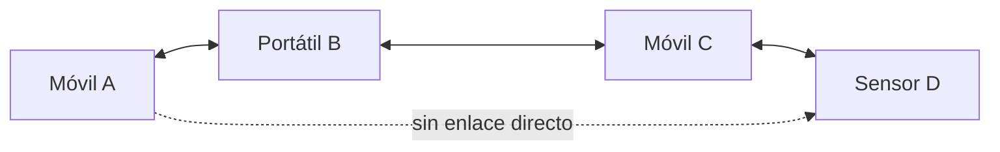
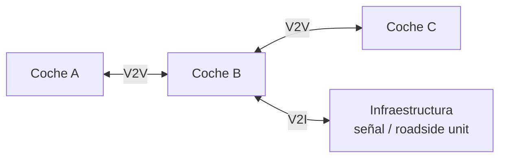
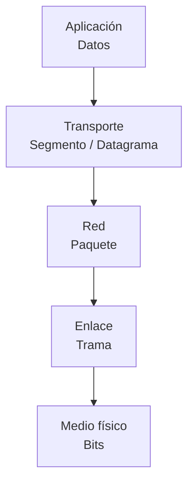

# Apuntes de clase — Lunes 14 de septiembre de 2026

## Taxonomía de Flynn

La **taxonomía de Flynn** clasifica las arquitecturas de computadores según el número de **flujos de instrucciones** y **flujos de datos** que pueden procesar simultáneamente.

| Arquitectura | Instrucciones | Datos | Idea principal | Ejemplo |
| --- | --- | --- | --- | --- |
| **SISD** | Una | Uno | Una única CPU ejecuta secuencialmente instrucciones sobre un único flujo de datos. | Programa secuencial tradicional en un solo núcleo. |
| **SIMD** | Una | Varios | La misma instrucción se aplica al mismo tiempo sobre muchos datos. | GPU procesando muchos píxeles con la misma operación. |
| **MISD** | Varias | Uno | Varias operaciones distintas procesan el mismo flujo de datos. Es poco habitual en sistemas de propósito general. | Sistemas redundantes o tolerantes a fallos que procesan una misma entrada de varias formas. |
| **MIMD** | Varias | Varios | Distintos procesadores ejecutan instrucciones diferentes sobre datos diferentes de forma paralela. | Clústeres, servidores multinúcleo y muchos sistemas distribuidos. |

!!! example "Ejemplo rápido"
    Si tenemos que aplicar el mismo filtro a un millón de píxeles, una arquitectura **SIMD** puede aplicar la misma operación sobre muchos píxeles en paralelo. En cambio, en un **clúster MIMD**, distintos nodos pueden ejecutar tareas diferentes sobre conjuntos de datos diferentes.

---

## Redes móviles ad hoc

Las redes *ad hoc* permiten que varios dispositivos se comuniquen entre sí **sin depender necesariamente de una infraestructura central fija**, como un router o un punto de acceso tradicional.

### MANET

Una **MANET** (*Mobile Ad Hoc Network*) es una red inalámbrica descentralizada formada por dispositivos móviles que pueden comunicarse directamente y colaborar para encaminar información.

Sus características principales son:

- Los nodos pueden **entrar, salir o desplazarse**.
- La topología de la red puede cambiar continuamente.
- No existe necesariamente un router central.
- Un dispositivo puede actuar tanto como **host** como **nodo intermedio** para reenviar mensajes.

!!! example "Ejemplo"
    En una operación de rescate donde no existe cobertura, los dispositivos de los equipos pueden formar una MANET. Un mensaje de un dispositivo podría llegar a otro pasando primero por varios dispositivos intermedios.

### VANET

Una **VANET** (*Vehicular Ad Hoc Network*) es un caso particular de MANET en el que los **vehículos actúan como nodos móviles**.

Los vehículos pueden comunicarse:

- **V2V (*Vehicle to Vehicle*)**: vehículo con vehículo.
- **V2I (*Vehicle to Infrastructure*)**: vehículo con infraestructura de carretera.
- Con otros elementos del entorno para compartir información sobre tráfico, accidentes o condiciones de la vía.

!!! example "Ejemplo"
    Un coche detecta una frenada de emergencia y comunica el evento a los vehículos que circulan detrás. Estos pueden reaccionar antes incluso de tener contacto visual con el vehículo que ha frenado.

### MANET frente a VANET

| Aspecto | MANET | VANET |
| --- | --- | --- |
| Nodos | Dispositivos móviles en general | Principalmente vehículos |
| Movimiento | Variable y poco predecible | Muy rápido, pero condicionado por carreteras |
| Topología | Cambiante | Cambia especialmente rápido |
| Uso típico | Emergencias, redes temporales, dispositivos móviles | Tráfico, seguridad vial, conducción conectada |
| Relación | Concepto general | Caso especializado de MANET |

---

## 1.2. Perspectiva del cliente

### PDU (*Protocol Data Unit*)

Una **PDU** es la unidad de información que maneja una determinada capa de un protocolo de comunicaciones.

Cuando los datos bajan por la pila de red, cada capa puede añadir información de control —por ejemplo, una cabecera— necesaria para ofrecer su servicio. Este proceso se denomina **encapsulación**.

De forma simplificada:

| Capa | PDU habitual | Información añadida |
| --- | --- | --- |
| Aplicación | Datos / mensaje | Depende del protocolo de aplicación |
| Transporte | Segmento TCP o datagrama UDP | Puertos, control de entrega, etc. |
| Red | Paquete IP | Direcciones IP |
| Enlace | Trama | Direcciones de enlace y control de errores |
| Física | Bits | Representación de la señal |

!!! example "Ejemplo de encapsulación"
    Si una aplicación envía el texto **"hola"**, TCP puede añadir información de puertos y secuencia; IP añade las direcciones de origen y destino; y Ethernet añade su propia cabecera antes de transmitir finalmente los bits por el medio físico.

La idea importante es que **la misma información recibe una representación distinta según la capa desde la que se observe**. Cada capa trata la PDU recibida de la capa superior como datos y añade la información necesaria para cumplir su función.
