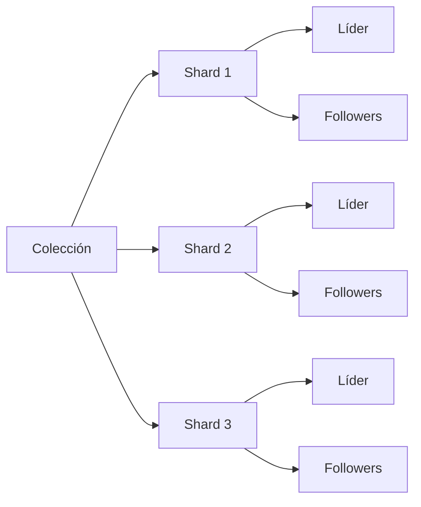
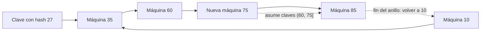

# Apuntes de clase — Miércoles 7 de octubre de 2026

> **Contexto:** Sistemas Distribuidos e IoT. Continuación del Bloque 2, a partir de la transcripción de clase.

La sesión conecta la replicación vista el 30 de septiembre con el **sharding** (particionado horizontal). Se estudia cómo repartir una colección de datos entre máquinas, cómo decidir la ubicación de cada registro, qué ocurre al cambiar el número de máquinas y cómo replicar los shards sin saturar la red. Al final, el docente retoma la práctica de servidor concurrente con procesos.

## 1. De replicar a fragmentar

La clase empieza recordando que escalar consiste en atender más carga al añadir recursos como CPU, memoria, discos o máquinas. La **elasticidad** añade el ajuste automático de recursos a la demanda. También se retoma la **resiliencia**: si falla una máquina, las copias pueden permitir que el sistema siga funcionando con menos servicio. El docente denomina a esta capacidad *graceful degradation* (degradación progresiva): el servicio no pasa necesariamente de funcionar perfectamente a quedar totalmente caído.

Replicar una colección completa no resuelve el crecimiento ilimitado. Si un conjunto de datos ocupa 5 TB y cada disco tiene 2 TB, no cabe completo en esas máquinas. Aunque hoy quepa, los datos pueden seguir creciendo. Además, si todas las máquinas contienen la colección entera, la capacidad queda limitada por la que pueda almacenar la máquina más pequeña.

El **sharding** divide la colección para repartir almacenamiento y trabajo entre máquinas. Una colección contiene shards, y cada shard contiene registros. Cada registro tiene una clave que interviene en su asignación y búsqueda. Particionar y replicar son operaciones diferentes:

- **Particionar** permite almacenar más datos en conjunto y distribuir escrituras entre shards distintos.
- **Replicar** conserva copias de un shard para tolerar fallos y repartir lecturas; las copias de un mismo shard no multiplican por sí solas su capacidad de escritura.
- Al combinar ambas técnicas, cada shard puede tener su propio grupo de réplicas.

El ejemplo de escala presentado fue un sistema de mensajería IoT que podría generar **10 TB en un día**. No es un umbral universal: ilustra por qué una colección grande puede requerir varios fragmentos.

El docente también advirtió que las políticas y mecanismos de coordinación consumen recursos: el *speedup* no crece siempre de forma lineal al añadir máquinas. El objetivo es que el coste de gestionar fragmentos y copias no anule la capacidad que aporta el sistema distribuido.

## 2. Clave de particionado y distribución de carga

El diseño debe resolver dos cuestiones relacionadas, pero distintas:

1. **A qué máquina va una clave:** la política de particionado determina el shard.
2. **Cómo se organizan o buscan allí los datos:** importa qué clave se conserva y qué consultas debe atender ese shard.

Una clave puede ser un identificador único, como el DNI o el identificador de un sensor, o un atributo compartido, como el país. Si se usa el país, todos los registros de un mismo país pueden terminar juntos. Antes de elegirla conviene estudiar los patrones de acceso: la clase propone mirar los *logs* históricos y averiguar por qué claves consultan más las aplicaciones.

Dos estrategias de particionado son:

| Estrategia | Asignación | Ventaja | Coste o riesgo |
| --- | --- | --- | --- |
| **Por rango** (*range partitioning*) | Divide los valores ordenados, por ejemplo A–F, G–M y N–Z. | Una consulta de intervalo puede resolverse en uno o pocos shards. | Un intervalo muy consultado o con muchas escrituras puede concentrar la carga. |
| **Por hash** (*hash partitioning*) | Aplica una función hash a la clave y mapea su resultado a un shard. | Tiende a repartir claves entre máquinas. | Rompe el orden natural; una consulta de intervalo puede requerir consultar todos los shards. |

### 2.1. Qué aporta una función hash

Una función hash transforma un valor de entrada en un valor de un espacio de salida. Para distribuir registros no se le exigen necesariamente las mismas propiedades que a un hash criptográfico: el objetivo es asignar y repartir datos, no protegerlos ni verificar su autenticidad. Que claves diferentes terminen en el mismo shard es normal; siguen siendo registros distintos identificados por sus claves.

Como ejemplo didáctico, la transcripción menciona valores hash **17 para Ana, 22 para Vector y 9 para Carmen**, y después aplicar módulo 3 y sumar 1 para obtener los nodos 1, 2 o 3. Así, 17 módulo 3 es 2 y, al sumar 1, corresponde al nodo 3. La función que calcula el hash y la regla que traduce ese número a una máquina son pasos separados. Los valores son los del ejemplo de clase, no una recomendación de función hash para producción.

El cálculo es barato —el docente lo describió como del orden de microsegundos— y evita que una clave siempre se asigne al mismo shard por su orden alfabético. A cambio, los valores relacionados dejan de quedar juntos. En el ejemplo, una búsqueda por apellidos de la A a la D que antes podía consultar una sola máquina podría tener que preguntar a los tres nodos.

### 2.2. *Hotspots* y el promedio engañoso

Una clave aparentemente razonable puede llevar una fracción desproporcionada del tráfico a un shard. Por ejemplo, particionar por país puede dejar la máquina de España muy cargada y la de Andorra casi vacía. A ese shard o máquina sobrecargados se les llama **hotspot**.

La clase dio un ejemplo con **5 máquinas**: cuatro tendrían **4 registros cada una** y una tendría **84**. El promedio sería 20 registros por máquina, aunque una sola concentra 84 y las otras tienen 4. Por tanto, el promedio no basta para evaluar el reparto. Conviene vigilar el máximo, compararlo con los demás shards o con la media y usar también medidas de dispersión, como la desviación típica. El docente señaló que expresar que una máquina tiene 10 o 20 veces la carga de otra puede resultar más claro para un operador.

La transcripción indica además que la mediana sería 6, lo cual no concuerda con la lista de cantidades reconocida (4, 4, 4, 4 y 84). Parece un error de reconocimiento de voz; por eso no se usa esa mediana como dato fiable.

### 2.3. Ejemplo IoT: muchos sensores y la misma marca de tiempo

El docente describió **2.000 sensores en Málaga** midiendo temperatura, CO₂ u otras variables y enviando una lectura al principio de cada minuto. Aunque un minuto da tiempo para procesar muchos datos, si la marca temporal es la clave, las lecturas del mismo minuto pueden concentrarse en la misma máquina. La frecuencia, las etiquetas y la elección de la clave forman parte del diseño del sistema IoT.

Se comentaron tres maneras de reducir esa concentración:

- **Usar el identificador del sensor** como clave. Los identificadores numéricos suelen ser más cortos y menos ambiguos que los nombres, y pueden repartir las escrituras por dispositivo. El coste es que una consulta por tiempo tendrá que combinar datos de varios sensores o shards.
- **Añadir un número aleatorio** a la clave temporal. La clase propuso como ejemplo un número entre 0 y 100. Las escrituras se dispersan, pero al buscar una hora hay que consultar las variantes posibles; el docente lo describió como buscar alrededor del tiempo y mencionó un margen «más/menos 10». La transcripción no permite asegurar si ese margen corresponde exactamente a la misma escala que el ejemplo 0–100, así que se conserva como explicación aproximada de la búsqueda ampliada.
- **Desfasar los envíos** de los sensores dentro del minuto. Se podría elegir uno de los 60 segundos para transmitir, reduciendo las escrituras simultáneas. Si se necesita más granularidad, el docente mencionó también los milisegundos. Los relojes físicos no tienen que estar perfectamente sincronizados para repartir los envíos si el programa asigna el instante de transmisión.

Estos cambios reducen hotspots de escritura, pero pueden hacer más costosas las lecturas que necesitan reconstruir una serie temporal completa.

## 3. Cambiar el número de máquinas

Una asignación sencilla es `shard = hash(clave) mod N`, donde `N` es el número de máquinas. El módulo limita los resultados al conjunto de nodos. El problema aparece cuando el sistema escala o reduce capacidad y `N` cambia: muchas claves pasan a producir otro nodo.

Al hablar de este patrón se citaron Cassandra y MongoDB como ejemplos de sistemas que usan estrategias basadas en el número de máquinas; se conserva aquí como referencia de la explicación de clase, no como descripción de todas sus configuraciones actuales.

La clase ilustró el cambio de **3 a 4 máquinas** y también planteó el caso de **10 a 11**. Los mismos registros, al aplicar la misma función hash con un módulo distinto, pueden quedar asignados a otras máquinas. Durante la migración, una solicitud enviada a la ubicación nueva puede no encontrar aún el dato. Una forma de tratarlo es que la máquina antigua responda que el dato se ha movido (*move*) e indique la ubicación nueva. Otra opción es detener el servicio mientras las máquinas intercambian fragmentos; eso puede ser inviable si mover terabytes tarda horas o un día.

La pertenencia y salida de máquinas es especialmente relevante en IoT y *edge computing*: los sensores, routers y servidores de borde pueden desconectarse, romperse o cambiar de alimentación. Se necesita una política para añadir y retirar máquinas sin redistribuir innecesariamente todos los datos.

### 3.1. *Consistent hashing* y anillo lógico

Por el contexto, el término que aparece varias veces como «hash inconsistente» en el reconocimiento de voz corresponde a **consistent hashing** (hash consistente). En esta técnica se aplica la misma función hash a las claves y a las máquinas, y los resultados se disponen en un **anillo lógico**. La transcripción usa como ejemplo un espacio de módulo 100; el tamaño de ese espacio es ilustrativo, no una regla matemática universal.

Cada clave se asigna a la primera máquina cuyo valor es igual o superior al hash de la clave al recorrer el anillo en sentido horario. Si la clave queda después de la última máquina, se vuelve a la primera máquina del anillo. En el ejemplo, con máquinas en 10, 35, 60 y 85:

- Una clave con hash 4 se asigna a la máquina 10.
- Una clave con hash 27 se asigna a la máquina 35.
- Las claves posteriores a 85 dan la vuelta y se asignan a la primera máquina del anillo.

Al añadir una máquina en 75, esta asume las claves del intervalo **(60, 75]** que antes correspondían a la máquina 85. El resto de claves mantiene su asignación. Por eso el movimiento queda limitado a una parte del anillo. Si se retira una máquina, sus datos deben reasignarse o recuperarse desde copias.

La clase usó un anillo de ejemplo con 100 posiciones y señaló que ese tamaño es una decisión de representación, no una capacidad para guardar solo 100 registros. Las máquinas mantienen una tabla pequeña con las posiciones y direcciones del anillo; en el ejemplo, esa información se replica en las cuatro máquinas. No se dio una fórmula universal para elegir el tamaño del espacio.

El hash de una IP de máquina y el hash de una clave pueden coincidir numéricamente. En la explicación, la posición de la máquina se guarda en la tabla del anillo y el hash de la clave se calcula al buscar; el mismo número no significa que ambos datos ocupen la misma estructura. La comparación de igualdad debe tratarse de forma coherente —por ejemplo, asignando la clave a la máquina en esa posición— para evitar ambigüedad en los límites.

## 4. Enrutar una petición hasta su shard

Una vez calculada la clave, el sistema debe decidir quién resuelve su destino. La clase presentó tres mecanismos:

| Mecanismo | Recorrido | Ventajas | Costes y riesgos |
| --- | --- | --- | --- |
| **Directorio o servicio de descubrimiento** | El cliente pregunta dónde está la clave y el directorio responde con la máquina. | Cliente sencillo; la tabla de asignaciones puede mantenerse en un sitio. | Añade una consulta; el ejemplo del docente estimaba alrededor de **0,5 ms** en una red local. Puede quedar desactualizado o convertirse en un punto crítico. |
| **Proxy** | El cliente envía el registro al proxy; este calcula el destino y lo reenvía. | El cliente no necesita conocer el mapa completo. | Añade un intermediario que puede ser cuello de botella o punto único de fallo si no se replica. Se citó `mongos` de MongoDB como ejemplo. |
| **Asignación en el cliente** | El cliente conserva el mapa y calcula directamente qué máquina usar. | Evita la consulta intermedia y ofrece autonomía y rapidez. | Cada cliente debe tener lógica y mapa actualizados; las tablas pueden crecer y quedar obsoletas con muchos nodos. |

El tiempo de consulta al directorio puede parecer pequeño, pero se paga en cada petición y se acumula con clientes que generan mucho tráfico. Proxy y directorio son máquinas de servicio que deben existir y responder; la clase insistió en tener redundancia o un respaldo listo. Si todas las operaciones dependen de un directorio caído, los datos pueden seguir almacenados y, sin embargo, quedar inaccesibles. Para este cálculo la latencia puede ser modesta, pero la disponibilidad sigue siendo importante.

## 5. Réplicas de shards, líder y log

Al replicar los shards, se define un **factor de replicación**. El ejemplo de clase usa factor **3**: un líder y dos *followers*. El líder acepta y ordena las escrituras; los followers reciben y aplican los cambios. El factor 3 es un ejemplo, no el valor adecuado para todos los sistemas.

La distinción entre sus beneficios es importante:

- Los **shards distintos** permiten distribuir datos y aceptar más trabajo de escritura en paralelo.
- Las **copias de cada shard** ayudan a sobrevivir a fallos y a repartir lecturas; no equivalen a tres líderes aceptando sin coordinación las mismas escrituras.

El líder puede configurarse al iniciar el sistema o elegirse mediante votación. En el caso descrito, las réplicas participan y una obtiene mayoría. Si falla un follower, las copias restantes pueden mantener el servicio y, cuando vuelva, puede actualizarse desde una copia disponible. Si falla el líder, se necesita elegir un nuevo líder.

Para no propagar continuamente copias completas por la red, el líder registra las operaciones en un **log ordenado**. Los followers leen el log y aplican las operaciones en ese orden; cada uno lleva un índice de hasta dónde ha avanzado. Así las réplicas pueden alcanzar el mismo estado procesando las mismas operaciones deterministas en el mismo orden, idea denominada **replicated state machine** (máquina de estado replicada). La clase presentó Kafka como sistema de publicación y suscripción y lo mencionó como ejemplo al explicar logs y shards replicados.

El ejemplo dio dos réplicas con posiciones 32 y 31: la primera ya había aplicado una operación más. Las réplicas avanzan a su ritmo y la diferencia de posición permite observar cuál va retrasada.

### 5.1. *Snapshot* y recuperación

El log no puede crecer sin límite. Un **snapshot** (instantánea) conserva el estado del shard en una posición determinada. La explicación propone tomar como referencia la posición mínima que todas las réplicas ya han aplicado. Por ejemplo, si tres réplicas van por las operaciones 10, 20 y 30, el punto común seguro es 10. A partir de ahí se puede conservar el snapshot y retirar del log el historial anterior que ya no hace falta.

Si una máquina falla, el snapshot sirve como punto de restauración y la réplica aplica después las operaciones nuevas del log. La analogía informal del docente fue la función Time Machine de Apple: recuperar una situación guardada y continuar desde allí. En este caso la instantánea se obtiene del estado aplicado, para reducir trabajo y no realizar sin necesidad una copia adicional de toda la colección.

## 6. Recordatorios sobre la práctica de servidores

En la parte final, el docente habló de generalizar el ejercicio de *echo* para varios clientes y procesos. El recorrido descrito es:

Al inicio de la sesión se recordó que el **grupo B** acudiría al laboratorio al día siguiente y se comprobó que el material de la práctica estuviera disponible para descargar.

1. El servidor espera en `accept` con su socket de escucha.
2. Al conectarse un cliente, el servidor crea un proceso hijo con `fork`.
3. El padre cierra el socket conectado a ese cliente y vuelve a esperar conexiones, conservando el socket de escucha.
4. El hijo cierra su copia del socket de escucha y atiende al cliente mediante el socket conectado.

El padre y el hijo heredan descriptores al hacer `fork`; cada proceso debe cerrar los que no utiliza. Cuando el hijo termina, debe comunicar un estado de salida (por ejemplo, `0` para éxito y `-1` ante un error, según el ejemplo oral). El padre instala desde el principio el tratamiento de `SIGCHLD` para recoger a los hijos terminados y evitar procesos zombi. Se mencionaron dos alternativas: ignorar la señal cuando no interesa el resultado, o ejecutar una función *reaper* que llame a `wait`/`waitpid` y recoja el estado de salida. El docente propuso usar ese estado también para contar hijos terminados o registrar bytes atendidos por el servicio *echo*. Como precisión práctica, el estado de salida sirve para valores pequeños, no para devolver un contador arbitrariamente grande; para eso haría falta otro mecanismo de comunicación entre procesos.

Como mejora opcional, se comentó separar el ciclo de aceptación de conexiones del programa que atiende al cliente: después de `fork`, el hijo puede ejecutar otro programa con `exec`. La práctica inmediata no necesariamente exige ese cambio. La explicación señaló que `fork` crea un proceso con el contexto del padre y que reemplazar luego ese programa permite que el padre se mantenga ligero; los sistemas operativos suelen optimizar la copia de memoria, pero esa precisión no se desarrolló en clase.

La transcripción contiene también una mención a «V-fork» o *virtual fork* al hablar de diferir la copia de memoria hasta que se modifican datos. No se distingue con suficiente claridad qué llamada o mecanismo concreto se nombró, por lo que no se presenta como API que haya que implementar.

También se recordaron estos puntos para la implementación:

- `read` y `write` pueden transferir menos bytes de los solicitados; se usan bucles y se comprueban errores y cierres. Esto aplica a cada proceso que atiende un socket.
- Los enteros deben representarse en **network byte order** antes de enviarlos y convertirse al orden del host al recibirlos. Se citaron las familias de funciones `htons`/`htonl` y `ntohs`/`ntohl`, según el tipo y tamaño del campo.
- Que las conversiones parezcan no hacer nada en las máquinas del laboratorio no las vuelve innecesarias: puede cambiar el orden de bytes al comunicar sistemas distintos, por ejemplo Linux, Windows y Unix.
- La conversión también se aplica a campos de direcciones de red. El docente recomendó revisar cómo se abre el socket para TCP frente a UDP y qué tipo de dirección se está usando.
- La conversión de bytes forma parte de la representación de datos que suele asociarse con la **capa de presentación** del modelo OSI.

## Ideas clave

- Replicar una colección completa mejora resiliencia, pero limita el tamaño a lo que pueda almacenar cada copia; particionar permite sumar capacidad entre máquinas.
- La clave de particionado debe responder a las consultas y al ritmo de escritura; un mal reparto crea *hotspots* aunque el promedio parezca equilibrado.
- Hash reduce el efecto del orden de las claves, pero las consultas por rango pueden tener que consultar varios shards.
- Con `hash(clave) mod N`, cambiar `N` puede mover muchas claves. El hash consistente usa un anillo para limitar la redistribución.
- Directorio, proxy y cliente pueden resolver el enrutamiento; los dos primeros requieren disponibilidad redundante y el último propaga estado a cada cliente.
- Las copias de un shard aplican un log ordenado; los índices muestran el progreso y el snapshot limita cuánto historial hace falta para recuperarse.
- En servidores concurrentes con `fork`, cada proceso cierra los sockets que no utiliza, el padre recoge a sus hijos y ambos extremos manejan correctamente la representación y transferencia de datos.

## Referencias relacionadas

- [Bloque 2 — Elasticidad y escalabilidad](../temario/bloque-2-elasticidad-y-escalabilidad.md)
- [Clase del 30 de septiembre — Replicación, escalabilidad y consistencia](clase-2026-09-30.md)
- [Notas de clase](index.md)

## Nota sobre la fuente

Los apuntes se elaboraron a partir del JSON de transcripción, no de una grabación inspeccionada por separado. En algunos tramos el reconocimiento de voz es defectuoso; se omitieron fragmentos ininteligibles y se señalan las dudas que afectan a cifras o términos. En particular, el término «hash inconsistente» se normaliza como *consistent hashing* porque el mecanismo explicado (anillo y asignación al siguiente nodo) lo identifica con claridad. El término anunciado para una sesión posterior aparece como «tool de Surprise» y no se incorpora porque no puede recuperarse con fiabilidad.
