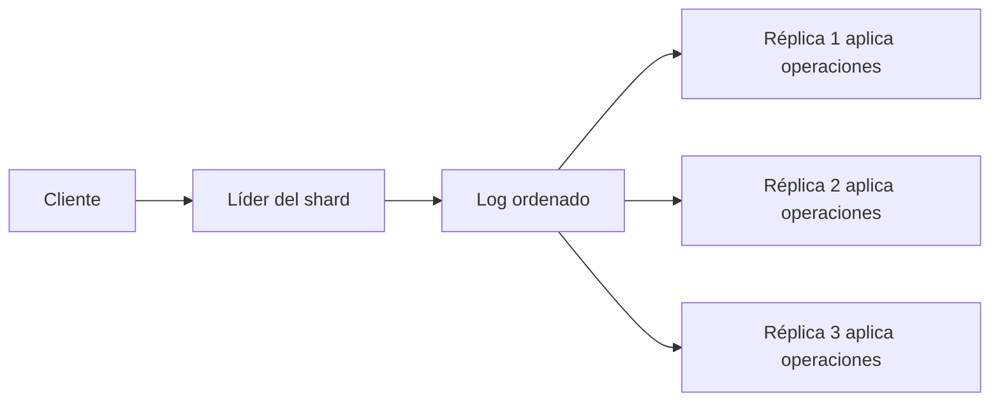
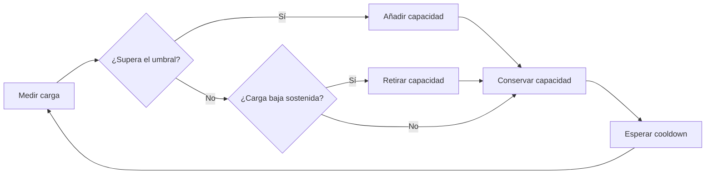

# Bloque 2 — Elasticidad y escalabilidad

Este bloque estudia cómo aumentar la capacidad de un sistema distribuido y cómo hacer que esa capacidad siga la demanda. El material fuente está en [B2_Elasticity_and_scalability.pdf](../fuentes/B2_Elasticity_and_scalability.pdf).

El hilo conductor es separar cuatro necesidades que suelen confundirse:

- **Replication**: mantener copias para servir más lecturas y sobrevivir a fallos.
- **Sharding**: dividir los datos para aumentar la capacidad de almacenamiento y escritura.
- **Elasticity**: añadir y retirar recursos automáticamente según la carga.
- **Scalability**: crecer manteniendo un rendimiento útil.

## 2.1 Problemas de replicación

La replicación mantiene varias copias de los mismos datos. Una copia cercana reduce la latencia de lectura; varias copias pueden mantener el servicio si una máquina falla. A cambio, cada escritura debe propagarse y las copias pueden responder con valores distintos mientras se actualizan.

### Actualización perdida

Dos operaciones leen el mismo valor antes de que ninguna escriba. Si ambas calculan un resultado nuevo a partir de ese valor, la segunda escritura puede sobrescribir la primera. Por ejemplo, dos transacciones que incrementan un saldo de 200 € en un 10 % deberían producir 242 €. Si las dos leen 200 €, ambas calculan 220 € y el resultado final incorrecto es 220 €.

El problema no siempre produce un error técnico: el valor guardado puede ser válido, aunque se haya perdido una actualización.

### Estrategias para ordenar o detectar escrituras

#### Primary copy y réplicas

Una réplica primaria recibe y ordena todas las escrituras; después las propaga a las demás. Las réplicas pueden repartir las lecturas, pero la capacidad de escritura sigue limitada por la primaria. Si falla, otra réplica puede promocionarse.

- **Propagación síncrona**: la primaria confirma cuando todas las copias han guardado la escritura. Una lectura posterior a la confirmación puede observar el nuevo valor en cualquier copia, pero la escritura espera a la copia más lenta y una copia inaccesible puede bloquearla.
- **Propagación asíncrona**: la primaria confirma sin esperar a las demás. Las escrituras son más rápidas, pero una lectura desde una copia retrasada puede devolver un valor antiguo (*replication lag*). Si la primaria falla antes de propagar el cambio, este puede perderse.

Una aplicación puede reducir lecturas obsoletas leyendo temporalmente de la primaria, manteniendo a cada cliente en la misma réplica o indicando a la réplica qué versión necesita.

#### Locks

Un *lock* concede acceso temporal a un dato. Un bloqueo de escritura es exclusivo; los demás escritores esperan. Esto evita que dos transacciones sobrescriban sus cambios, pero añade espera y puede reducir el rendimiento.

Hay *deadlock* (interbloqueo) si dos transacciones esperan recursos retenidos por la otra. Por ejemplo, T retiene A y espera B, mientras U retiene B y espera A. Un detector busca ciclos de espera y aborta una transacción, normalmente con un *timeout*.

#### Control optimista

Cada valor tiene una versión. El cliente lee el valor y su versión, calcula sin bloquear y escribe únicamente si la versión sigue siendo la misma. Si otra operación ya la cambió, la escritura se rechaza y se vuelve a intentar sobre el valor actualizado. Funciona bien con muchos lectores y pocos conflictos; con escritores concurrentes frecuentes repite trabajo.

#### Quorum

Sea `N` el número de copias, `W` el número que debe confirmar una escritura y `R` el número que responde a una lectura. Si `W + R > N`, cualquier conjunto de `W` copias y cualquier conjunto de `R` copias comparten al menos una réplica. La lectura puede comparar versiones y obtener la escritura confirmada más reciente.

| Configuración | Consecuencia general |
| --- | --- |
| `W + R > N` | Lectura y escritura se solapan; más contactos y latencia, con lectura reciente bajo el protocolo correspondiente. |
| `W + R ≤ N` | Los conjuntos pueden no solaparse; una lectura obsoleta o escrituras conflictivas son posibles. |

Ejemplo: con `N = 5`, `W = 3` y `R = 3`, los conjuntos comparten como mínimo una copia porque `3 + 3 > 5`. La elección concreta intercambia latencia, disponibilidad y consistencia; el quorum por sí solo no define el manejo de conflictos.

### Conflictos entre escrituras

Sin un orden global, dos dispositivos pueden aceptar cambios incompatibles, por ejemplo al editar una cesta mientras están desconectados. Las políticas habituales son:

- *Last writer wins*: conserva la escritura con la marca temporal posterior; es sencillo, pero descarta silenciosamente el otro cambio y depende de marcas temporales comparables.
- Devolver ambas versiones para que la aplicación resuelva el conflicto.
- Fusionar según el tipo de dato. Para un conjunto, la unión puede conservar elementos añadidos en ambas copias.

La estrategia de replicación determina qué valor observa el cliente y qué coste paga el sistema: espera, lecturas potencialmente obsoletas, contactos con varias copias o reconciliación posterior.

## 2.2 Sharding y máquinas de estado

Las réplicas completas no amplían el espacio disponible: cada una conserva todos los datos. El *sharding* (particionado horizontal) divide los datos entre máquinas. Cada clave pertenece a un *shard*; esto aumenta la capacidad total de almacenamiento y permite procesar escrituras de shards distintos en paralelo.

### Particionado por rango o por hash

- **Range partitioning** asigna intervalos de claves a cada shard. Facilita consultas por intervalos, pero una distribución desigual puede concentrar escrituras en un shard (*hot spot*). Por ejemplo, guardar mediciones por hora puede enviar todas las escrituras actuales a la partición del intervalo más reciente.
- **Hash partitioning** aplica una función de dispersión a la clave y reparte las escrituras. Tiende a equilibrar la carga, pero una consulta por rango puede tener que preguntar a muchos shards.

La elección de la clave de partición es esencial. Hay que medir el shard más cargado y compararlo con la media: un promedio bajo puede ocultar una partición saturada. Si muchos sensores publican a la vez, una clave basada solo en el instante puede reunir todas las escrituras; usar el identificador del sensor o distribuir el instante dentro de una ventana puede repartirlas mejor.

### Incorporar máquinas

La regla `hash(k) mod N` es fácil de implementar, pero al cambiar `N` muchas claves cambian de máquina y deben copiarse. *Consistent hashing* coloca máquinas y claves en un anillo ordenado por hash. Cada clave pertenece a la primera máquina que aparece en sentido horario. Al añadir una máquina, esta asume principalmente las claves comprendidas entre ella y su vecina anterior; las demás no se mueven. Los *virtual nodes* asignan varias posiciones a cada máquina y ayudan a equilibrar las particiones.

Una petición debe localizar su shard. El mapa puede estar en un servicio de directorio, en un proxy que enruta las peticiones o en la biblioteca del cliente. El directorio y el proxy añaden un salto; con un mapa en el cliente, hay que distribuir las actualizaciones cuando cambia el conjunto de máquinas.

### Shards replicados

Particionado y replicación resuelven problemas distintos y se combinan: el particionado aumenta almacenamiento y escrituras; las copias aportan tolerancia a fallos y capacidad de lectura. Por ejemplo, tres shards con tres copias cada uno ocupan nueve máquinas. Cada shard puede tener una réplica líder y varias seguidoras; las escrituras de shards diferentes avanzan en paralelo.

### Replicated state machine y log

Una *replicated state machine* mantiene varias copias del mismo estado. Si todas parten del mismo estado, aplican las mismas operaciones deterministas en el mismo orden, terminan con el mismo resultado. Por ello, las réplicas acuerdan el orden de las operaciones, en lugar de comparar continuamente sus datos completos.

El *log* es una secuencia numerada y solo se añaden entradas al final. Cada réplica registra hasta qué posición ha aplicado. Una réplica nueva puede cargar una instantánea (*snapshot*) de la posición `p` y reproducir solo las entradas posteriores, en vez de ejecutar el historial completo. Cada consumidor conserva su propia posición, por lo que uno lento no bloquea a los demás.

## 2.3 DHT y publish/subscribe

### Distributed hash table y Chord

Una *distributed hash table* (DHT, tabla hash distribuida) almacena pares clave-valor entre máquinas sin un índice central. El anillo de *consistent hashing* determina quién es responsable de una clave, pero recorrer máquina a máquina sería demasiado lento.

Chord mantiene en cada máquina una tabla de atajos llamada *finger table*, con referencias a posiciones a distancias crecientes (1, 2, 4, 8, …). En cada salto se elige el atajo más lejano que no sobrepasa la clave buscada. Así se necesitan aproximadamente `log₂ N` saltos: alrededor de 20 para un millón de máquinas, suponiendo que las tablas estén actualizadas.

Cuando una máquina se incorpora, busca a su sucesora y asume las claves que le corresponden. Una máquina que se retira puede transferirlas; una que desaparece sin aviso puede perderlas. Mantener copias en las máquinas sucesoras ayuda a tolerar fallos, mientras los nodos reparan periódicamente las referencias del anillo.

### Colas y brokers

La mensajería transitoria, como un socket, requiere que emisor y receptor estén activos al mismo tiempo. Una cola persistente conserva el mensaje hasta que el receptor lo obtiene, de modo que puede tolerar reinicios y desconexiones.

| Operación | Comportamiento |
| --- | --- |
| `PUT` | Añade un mensaje al final de la cola sin esperar al receptor. |
| `GET` | Espera hasta que haya un mensaje y lo retira. |
| `POLL` | Devuelve un mensaje si hay uno disponible; si no, devuelve vacío. |
| `NOTIFY` | Registra una función que se ejecutará cuando llegue un mensaje. |

Un *broker* recibe, almacena y enruta mensajes por nombre. Desacopla al emisor de la dirección y disponibilidad del receptor, pero cada mensaje atraviesa el broker, por lo que puede ser un cuello de botella y debe protegerse frente a fallos.

- Una **queue** entrega cada mensaje a un solo consumidor del grupo: apropiado para repartir trabajo que debe hacerse una vez.
- Un **topic** distribuye una copia a cada suscriptor: apropiado para notificar un hecho a varios servicios.

### Publish/subscribe y MQTT

En el modelo *publish/subscribe*, el emisor publica en un *topic* sin conocer a sus suscriptores. Los temas pueden expresarse como rutas con niveles separados por `/`, por ejemplo `city/noise/sensor7`. En filtros MQTT, `+` coincide con un nivel y `#` con cero o más niveles restantes; `#` se coloca al final del filtro. Un publicador en `city/noise/sensor7` coincide con `city/noise/+` y `city/#`.

MQTT adapta este modelo a dispositivos y redes limitadas; normalmente se ejecuta sobre TCP y usa un broker. Los niveles de entrega especifican distintas garantías y costes de intercambio:

| QoS | Garantía resumida | Implicación |
| --- | --- | --- |
| 0 | Como máximo una entrega | Se envía una vez; puede perderse. |
| 1 | Al menos una entrega | Se reintenta; puede haber duplicados, que el receptor debe tolerar. |
| 2 | Una sola entrega | Intercambio de cuatro mensajes para evitar la duplicación de la entrega. |

El *last will* permite que el broker publique un mensaje predefinido si un cliente se desconecta de forma inesperada.

### Multicast y acoplamiento

En *multicast*, la fuente envía un mensaje a un grupo y los routers replican los paquetes cerca de los receptores. Esto ahorra duplicar el tráfico desde el origen.

Los mecanismos también difieren en cómo acoplan programas:

- **Acoplamiento espacial**: cada extremo debe conocer la identidad o dirección del otro.
- **Acoplamiento temporal**: ambos deben estar activos a la vez.

Un socket suele acoplar en espacio y tiempo. Una cola elimina la dependencia temporal, aunque emisor y receptor conocen el nombre de la cola. Un sistema de publicación/suscripción con almacenamiento puede eliminar ambos acoplamientos directos.

## 2.4 Escalabilidad en la nube

### Scale up, scale out y elasticidad

- **Scale up**: sustituir una máquina por otra mayor. Requiere pocos cambios en el programa, pero existe un límite de tamaño.
- **Scale out**: añadir máquinas detrás de una dirección común. Puede crecer más, pero las peticiones deben poder atenderse en cualquier máquina.

Para facilitar *scale out*, los servidores web suelen evitar guardar en memoria local el estado de una sesión. La sesión puede residir en un almacén compartido o viajar con el cliente.

La **scalability** es la capacidad de aumentar la carga atendida. La **elasticity** añade ajuste automático: recursos que se incorporan cuando sube la demanda y se liberan cuando baja. Así se paga por la capacidad utilizada en cada momento, sujeto al tiempo de arranque y a la precisión del escalado.

### Load balancer y autoscaling

Un *load balancer* (balanceador de carga) ofrece un punto de entrada y dirige cada petición a una máquina sana. Puede comprobar periódicamente la salud y distribuir peticiones por turnos o por conexiones activas. También es un componente crítico: normalmente se replica. Si la sesión vive en el servidor, el balanceador no puede mover libremente las peticiones; trasladar el estado a un almacén compartido o al cliente elimina esa afinidad.

Un controlador de *autoscaling* mide una señal, la compara con umbrales, añade o retira máquinas y espera un período de enfriamiento (*cooldown*) antes de decidir otra vez. Debe contemplar:

- Umbrales distintos para escalar hacia arriba y hacia abajo, evitando oscilaciones.
- El tiempo de arranque y preparación: iniciar la máquina, descargar la aplicación y calentar la caché.
- Un mínimo de máquinas o el inicio anticipado ante eventos conocidos si la carga puede subir antes de que las nuevas máquinas estén listas.

### Colas y ley de Little

Una cola delante de los trabajadores absorbe ráfagas cuando las llegadas superan temporalmente la capacidad de procesamiento. Si llegan `λ` peticiones por segundo y se procesan `μ`, el backlog crece a razón de `λ − μ` mientras `λ > μ`. Por ejemplo, con `λ = 500` y `μ = 100`, la cola aumenta en 400 peticiones por segundo: en 10 segundos acumula 4000. Cuando termina la ráfaga, tardaría 40 segundos en vaciarse si se procesan 100 peticiones por segundo y no llegan nuevas.

Una cola ayuda con ráfagas finitas, pero no puede compensar una tasa de llegada sostenida superior a la de servicio: el backlog crecería sin límite. Su longitud puede servir como señal para añadir o retirar trabajadores.

La **ley de Little** relaciona el número medio de solicitudes dentro de un sistema estable con la tasa de llegada y el tiempo medio dentro del sistema:

`L = λ × W`

Si llegan 200 solicitudes/s y cada una tarda 0,25 s, habrá unas 50 solicitudes en curso. Esta relación ayuda a dimensionar pools de conexiones y trabajadores. Un pool de 20 conexiones con 0,25 s por solicitud limita el caudal a `L/W = 80` solicitudes/s, bajo esas condiciones.

### Cachés y descubrimiento de miembros

Una caché responde a las peticiones que ya tiene y solo reenvía los fallos (*cache misses*) a la capa siguiente. Para una capa con aciertos independientes, el tiempo medio se aproxima por `ratio de fallos × coste de consultar la capa siguiente`. Con un 80 % de aciertos y una base de datos que tarda 40 ms, la contribución media es `0,2 × 40 = 8 ms`.

Las capas pueden incluir navegador, red de distribución de contenido (CDN), caché de aplicación y base de datos. Cada una requiere una política de expiración; en HTTP, `Cache-Control: max-age=300` indica que la respuesta puede almacenarse durante 300 segundos.

En un conjunto dinámico de máquinas, cada nodo necesita conocer qué procesos están disponibles. *Gossip* (protocolo epidémico) hace que los nodos intercambien periódicamente listas de miembros con un vecino aleatorio. Cada nodo combina la información recibida y detecta procesos cuyo contador no avanza. La información se difunde rápidamente —aproximadamente duplicando los nodos informados en cada ronda—, pero no existe un instante exacto en que todos puedan asegurar que conocen el estado global.

### Encontrar el primer límite

La capacidad del sistema queda limitada por el componente que debe atender cada petición y tiene menor caudal. Si seis servidores web procesan 500 solicitudes/s cada uno, su capacidad agregada es 3000 solicitudes/s; si la base de datos acepta 1000 escrituras/s, el sistema completo queda limitado a 1000 escrituras/s.

El orden de intervención propuesto en las diapositivas es:

1. Cachear lecturas para reducir las peticiones que llegan a la base de datos.
2. Encolar escrituras para absorber ráfagas y procesarlas al ritmo del almacenamiento.
3. Dividir los datos en shards con líderes distintos para repartir las escrituras.
4. Permitir lecturas de valores antiguos cuando la aplicación lo admita.

En una plataforma IoT, las mediciones simultáneas pueden agruparse en una pasarela, amortiguarse con una cola y almacenarse en shards por identificador de sensor, con réplicas para sobrevivir a fallos. La tasa promedio y el pico instantáneo deben dimensionarse por separado.

## Ideas clave

- Las copias mejoran lecturas y tolerancia a fallos; los shards aumentan almacenamiento y capacidad de escritura.
- Toda garantía de consistencia tiene un coste en latencia, disponibilidad, coordinación o reconciliación.
- La clave de partición determina si la carga se reparte o crea puntos calientes.
- La elasticidad requiere que las instancias entren y salgan sin que el estado de sesión dependa de una sola máquina.
- Colas y cachés suavizan carga o reducen trabajo, pero no eliminan el límite sostenido de capacidad del recurso más lento.

## Referencias relacionadas

- [Bloque 1 — Evolución de los sistemas distribuidos](bloque-1-evolucion-de-los-sistemas-distribuidos.md)
- [Notas de clase](../notas-clase/index.md)
- [PDF original del Bloque 2](../fuentes/B2_Elasticity_and_scalability.pdf)
